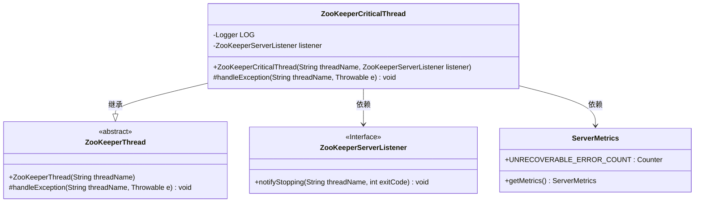
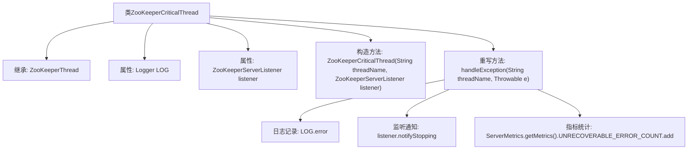

# 基础信息

|      |      |
|------|------|
| 名称 | ZooKeeperCriticalThread |
| 编码语言 | .java |
| 代码路径 | zookeeper/zookeeper-server/src/main/java/org/apache/zookeeper/server/ZooKeeperCriticalThread.java |
| 包名 | org.apache.zookeeper.server |
| 依赖项 | ['org.slf4j.Logger', 'org.slf4j.LoggerFactory'] |
| 概述说明 | ZooKeeperCriticalThread是ZooKeeperThread的子类，用于处理关键线程异常。当未捕获异常发生时，记录错误日志、通知监听器停止服务并增加错误计数。 |

# 说明

ZooKeeperCriticalThread是继承自ZooKeeperThread的线程类，用于处理关键任务。它包含一个ZooKeeperServerListener监听器，通过构造函数初始化线程名称和监听器。该类重写了handleException方法，用于处理未捕获异常：当异常发生时，会记录严重错误日志，通知监听器停止服务，并增加不可恢复错误计数。该方法接收线程名称和异常对象作为参数，最终触发系统退出并返回意外错误码。

# 类列表 Class Summary

| 名称   | 类型  | 说明 |
|-------|------|-------------|
| ZooKeeperCriticalThread | class | ZooKeeperCriticalThread继承ZooKeeperThread，处理未捕获异常时记录错误、通知监听器并增加错误计数。 |

## 类 ZooKeeperCriticalThread

|      |      |
|------|------|
| 访问范围 | public |
| 类型 | class |
| 名称 | ZooKeeperCriticalThread |
| 说明 | ZooKeeperCriticalThread继承ZooKeeperThread，处理未捕获异常时记录错误、通知监听器并增加错误计数。 |

### UML类图

这段代码展示了一个ZooKeeper关键线程的实现，该线程继承自抽象基类ZooKeeperThread，并实现了异常处理机制。当发生未捕获异常时，会通过监听器通知系统停止，并记录不可恢复错误指标。类图中清晰地体现了继承关系和依赖关系，包括与ZooKeeperServerListener接口和ServerMetrics工具类的交互。该设计确保了关键线程异常时能够优雅地终止系统并收集监控数据。

### 内部方法调用关系图

这段代码描述了一个ZooKeeperCriticalThread类，继承自ZooKeeperThread，主要用于处理ZooKeeper服务器中的关键线程异常。当线程发生未捕获异常时，会记录错误日志、通知监听器服务器停止，并统计不可恢复错误指标。流程图展示了类的继承关系、属性、构造方法以及异常处理流程中各步骤的调用顺序。

### 字段列表 Field List

| 名称  | 类型  | 说明 |
|-------|-------|------|
| LOG = LoggerFactory.getLogger(ZooKeeperCriticalThread.class) | Logger | ZooKeeperCriticalThread类中定义了一个私有静态日志记录器LOG，用于记录日志信息。 |
| listener | ZooKeeperServerListener | 私有ZooKeeper服务器监听器实例。 |

### 方法列表 Method List

| 名称  | 类型  | 说明 |
|-------|-------|------|
| handleException | void | Java方法：线程异常处理，记录错误日志，通知监听线程停止，增加不可恢复错误计数。 |

