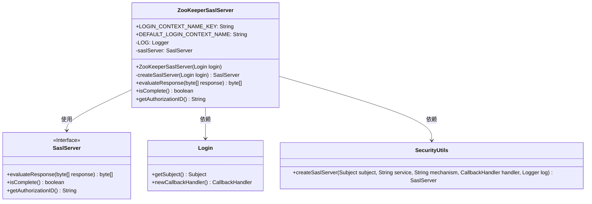
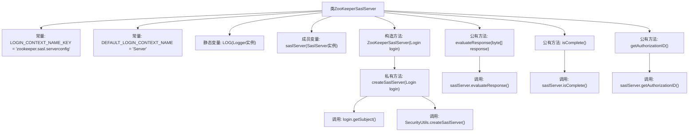

# 基础信息

|      |      |
|------|------|
| 名称 | ZooKeeperSaslServer |
| 编码语言 | .java |
| 代码路径 | zookeeper/zookeeper-server/src/main/java/org/apache/zookeeper/server/ZooKeeperSaslServer.java |
| 包名 | org.apache.zookeeper.server |
| 依赖项 | ['javax.security.auth.Subject', 'javax.security.sasl.SaslException', 'javax.security.sasl.SaslServer', 'org.apache.zookeeper.Login', 'org.apache.zookeeper.util.SecurityUtils', 'org.slf4j.Logger', 'org.slf4j.LoggerFactory'] |
| 概述说明 | ZooKeeperSaslServer类实现SASL服务器功能，包含创建SASL服务器、响应评估及状态检查方法，使用同步机制确保线程安全。 |

# 说明

ZooKeeperSaslServer类实现了基于SASL协议的服务器端认证功能。该类包含两个静态常量：LOGIN_CONTEXT_NAME_KEY用于指定登录上下文名称，DEFAULT_LOGIN_CONTEXT_NAME定义了默认值。核心成员变量saslServer通过createSaslServer方法初始化，该方法在同步块中使用SecurityUtils工具创建SASL服务器实例。类提供了三个关键方法：evaluateResponse处理客户端响应数据，isComplete检查认证是否完成，getAuthorizationID获取授权标识。整个实现围绕SASL认证流程展开，支持zk-sasl-md5机制。

# 类列表 Class Summary

| 名称   | 类型  | 说明 |
|-------|------|-------------|
| ZooKeeperSaslServer | class | ZooKeeperSaslServer类实现SASL服务器认证，包含创建SaslServer、响应评估及状态检查方法，使用Login对象进行安全验证。 |

## 类 ZooKeeperSaslServer

|      |      |
|------|------|
| 访问范围 | public |
| 类型 | class |
| 名称 | ZooKeeperSaslServer |
| 说明 | ZooKeeperSaslServer类实现SASL服务器认证，包含创建SaslServer、响应评估及状态检查方法，使用Login对象进行安全验证。 |

### UML类图

这段代码描述了一个ZooKeeperSASL服务器实现，用于处理SASL认证流程。ZooKeeperSaslServer类封装了SaslServer接口的核心功能，包括响应评估、状态检查和授权ID获取。它通过Login类获取Subject和CallbackHandler，并依赖SecurityUtils工具类创建SaslServer实例。该实现采用线程安全方式创建SASL服务器，适用于ZooKeeper的安全认证场景，支持"zk-sasl-md5"机制。类图清晰地展示了各组件间的依赖关系和使用方式。

### 内部方法调用关系图

这段代码是ZooKeeper的SASL服务器认证实现类，主要功能是通过Kerberos等机制完成服务端认证。流程图展示了类结构、常量定义、关键方法调用链，特别是createSaslServer方法中同步获取Subject对象并通过SecurityUtils创建SASL服务器的过程，以及对外暴露的三个核心方法（响应评估、状态检查和授权ID获取）与底层saslServer实例的调用关系。整个设计采用门面模式，封装了复杂的SASL协议交互细节。

### 字段列表 Field List

| 名称  | 类型  | 说明 |
|-------|-------|------|
| DEFAULT_LOGIN_CONTEXT_NAME = "Server" | String | 定义常量DEFAULT_LOGIN_CONTEXT_NAME，值为"Server"，用于默认登录上下文名称。 |
| LOG = LoggerFactory.getLogger(ZooKeeperSaslServer.class) | Logger | ZooKeeperSaslServer类中定义了一个私有静态日志记录器LOG，用于记录日志信息。 |
| LOGIN_CONTEXT_NAME_KEY = "zookeeper.sasl.serverconfig" | String | 定义常量LOGIN_CONTEXT_NAME_KEY，值为"zookeeper.sasl.serverconfig"，用于ZooKeeper的SASL服务配置。 |
| saslServer | SaslServer | 私有SaslServer对象saslServer。 |

### 方法列表 Method List

| 名称  | 类型  | 说明 |
|-------|-------|------|
| createSaslServer | SaslServer | 创建SaslServer方法，同步处理login，基于subject和zk参数生成安全服务器实例。 |
| evaluateResponse | byte[] | 这是一个Java方法，用于评估SASL认证响应，调用saslServer的evaluateResponse处理响应数据，可能抛出SaslException异常。 |
| isComplete | boolean | 该方法检查SASL服务器认证是否完成，返回布尔值结果。 |
| getAuthorizationID | String | 获取授权ID的方法，返回SASL服务器的授权ID。 |

