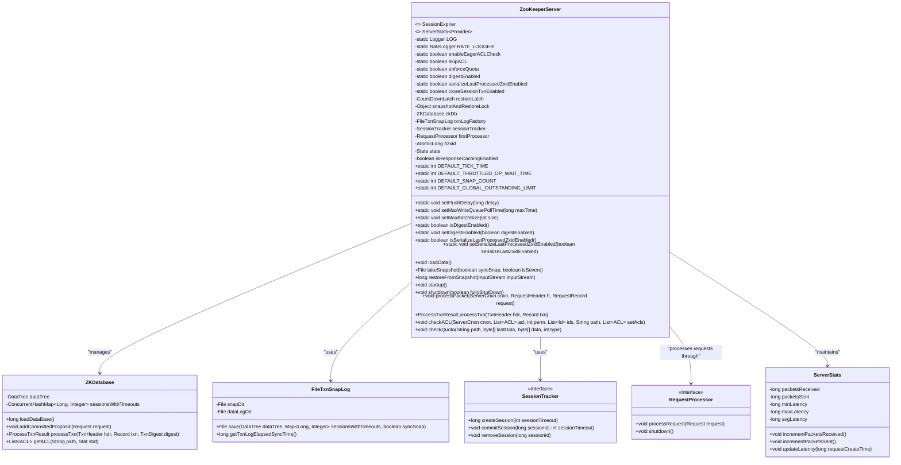
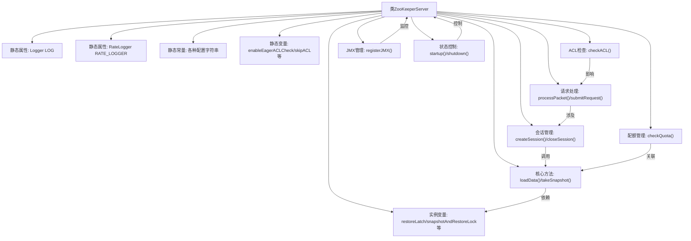

# 基础信息

|      |      |
|------|------|
| 名称 | ZooKeeperServer |
| 编码语言 | .java |
| 代码路径 | zookeeper/zookeeper-server/src/main/java/org/apache/zookeeper/server/ZooKeeperServer.java |
| 包名 | org.apache.zookeeper.server |
| 依赖项 | ['edu.umd.cs.findbugs.annotations.SuppressFBWarnings', 'java.io.BufferedInputStream', 'java.io.ByteArrayOutputStream', 'java.io.File', 'java.io.IOException', 'java.io.InputStream', 'java.io.PrintWriter', 'java.nio.ByteBuffer', 'java.util.ArrayDeque', 'java.util.ArrayList', 'java.util.Arrays', 'java.util.Deque', 'java.util.HashMap', 'java.util.List', 'java.util.Map', 'java.util.Properties', 'java.util.Random', 'java.util.Set', 'java.util.concurrent.CountDownLatch', 'java.util.concurrent.atomic.AtomicInteger', 'java.util.concurrent.atomic.AtomicLong', 'java.util.function.BiConsumer', 'java.util.zip.Adler32', 'java.util.zip.CheckedInputStream', 'javax.security.sasl.SaslException', 'org.apache.jute.BinaryInputArchive', 'org.apache.jute.BinaryOutputArchive', 'org.apache.jute.InputArchive', 'org.apache.jute.Record', 'org.apache.zookeeper.Environment', 'org.apache.zookeeper.KeeperException', 'org.apache.zookeeper.KeeperException.Code', 'org.apache.zookeeper.KeeperException.SessionExpiredException', 'org.apache.zookeeper.Quotas', 'org.apache.zookeeper.StatsTrack', 'org.apache.zookeeper.Version', 'org.apache.zookeeper.ZooDefs', 'org.apache.zookeeper.ZooDefs.OpCode', 'org.apache.zookeeper.ZookeeperBanner', 'org.apache.zookeeper.common.PathUtils', 'org.apache.zookeeper.common.StringUtils', 'org.apache.zookeeper.common.Time', 'org.apache.zookeeper.data.ACL', 'org.apache.zookeeper.data.Id', 'org.apache.zookeeper.data.StatPersisted', 'org.apache.zookeeper.jmx.MBeanRegistry', 'org.apache.zookeeper.metrics.MetricsContext', 'org.apache.zookeeper.proto.AuthPacket', 'org.apache.zookeeper.proto.ConnectRequest', 'org.apache.zookeeper.proto.ConnectResponse', 'org.apache.zookeeper.proto.CreateRequest', 'org.apache.zookeeper.proto.DeleteRequest', 'org.apache.zookeeper.proto.GetSASLRequest', 'org.apache.zookeeper.proto.ReplyHeader', 'org.apache.zookeeper.proto.RequestHeader', 'org.apache.zookeeper.proto.SetACLRequest', 'org.apache.zookeeper.proto.SetDataRequest', 'org.apache.zookeeper.proto.SetSASLResponse', 'org.apache.zookeeper.server.DataTree.ProcessTxnResult', 'org.apache.zookeeper.server.RequestProcessor.RequestProcessorException', 'org.apache.zookeeper.server.ServerCnxn.CloseRequestException', 'org.apache.zookeeper.server.SessionTracker.Session', 'org.apache.zookeeper.server.SessionTracker.SessionExpirer', 'org.apache.zookeeper.server.auth.ProviderRegistry', 'org.apache.zookeeper.server.auth.ServerAuthenticationProvider', 'org.apache.zookeeper.server.persistence.FileTxnSnapLog', 'org.apache.zookeeper.server.quorum.QuorumPeerConfig', 'org.apache.zookeeper.server.quorum.ReadOnlyZooKeeperServer', 'org.apache.zookeeper.server.util.JvmPauseMonitor', 'org.apache.zookeeper.server.util.OSMXBean', 'org.apache.zookeeper.server.util.QuotaMetricsUtils', 'org.apache.zookeeper.server.util.RequestPathMetricsCollector', 'org.apache.zookeeper.txn.CreateSessionTxn', 'org.apache.zookeeper.txn.TxnDigest', 'org.apache.zookeeper.txn.TxnHeader', 'org.apache.zookeeper.util.ServiceUtils', 'org.slf4j.Logger', 'org.slf4j.LoggerFactory'] |
| 概述说明 | ZooKeeperServer是ZooKeeper核心服务类，负责会话管理、请求处理、ACL检查、配额控制等核心功能。支持动态配置、JMX监控、快照恢复，内置多种请求处理器链。关键特性包括：会话追踪、事务处理、请求限流、SASL认证、数据树维护。 |

# 说明

ZooKeeperServer是ZooKeeper的核心服务实现类，主要功能包括会话管理、请求处理、数据存储和ACL校验等。关键特性如下：

1. 会话管理：通过SessionTracker跟踪客户端会话，处理创建、续期和过期逻辑，支持本地和全局会话。

2. 请求处理：使用多级处理器链（PrepRequestProcessor、SyncRequestProcessor、FinalRequestProcessor）处理客户端请求，支持读写分离和事务日志记录。

3. 数据存储：基于ZKDatabase管理数据树和快照，提供数据恢复、事务处理和配额检查功能。

4. 安全控制：实现ACL校验机制，支持多种认证方案（SASL/Digest），提供超级用户权限和连接限流。

5. 状态管理：维护服务器运行状态（INITIAL/RUNNING/SHUTDOWN/ERROR），支持优雅停机。

6. 监控指标：集成JMX和Metrics，暴露性能指标、连接数和存储统计等信息。

7. 配置参数：支持动态调整tickTime、会话超时、限流阈值等运行时参数。

8. 扩展性：提供插件式认证提供者接口，支持自定义安全方案。

该类通过FileTxnSnapLog实现数据持久化，采用原子操作保证一致性，是ZooKeeper协调服务的核心实现。

# 类列表 Class Summary

| 名称   | 类型  | 说明 |
|-------|------|-------------|
| ZooKeeperServer | class | ZooKeeperServer是ZooKeeper核心服务类，负责会话管理、请求处理、ACL校验、配额控制等功能。支持快照恢复、JMX监控、SASL认证，内置多种配置参数如tickTime、sessionTimeout等。通过RequestProcessor链处理请求，维护数据一致性和高可用性。 |

## 类 ZooKeeperServer

|      |      |
|------|------|
| 访问范围 | public |
| 类型 | class |
| 名称 | ZooKeeperServer |
| 说明 | ZooKeeperServer是ZooKeeper核心服务类，负责会话管理、请求处理、ACL校验、配额控制等功能。支持快照恢复、JMX监控、SASL认证，内置多种配置参数如tickTime、sessionTimeout等。通过RequestProcessor链处理请求，维护数据一致性和高可用性。 |

### UML类图

这段代码是Apache ZooKeeper服务器的核心实现类ZooKeeperServer，它负责处理客户端连接、会话管理、请求处理、事务日志和快照等核心功能。类图展示了其主要组件和关系：ZKDatabase管理内存数据树和会话，FileTxnSnapLog处理事务日志和快照持久化，SessionTracker跟踪会话状态，RequestProcessor处理请求管道，ServerStats维护服务器统计信息。ZooKeeperServer通过状态机管理服务器生命周期（INITIAL/RUNNING/SHUTDOWN/ERROR），实现了ACL检查、配额控制、请求节流等关键功能，并支持JMX监控和指标收集。

### 内部方法调用关系图

这段代码是ZooKeeper服务器的核心实现类，主要功能包括：1) 数据存储管理（通过ZKDatabase和FileTxnSnapLog）；2) 会话生命周期管理（创建/关闭/过期处理）；3) 请求处理流水线（Prep-Sync-Final处理器链）；4) ACL权限控制和配额管理；5) 集群状态监控和JMX管理。代码通过原子变量和同步锁保证线程安全，采用分层架构设计，各模块通过清晰接口交互，同时处理大量边缘情况如大请求限流、连接数控制等。

### 字段列表 Field List

| 名称  | 类型  | 说明 |
|-------|-------|------|
| localSessionEnabled = false | boolean | 本地会话功能已禁用。 |
| zkDb | ZKDatabase | 私有变量zkDb，类型为ZKDatabase。 |
| FLUSH_DELAY = "zookeeper.flushDelay" | String | 私有静态常量字符串FLUSH_DELAY，值为"zookeeper.flushDelay"。 |
| listener | ZooKeeperServerListener | 私有ZooKeeper服务器监听器实例。 |
| digestEnabled | boolean | 私有静态布尔变量digestEnabled，用于控制摘要功能是否启用。 |
| readResponseCache | ResponseCache | 私有响应缓存读取实例。 |
| SNAP_COUNT = "zookeeper.snapCount" | String | ZooKeeper配置项，定义事务日志快照阈值。 |
| authHelper = new AuthenticationHelper() | AuthenticationHelper | 私有认证助手实例化，用于处理认证相关操作。 |
| secureServerCnxnFactory | ServerCnxnFactory | 声明一个受保护的ServerCnxnFactory类型变量secureServerCnxnFactory。 |
| currentLargeRequestBytes = new AtomicInteger(0) | AtomicInteger | 私有原子整型变量currentLargeRequestBytes，初始值为0，用于线程安全地记录当前大请求字节数。 |
| serverCnxnFactory | ServerCnxnFactory | 保护类型的ServerCnxnFactory实例变量serverCnxnFactory。 |
| zkShutdownHandler | ZooKeeperServerShutdownHandler | 私有ZooKeeper服务器关闭处理器变量zkShutdownHandler。 |
| largeRequestThreshold = -1 | int | 私有可变整型变量largeRequestThreshold，初始值为-1。 |
| flushDelay | long | 私有静态可变长整型变量flushDelay，用于控制延迟刷新时间。 |
| outstandingChangesForPath = new HashMap<>() | Map<String, ChangeRecord> | 创建名为outstandingChangesForPath的HashMap，键为String类型，值为ChangeRecord类型。 |
| SASL_SUPER_USER = "zookeeper.superUser" | String | SASL认证的超级用户配置项，键名为zookeeper.superUser。 |
| enforceQuota | boolean | 静态常量布尔值，用于强制配额控制。 |
| listenBacklog = -1 | int | 声明一个受保护的整型变量listenBacklog，初始值为-1。 |
| largeRequestMaxBytes = 100 * 1024 * 1024 | int | 私有可变整型变量largeRequestMaxBytes，默认值100MB。 |
| outstandingChanges = new ArrayDeque<>() | Deque<ChangeRecord> | 声明一个最终变量outstandingChanges，使用ArrayDeque存储ChangeRecord对象。 |
| maxSessionTimeout = -1 | int | 受保护的整型变量maxSessionTimeout，默认值为-1。 |
| skipACL | boolean | 静态常量布尔值skipACL，用于控制是否跳过ACL检查。 |
| ALLOW_SASL_FAILED_CLIENTS = "zookeeper.allowSaslFailedClients" | String | 这是一个Java静态常量，定义ZooKeeper配置项"zookeeper.allowSaslFailedClients"，用于控制是否允许SASL认证失败的客户端连接。 |
| minSessionTimeout = -1 | int | 受保护的整型变量minSessionTimeout，默认值为-1。 |
| sessionTracker | SessionTracker | 声明一个受保护的SessionTracker类型变量sessionTracker。 |
| enableEagerACLCheck | boolean | 静态布尔变量enableEagerACLCheck，用于控制是否启用快速ACL检查。 |
| throttledOpWaitTime =        Integer.getInteger("zookeeper.throttled_op_wait_time", DEFAULT_THROTTLED_OP_WAIT_TIME) | int | 定义受保护的静态可变整型变量throttledOpWaitTime，默认值为DEFAULT_THROTTLED_OP_WAIT_TIME，可通过系统属性zookeeper.throttled_op_wait_time覆盖。 |
| GET_CHILDREN_RESPONSE_CACHE_SIZE = "zookeeper.maxGetChildrenResponseCacheSize" | String | ZooKeeper配置参数，用于设置获取子节点响应缓存的最大大小。 |
| DEFAULT_GLOBAL_OUTSTANDING_LIMIT = 1000 | int | 私有静态常量，默认全局限制值为1000。 |
| GET_DATA_RESPONSE_CACHE_SIZE = "zookeeper.maxResponseCacheSize" | String | 该代码定义了一个静态常量，用于配置ZooKeeper的最大响应缓存大小。 |
| DEFAULT_THROTTLED_OP_WAIT_TIME = 0 | int | 静态常量DEFAULT_THROTTLED_OP_WAIT_TIME默认值为0，表示限流操作等待时间。 |
| superSecret = 0XB3415C00L | long | 私有静态长整型常量superSecret，值为十六进制0XB3415C00L。 |
| ENFORCE_QUOTA = "zookeeper.enforceQuota" | String | 这是一个Java静态常量定义，表示ZooKeeper的配额强制执行配置项。 |
| DEFAULT_SNAP_COUNT = 100000 | int | 私有静态常量DEFAULT_SNAP_COUNT默认值为100000。 |
| SKIP_ACL = "zookeeper.skipACL" | String | ZK配置项：跳过ACL检查的参数名为"zookeeper.skipACL"。 |
| tickTime = DEFAULT_TICK_TIME | int | 保护整型变量tickTime，默认值为DEFAULT_TICK_TIME。 |
| connThrottle = new BlueThrottle() | BlueThrottle | 私有终态BlueThrottle连接限流器实例化。 |
| ENABLE_EAGER_ACL_CHECK = "zookeeper.enableEagerACLCheck" | String | ZooKeeper配置参数，用于启用急切ACL检查，控制访问权限验证时机。 |
| INT_BUFFER_STARTING_SIZE_BYTES = "zookeeper.intBufferStartingSizeBytes" | String | ZooKeeper配置参数：初始整型缓冲区大小（字节），键为"zookeeper.intBufferStartingSizeBytes"。 |
| jmxDataTreeBean | DataTreeBean | 声明一个受保护的DataTreeBean类型变量jmxDataTreeBean。 |
| jmxServerBean | ZooKeeperServerBean | 保护类型的ZooKeeper JMX服务Bean变量。 |
| maxBatchSize | int | 私有静态可变整型变量maxBatchSize |
| initialConfig | String | 声明了一个受保护的字符串变量initialConfig。 |
| GLOBAL_OUTSTANDING_LIMIT = "zookeeper.globalOutstandingLimit" | String | ZooKeeper配置参数，用于设置全局请求队列的最大限制。 |
| RATE_LOGGER | RateLogger | 私有静态常量RATE_LOGGER，类型为RateLogger。 |
| txnLogFactory = null | FileTxnSnapLog | 私有文件事务日志工厂实例未初始化。 |
| snapshotAndRestoreLock = new Object() | Object | 私有对象锁用于快照与恢复操作的同步控制。 |
| MAX_BATCH_SIZE = "zookeeper.maxBatchSize" | String | 私有静态常量MAX_BATCH_SIZE，值为"zookeeper.maxBatchSize"。 |
| requestsInProcess = new AtomicInteger(0) | AtomicInteger | 私有原子整型变量requestsInProcess，初始值为0，用于线程安全计数。 |
| intBufferStartingSizeBytes | int | 静态常量整型缓冲区初始大小（字节）。 |
| isResponseCachingEnabled = true | boolean | 启用响应缓存功能。 |
| DEFAULT_TICK_TIME = 3000 | int | 静态常量DEFAULT_TICK_TIME默认值为3000。 |
| restoreLatch | CountDownLatch | 私有易变CountDownLatch恢复锁 |
| requestThrottler | RequestThrottler | 代码中通过注解忽略同步警告，说明内部使用阻塞队列确保线程安全。 |
| maxWriteQueuePollTime | long | 私有静态易变长整型变量，记录最大写入队列轮询时间。 |
| LOG | Logger | 声明一个受保护的静态常量日志记录器LOG。 |
| closeSessionTxnEnabled = true | boolean | 私有静态布尔变量closeSessionTxnEnabled，默认值为true。 |
| jvmPauseMonitor | JvmPauseMonitor | 保护类型的JvmPauseMonitor实例变量。 |
| firstProcessor | RequestProcessor | 保护成员firstProcessor，类型为RequestProcessor。 |
| ok = new Exception("No prob") | Exception | 定义静态常量异常ok，表示无问题，值为"No prob"。 |
| createSessionTrackerServerId = 1 | int | 私有可变整型变量，初始值为1，用于会话跟踪服务器ID。 |
| hzxid = new AtomicLong(0) | AtomicLong | 私有原子长整型变量hzxid，初始值为0。 |
| serializeLastProcessedZxidEnabled | boolean | 私有静态布尔变量，控制是否启用序列化最后处理的Zxid功能。 |
| ZOOKEEPER_SERIALIZE_LAST_PROCESSED_ZXID_ENABLED = "zookeeper.serializeLastProcessedZxid.enabled" | String | ZooKeeper配置项，控制是否序列化最后处理的ZXID。 |
| state = State.INITIAL | State | 声明一个受保护的易变状态变量，初始值为INITIAL。 |
| getChildrenResponseCache | ResponseCache | 获取子节点响应缓存的方法。 |
| serverStats | ServerStats | 私有不可变的服务器统计对象。 |
| CLOSE_SESSION_TXN_ENABLED = "zookeeper.closeSessionTxn.enabled" | String | 配置项控制ZooKeeper关闭会话时是否生成事务，默认值未提及。 |
| ZOOKEEPER_DIGEST_ENABLED = "zookeeper.digest.enabled" | String | ZOOKEEPER_DIGEST_ENABLED是ZooKeeper的静态常量字符串，用于标识是否启用摘要认证。 |
| MAX_WRITE_QUEUE_POLL_SIZE = "zookeeper.maxWriteQueuePollTime" | String | 私有静态常量MAX_WRITE_QUEUE_POLL_SIZE定义ZooKeeper写队列最大轮询时间配置键。 |
| DEFAULT_STARTING_BUFFER_SIZE = 1024 | int | 静态常量DEFAULT_STARTING_BUFFER_SIZE，默认初始缓冲区大小为1024。 |
| requestPathMetricsCollector | RequestPathMetricsCollector | 私有终态请求路径指标收集器实例。 |
| reconfigEnabled | boolean | 保护类型布尔变量reconfigEnabled，用于控制重新配置功能是否启用。 |

### 方法列表 Method List

| 名称  | 类型  | 说明 |
|-------|-------|------|
| getClientPort | int | 获取客户端端口方法：若服务连接工厂存在则返回本地端口，否则返回-1。 |
| getClientPortListenBacklog | int | 方法返回监听端口连接请求的积压队列长度。 |
| getServerId | long | 方法getServerId返回固定值0，无参数。 |
| getLargeRequestMaxBytes | int | 方法返回largeRequestMaxBytes的值。 |
| getTickTime | int | 获取tickTime的整数值方法。 |
| getOutstandingRequests | long | 方法getOutstandingRequests返回当前处理中的请求数量，直接调用getInProcess()获取结果。 |
| requestThrottleInflight | int | 检查请求限流器是否存在，存在则返回当前处理中的请求数，否则返回0。 |
| shutdown | void | 关闭当前操作，不强制终止。 |
| getInflight | int | 方法getInflight返回requestThrottleInflight()的整数值，用于获取当前请求的飞行中数量。 |
| getState | String | 方法返回字符串"standalone"，表示当前状态为独立运行模式。 |
| startdata | void | 方法startdata检查zkDb是否为空，若空则初始化；未初始化则调用loadData加载数据。可能抛出IO或中断异常。 |
| setTxnLogFactory | void | 方法setTxnLogFactory用于设置事务日志工厂，参数为FileTxnSnapLog类型。 |
| getSnapSizeInBytes | long | 获取ZooKeeper快照大小限制，默认4GB，若设为非正值则禁用功能，返回字节单位值。 |
| isRunning | boolean | 检查当前状态是否为运行中。 |
| isDigestEnabled | boolean | 这是一个静态方法，用于返回布尔值digestEnabled的状态，判断摘要功能是否启用。 |
| updateQuotaExceededMetrics | void | 静态方法updateQuotaExceededMetrics检查命名空间非空后，在ServerMetrics中记录该命名空间的配额超限错误计数加1。 |
| startSessionTracker | void | 启动会话跟踪器，调用sessionTracker的start方法。 |
| getZooKeeperServerListener | ZooKeeperServerListener | 获取ZooKeeper服务器监听器的方法，返回listener对象。 |
| getConnectionDropChance | double | 该方法返回连接被丢弃的概率，数值来源于connThrottle对象的dropChance属性。 |
| initLargeRequestThrottlingSettings | void | 初始化大请求限流设置：读取系统属性配置大请求最大字节数和阈值，未配置则使用默认值或-1。 |
| getInitialConfig | String | 这是一个Java方法，返回字符串类型的初始配置值。方法名为getInitialConfig，无参数，直接返回成员变量initialConfig。 |
| getReadResponseCache | ResponseCache | 该方法返回读取响应缓存，若启用缓存则返回缓存对象，否则返回null。 |
| takeSnapshot | File | 方法takeSnapshot用于创建同步或异步快照。若发生严重IO异常则退出系统，否则抛出异常。记录快照耗时并返回快照文件。 |
| setupRequestProcessors | void | 创建请求处理器链：FinalRequestProcessor作为最终处理器，SyncRequestProcessor同步处理并启动，PrepRequestProcessor作为首个处理器启动。 |
| setClientPortListenBacklog | void | 方法setClientPortListenBacklog设置监听队列长度，更新listenBacklog值并记录日志。 |
| getSessionExpiryMap | Map<Long, Set<Long>> | 获取会话过期时间映射表，返回键为长整型、值为长整型集合的Map。 |
| truncateLog | void | 方法truncateLog截断日志至指定zxid，可能抛出IO异常。 |
| getZKDatabase | ZKDatabase | 获取当前ZKDatabase实例的方法，直接返回内部zkDb对象。 |
| getLastProcessedZxid | long | 获取最后处理的Zxid值，调用zkDb的getDataTreeLastProcessedZxid方法返回长整型结果。 |
| closeSession | void | 关闭指定会话ID的服务器连接。 |
| serverStats | ServerStats | 公开方法返回服务器状态对象。 |
| getGlobalOutstandingLimit | int | 获取全局限额值，默认返回DEFAULT_GLOBAL_OUTSTANDING_LIMIT。 |
| isEnableEagerACLCheck | boolean | 该代码定义了一个静态方法isEnableEagerACLCheck，返回布尔值enableEagerACLCheck的状态。 |
| getMaxBatchSize | int | 获取最大批处理大小的方法，返回变量maxBatchSize的值。 |
| getSecureClientPort | int | 获取安全客户端端口，若存在安全服务连接工厂则返回其本地端口，否则返回-1。 |
| getSnapCount | int | 静态方法getSnapCount获取snapCount值，若小于2则重置为2并警告，确保符合SyncRequestProcessor要求。 |
| setLargeRequestThreshold | void | 设置大请求阈值方法：参数为0或小于-1时设为-1并警告，否则设为参数值并记录日志。 |
| getFlushDelay | long | 获取flushDelay值的函数。 |
| checkQuota | void | 检查配额方法，验证字节和计数是否超限，硬限制超限抛出异常并更新指标。 |
| dumpMonitorValues | void | 方法dumpMonitorValues接收一个BiConsumer参数，用于输出服务器版本和状态信息。 |
| setState | void | 方法setState更新状态并通知注册的关闭处理器。若无处理器则记录调试信息。 |
| removeCnxn | void | 删除指定服务器连接的内部方法，调用zkDb对象移除对应连接。 |
| getLargeRequestThreshold | int | 该方法返回整型变量largeRequestThreshold的值。 |
| submitRequestNow | void | 方法submitRequestNow处理请求：检查处理器链状态，验证请求类型，有效则处理并更新计数，无效或异常则记录并结束请求。 |
| unregisterMetrics | void | 该方法用于注销所有注册的监控指标，包括延迟、连接数、会话数、文件描述符、配额等各类系统性能数据。 |
| startup | void | 启动服务时检查会话跟踪器，创建并启动它，初始化请求处理器和限流器，注册JMX和指标，启动JVM暂停监控，设置运行状态，启动请求路径指标收集器，检查本地会话状态并通知所有等待线程。 |
| setLargeRequestMaxBytes | void | 该方法设置大请求最大字节数。若输入值非正，警告并保持原值；否则更新并记录新值。 |
| getDirSize | long | 递归计算文件或目录大小，目录则遍历子文件累加，文件直接返回长度。 |
| registerMetrics | void | 注册监控指标，包括延迟、连接数、数据节点、会话数、文件描述符、响应大小、认证失败及配额限制等。 |
| startJvmPauseMonitor | void | 启动JVM暂停监控服务，若监控器存在则调用其启动方法。 |
| shouldForceWriteInitialSnapshotAfterLeaderElection | boolean | 方法判断选举后是否强制写入初始快照，调用事务日志工厂的对应方法返回结果。 |
| createSessionTracker | void | 创建会话跟踪器，初始化SessionTrackerImpl实例，传入当前对象、会话超时配置、时间单位及监听器。 |
| isSaslSuperUser | boolean | 检查ID是否为SASL超级用户：若ID为空返回false，否则遍历系统属性，匹配SASL_SUPER_USER前缀的属性值，若与ID一致则返回true，否则false。 |
| shutdown | void | 同步方法shutdown根据参数fullyShutDown决定关闭行为：若可关闭，先关闭组件，非完全关闭时快速更新数据库（出错则强制完全关闭），最后设置状态；若不可关闭则记录日志。完全关闭时清空数据库。 |
| getMaxSessionTimeout | int | 获取最大会话超时时间的方法，返回整型变量maxSessionTimeout的值。 |
| reopenSession | void | 方法reopenSession验证会话密码，正确则重新验证会话，否则记录警告并结束初始化。 |
| setMaxBatchSize | void | 静态方法setMaxBatchSize设置最大批处理大小为指定值，并记录日志。 |
| setLocalSessionFlag | void | 方法setLocalSessionFlag接收Request参数si，无具体实现。 |
| setResponseCachingEnabled | void | 设置响应缓存启用状态的方法，通过布尔参数控制。 |
| getGetChildrenResponseCache | ResponseCache | 该方法返回子节点缓存的响应数据。若启用缓存则返回缓存对象，否则返回null。 |
| setMaxSessionTimeout | void | 设置最大会话超时时间。若输入为-1，则设为tickTime的20倍，否则设为输入值。记录日志显示最终值。 |
| takeSnapshot | File | 方法takeSnapshot接收布尔参数syncSnap，可能同步生成快照，调用重载方法并抛出IOException。 |
| finishSessionInit | void | 方法finishSessionInit处理会话初始化：验证连接有效性后注册JMX，发送连接响应，成功则启用接收，失败则关闭连接。异常时记录日志并终止。 |
| setFlushDelay | void | 静态方法setFlushDelay设置延迟时间，记录日志并更新变量flushDelay。 |
| startRequestThrottler | void | 启动请求限流器，创建并开始执行限流功能。 |
| getMaxWriteQueuePollTime | long | 方法getMaxWriteQueuePollTime返回maxWriteQueuePollTime的值。 |
| setCreateSessionTrackerServerId | void | 方法setCreateSessionTrackerServerId用于设置createSessionTrackerServerId的值为参数newId。 |
| createSession | long | 
创建会话方法：检查密码为空则初始化，生成会话ID并用随机数加密密码，提交创建会话请求后返回会话ID。 |
| shutdownComponents | void | 关闭组件方法：注销指标，停用请求限流器、会话跟踪器、首处理器和JVM暂停监控，最后关闭请求路径指标收集器并注销JMX。 |
| setZKDatabase | void | 这是一个Java方法，用于设置ZKDatabase对象实例。方法名为setZKDatabase，接受一个ZKDatabase类型参数zkDb，并将其赋值给当前对象的zkDb成员变量。 |
| getEphemerals | Map<Long, Set<String>> | 该方法返回一个映射，键为长整型，值为字符串集合，内容来自zkDb的临时节点数据。 |
| submitRequest | void | 方法submitRequest在恢复操作期间阻塞请求提交，等待恢复完成后将请求加入队列。若被中断则记录警告。 |
| checkPasswd | boolean | 检查密码有效性：当会话ID非零且密码与生成的密码匹配时返回真。 |
| setTickTime | void | 方法setTickTime用于设置tickTime值，记录日志并更新成员变量。 |
| getNumAliveConnections | int | 获取当前活跃连接数，包括普通和安全连接工厂的统计总和。 |
| revalidateSession | void | 方法revalidateSession验证会话有效性，调用sessionTracker.touchSession检查会话，记录日志后调用finishSessionInit完成初始化。 |
| shouldAllowSaslFailedClientsConnect | boolean | 检查系统属性ALLOW_SASL_FAILED_CLIENTS是否为true，决定是否允许SASL验证失败的客户端连接。 |
| restoreFromSnapshot | long | 方法从输入流恢复数据库快照，校验数据后创建新数据库实例，替换旧库并重建会话跟踪器，记录耗时和关键指标如节点数、会话数及最后处理的事务ID。 |
| setServerCnxnFactory | void | 设置服务器连接工厂方法，将输入参数赋值给内部变量serverCnxnFactory。 |
| processTxnInDB | ProcessTxnResult | 处理数据库事务的方法：若事务头为空则返回空结果，否则调用ZKDatabase处理事务并返回结果。 |
| processTxnForSessionEvents | void | 处理会话事件的交易方法：根据请求或头获取操作码和会话ID。创建会话时提交超时，关闭会话时移除。异常情况记录日志。 |
| getConf | ZooKeeperServerConf | 获取ZooKeeper服务器配置，包括端口、快照和数据日志路径、超时设置、连接限制及服务器ID等参数。 |
| isResponseCachingEnabled | boolean | 该方法返回响应缓存是否启用的布尔值。 |
| setMinSessionTimeout | void | 设置最小会话超时时间，若参数为-1则默认两倍tickTime，否则使用给定值，并记录日志。 |
| takeSnapshot | File | 公开方法takeSnapshot，无参，可能抛出IOException，内部调用带布尔参数的版本。 |
| touch | void | 方法touch检查服务器连接会话，若会话ID或超时无效则抛出异常。 |
| close | void | 关闭指定会话ID的会话，通过提交关闭请求实现。 |
| createRequestThrottler | RequestThrottler | 创建一个请求限流器实例，返回当前对象的限流器。 |
| expire | void | 强制终止指定会话ID的会话并记录日志。 |
| getLogDirSize | long | 重写getLogDirSize方法：检查zkDb为空返回0，否则获取数据日志目录并返回其大小。 |
| setMaxWriteQueuePollTime | void | 静态方法设置最大写入队列轮询时间为指定毫秒值，并记录日志。 |
| processTxn | ProcessTxnResult | 处理事务请求，区分读写和仲裁请求。写请求同步处理并更新变更记录，仲裁请求提交提案。非写非仲裁请求直接返回。 |
| dumpConf | void | 方法dumpConf将配置信息输出到PrintWriter，包括端口、目录路径、大小、超时设置及服务器ID等关键参数。 |
| setOwner | void | 方法setOwner用于设置所有者，参数为长整型id和对象owner，可能抛出SessionExpiredException异常。调用sessionTracker的setOwner方法实现功能。 |
| registerServerShutdownHandler | void | 注册ZooKeeper服务器关闭处理程序，用于处理关闭事件。 |
| getDataDirSize | long | 该方法检查zkDb是否为空，若为空返回0，否则获取其快照目录并返回目录大小。 |
| loadData | void | 方法loadData在领导者启动时调用，避免重复初始化数据库以减少开销。检查数据库是否已初始化，若已初始化则设置zxid，否则加载数据库。清理无效会话并生成快照。 |
| checkACL | void | 检查ACL权限：跳过ACL则返回；验证客户端ID和权限，超级用户或匹配权限则通过，否则抛出无权限异常。 |
| enqueueRequest | void | 方法enqueueRequest处理请求入队：若requestThrottler未初始化，同步等待状态变为RUNNING；若仍为空则抛出异常，否则提交请求。中断时记录警告。 |
| validateSession | void | 验证会话方法，空实现，无操作。 |
| expire | void | 该方法用于终止超时会话，记录会话ID和超时时间后关闭会话。 |
| processTxn | ProcessTxnResult | 处理事务方法，先处理会话事件，再处理数据库事务。 |
| dumpEphemerals | void | 方法dumpEphemerals将临时节点数据通过PrintWriter输出，调用zkDb的dumpEphemerals实现。 |
| setSecureServerCnxnFactory | void | 该方法用于设置安全服务器的连接工厂实例，将传入的factory参数赋值给secureServerCnxnFactory变量。 |
| checkRequestSizeWhenMessageReceived | boolean | 检查请求大小，若超过限制则拒绝并抛出异常，否则通过。 |
| getSecureServerCnxnFactory | ServerCnxnFactory | 获取安全服务器连接工厂实例的方法，直接返回私有成员变量secureServerCnxnFactory。 |
| connThrottle | BlueThrottle | 公开方法`connThrottle()`返回类型为`BlueThrottle`的成员变量`connThrottle`。 |
| decInProcess | void | 方法decInProcess减少处理中请求数，若存在限流器则唤醒它。 |
| generatePasswd | byte[] | 生成16字节随机密码，基于ID与密钥异或的随机种子。 |
| unregisterJMX | void | 方法unregisterJMX用于从JMX注销两个Bean，处理异常并置空引用。 |
| getThrottledOpWaitTime | int | 获取限流操作等待时间的方法，返回整型变量throttledOpWaitTime的值。 |
| closeSession | void | 关闭指定会话ID的会话，立即执行不等待，并记录日志。 |
| getTxnLogElapsedSyncTime | long | 获取事务日志同步耗时的方法，调用txnLogFactory返回同步时间。 |
| getInProcess | int | 该方法返回当前处理中的请求数量，使用原子变量确保线程安全。 |
| shouldThrottle | boolean | 方法检查是否应限制请求：若全局限制小于当前处理中或待处理请求数，且待处理数大于0则返回真，否则返回假。 |
| getServerCnxnFactory | ServerCnxnFactory | 获取服务器连接工厂实例的方法，返回当前serverCnxnFactory对象。 |
| getMinSessionTimeout | int | 方法返回最小会话超时时间。 |
| registerJMX | void | 该方法注册ZooKeeper的JMX监控，先注册ServerBean，再尝试注册DataTreeBean。失败时记录警告并置空对应Bean。 |
| requestFinished | void | 方法requestFinished处理请求完成事件：若请求的largeRequestSize不为-1，则从currentLargeRequestBytes中减去该值。 |
| getTxnLogFactory | FileTxnSnapLog | 该方法返回当前对象的`txnLogFactory`属性，类型为`FileTxnSnapLog`。 |
| setCloseSessionTxnEnabled | void | 静态方法setCloseSessionTxnEnabled用于设置ZooKeeperServer的closeSessionTxnEnabled属性值，并记录日志。 |
| killSession | void | 该方法用于终止指定会话：调用zkDb.killSession结束会话，记录日志（若启用跟踪），并从sessionTracker移除会话ID。 |
| checkRequestSizeWhenReceivingMessage | boolean | 检查请求大小，若未超限返回true，超限则记录指标并抛出异常。 |
| processConnectRequest | void | 处理客户端连接请求，包括会话验证、限流检查、只读模式判断和会话超时设置。新会话创建或现有会话续期，失败时抛出异常。 |
| setZxid | void | 设置ZXID的方法，通过hzxid对象更新zxid值。 |
| setThrottledOpWaitTime | void | 设置限流操作等待时间的方法，记录日志并更新等待时间。 |
| isCloseSessionTxnEnabled | boolean | 这是一个静态方法，用于检查会话关闭事务是否启用，返回布尔值closeSessionTxnEnabled。 |
| isLargeRequest | boolean | 检查请求长度是否超过阈值。若阈值为-1则直接返回false，否则比较长度与阈值。 |
| getRequestPathMetricsCollector | RequestPathMetricsCollector | 获取请求路径指标收集器的方法，返回requestPathMetricsCollector实例。 |
| getNextZxid | long | 方法getNextZxid通过原子类hzxid递增并返回下一个zxid值。 |
| incInProcess | void | 该方法用于增加正在处理的请求计数，通过原子操作递增requestsInProcess变量。 |
| setEnableEagerACLCheck | void | 静态方法setEnableEagerACLCheck用于设置ZooKeeperServer的enableEagerACLCheck标志，并记录日志。参数enabled控制标志状态。 |
| getMaxClientCnxnsPerHost | int | 获取每个主机的最大客户端连接数，优先检查普通连接工厂，其次检查安全连接工厂，均不存在则返回-1。 |
| processSasl | void | 处理客户端SASL认证请求，验证令牌并返回响应。成功时添加授权信息，失败则关闭连接或允许继续（根据配置）。记录日志并发送响应。 |
| getLargeRequestBytes | int | 该方法返回当前大请求字节数的整型值。 |
| processPacket | void | 处理服务器请求，先检查请求限制，再根据请求类型处理：认证请求验证后返回结果，SASL请求调用特定处理，其他请求提交前检查认证和大请求限制。 |
| getSessionTracker | SessionTracker | 获取sessionTracker对象的方法。 |
| canShutdown | boolean | 方法canShutdown检查状态是否为RUNNING或ERROR，返回布尔值。 |
| getZxid | long | 获取当前ZXID值，返回长整型数据。 |
| checkQuota | void | 检查ZooKeeper配额的方法，根据操作类型（创建或更新）计算数据大小变化，若超出配额则抛出异常。 |
| setDigestEnabled | void | 设置ZooKeeper摘要功能开关，更新digestEnabled状态并记录日志。 |
| isSerializeLastProcessedZxidEnabled | boolean | 检查是否启用了序列化最后处理的Zxid功能。 |
| setSerializeLastProcessedZxidEnabled | void | 设置序列化最后处理ZXID功能开关，并记录日志。 |
| parentPath | String | 获取路径的父路径，若路径无效（无斜杠、含空字符或特殊路径）则抛出异常。根路径返回"/"。 |
| effectiveACLPath | String | 方法根据请求类型处理路径和ACL：创建操作检查父路径和ACL，删除操作获取父路径，设置数据和ACL操作直接使用路径。若需检查ACL则验证其有效性，最后返回路径。 |
| effectiveACLPerms | int | 私有方法根据请求类型返回对应权限：创建返回CREATE，删除返回DELETE，写数据返回WRITE，设置ACL返回ADMIN，其他返回ALL。 |
| authWriteRequest | boolean | 方法检查请求的ACL权限，若未启用检查则直接通过。处理中捕获各类异常并记录日志，错误时返回失败响应，无异常则返回成功。 |
| getOutstandingHandshakeNum | int | 检查服务器连接工厂类型，若为Netty则返回未完成握手数，否则返回0。 |
| isReconfigEnabled | boolean | 该方法返回布尔值，表示是否启用重新配置功能。 |
| getZkShutdownHandler | ZooKeeperServerShutdownHandler | 获取ZooKeeper服务器关闭处理器的公共方法，返回zkShutdownHandler实例。 |

