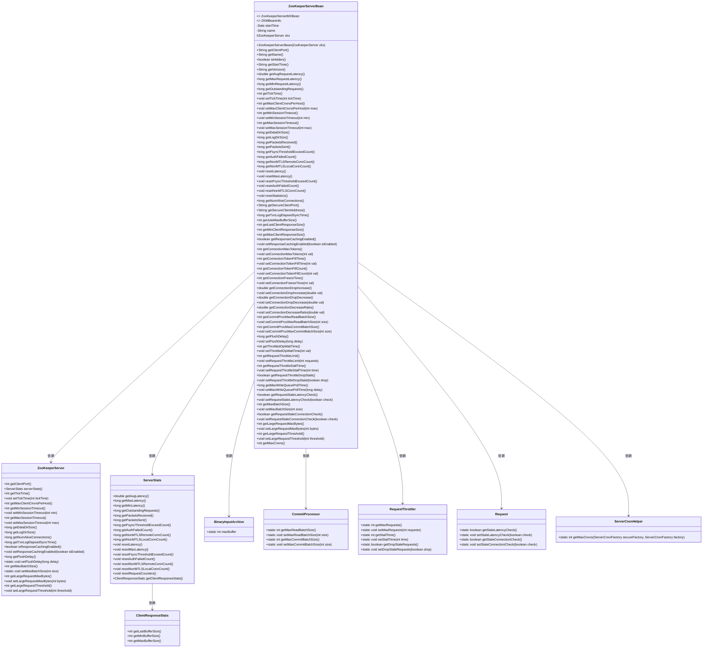

# 基础信息

|      |      |
|------|------|
| 名称 | ZooKeeperServerBean |
| 编码语言 | .java |
| 代码路径 | zookeeper/zookeeper-server/src/main/java/org/apache/zookeeper/server/ZooKeeperServerBean.java |
| 包名 | org.apache.zookeeper.server |
| 依赖项 | ['java.util.Date', 'org.apache.jute.BinaryInputArchive', 'org.apache.zookeeper.Version', 'org.apache.zookeeper.jmx.ZKMBeanInfo', 'org.apache.zookeeper.server.quorum.CommitProcessor'] |
| 概述说明 | ZooKeeperServerBean类实现ZooKeeperServerMXBean和ZKMBeanInfo接口，提供服务器状态监控和管理功能，包括连接、请求延迟、会话超时、数据目录大小等统计信息，支持配置调整如TickTime、客户端连接数限制等。 |

# 说明

ZooKeeperServerBean类实现了ZooKeeperServerMXBean和ZKMBeanInfo接口，用于管理ZooKeeper服务器的监控和配置。它包含服务器启动时间、名称、客户端端口等基本信息，以及请求延迟、会话超时、连接数等性能指标。该类提供了对服务器参数如TickTime、最大客户端连接数、会话超时范围的设置方法，并支持统计信息重置功能。此外，它还管理连接限制、请求节流、批量处理大小等高级配置，包括令牌桶参数、冻结时间、请求丢弃策略等。安全端口和地址信息也可通过该类获取。整体实现了对ZooKeeper服务器运行状态的全面监控和精细调控。

# 类列表 Class Summary

| 名称   | 类型  | 说明 |
|-------|------|-------------|
| ZooKeeperServerBean | class | ZooKeeperServerBean类实现ZooKeeperServerMXBean接口，提供服务器状态监控和配置功能，包括连接、请求、会话管理及性能统计等。 |

## 类 ZooKeeperServerBean

|      |      |
|------|------|
| 访问范围 | public |
| 类型 | class |
| 名称 | ZooKeeperServerBean |
| 说明 | ZooKeeperServerBean类实现ZooKeeperServerMXBean接口，提供服务器状态监控和配置功能，包括连接、请求、会话管理及性能统计等。 |

### UML类图

这段代码定义了一个ZooKeeperServerBean类，实现了ZooKeeperServerMXBean和ZKMBeanInfo接口，用于管理和监控ZooKeeper服务器的各种状态和配置。该类通过聚合ZooKeeperServer实例，提供了大量获取和设置服务器参数的方法，包括连接限制、请求延迟、会话超时、数据目录大小等统计信息，以及与安全连接、批处理、请求节流等相关的配置功能。

### 内部方法调用关系图

该流程图展示了ZooKeeperServerBean类的完整结构，这是一个实现ZooKeeper服务器管理的MXBean接口的核心类。类通过聚合ZooKeeperServer实例(zks)提供全方位的服务器监控和控制能力，包含40+个方法，主要分为：基础信息获取、性能统计、连接控制、会话管理、目录监控、网络统计、安全控制、重置操作和高级功能(如限流/批量处理)等九大模块。所有方法最终都通过zks实例或其内部组件(如serverStats/serverCnxnFactory)实现具体功能，形成清晰的三层调用结构(MXBean接口→ZooKeeperServerBean→ZooKeeperServer)。

### 字段列表 Field List

| 名称  | 类型  | 说明 |
|-------|-------|------|
| zks | ZooKeeperServer | 受保护的最终ZooKeeper服务器实例zks。 |
| name | String | 私有字符串变量name。 |
| startTime | Date | 私有不可变的开始时间变量。 |

### 方法列表 Method List

| 名称  | 类型  | 说明 |
|-------|-------|------|
| getConnectionTokenFillTime | int | 方法getConnectionTokenFillTime返回连接限流器的填充时间值。 |
| getCommitProcMaxCommitBatchSize | int | 该方法返回CommitProcessor的最大提交批处理大小。 |
| setRequestThrottleLimit | void | 设置请求限制阈值，通过调用RequestThrottler的setMaxRequests方法传入参数requests实现。 |
| getLogDirSize | long | 获取日志目录大小的方法，调用zks的getLogDirSize返回结果。 |
| getTxnLogElapsedSyncTime | long | 重写方法getTxnLogElapsedSyncTime，返回zks的TxnLogElapsedSyncTime值。 |
| setCommitProcMaxReadBatchSize | void | 设置提交处理器的最大读取批次大小为指定值。 |
| setFlushDelay | void | 重写setFlushDelay方法，调用ZooKeeperServer的同名方法设置延迟参数。 |
| getStartTime | String | 方法返回字符串形式的开始时间。 |
| getConnectionDropDecrease | double | 该方法返回ZooKeeper服务器连接限流机制中的连接丢弃率下降值。 |
| getCommitProcMaxReadBatchSize | int | 方法返回CommitProcessor的最大读取批次大小。 |
| setMinSessionTimeout | void | 设置最小会话超时时间，调用zks的setMinSessionTimeout方法。 |
| setConnectionDropDecrease | void | 设置连接数下降阈值的方法，参数为双精度浮点数val，调用zks的connThrottle()的setDropDecrease方法。 |
| getAuthFailedCount | long | 获取认证失败次数的统计值，调用zks的serverStats方法返回计数结果。 |
| setMaxSessionTimeout | void | 设置会话最大超时时间，调用zks的对应方法。 |
| getMaxBatchSize | int | 重写getMaxBatchSize方法，返回zks的MaxBatchSize值。 |
| getName | String | 这是一个Java方法，返回字符串类型的成员变量name的值。 |
| setRequestStaleLatencyCheck | void | 设置请求延迟检查状态的方法，调用Request类的静态方法。 |
| getMaxSessionTimeout | int | 获取最大会话超时时间，返回zks对象中的MaxSessionTimeout值。 |
| getMinRequestLatency | long | 获取最小请求延迟时间的方法，返回服务器统计中的最小延迟值。 |
| getResponseCachingEnabled | boolean | 重写方法返回ZKS响应缓存启用状态。 |
| getJuteMaxBufferSize | int | 重写getJuteMaxBufferSize方法，返回BinaryInputArchive的maxBuffer值。 |
| resetMaxLatency | void | 重置最大延迟统计。调用服务器统计对象的resetMaxLatency方法。 |
| resetLatency | void | 重置服务器延迟统计。调用方法清空当前延迟数据。 |
| getMaxClientResponseSize | int | 重写方法返回ZooKeeper服务端统计中客户端响应的最大缓冲区大小。 |
| getFlushDelay | long | Java方法重写，返回zks对象的flushDelay值。 |
| resetNonMTLSConnCount | void | 重置非MTLS连接计数，包括远程和本地连接。 |
| getDataDirSize | long | 这是一个Java方法，返回ZooKeeper服务器数据目录的大小，调用zks对象的getDataDirSize方法获取结果。 |
| getSecureClientAddress | String | 该方法返回安全客户端地址，若存在安全连接工厂则返回其主机字符串和端口号，否则返回空字符串。 |
| getSecureClientPort | String | 该代码重写方法`getSecureClientPort`，检查`zks.secureServerCnxnFactory`是否存在，存在则返回其本地端口字符串，否则返回空字符串。 |
| getConnectionDropIncrease | double | 该方法返回ZooKeeper服务器连接限流器的连接丢弃率增加值。 |
| setMaxWriteQueuePollTime | void | 重写方法setMaxWriteQueuePollTime，调用ZooKeeperServer的同名方法设置最大写队列轮询时间。 |
| getAvgRequestLatency | double | 该方法返回ZooKeeper服务器统计的平均请求延迟时间。 |
| setConnectionFreezeTime | void | 方法setConnectionFreezeTime设置连接冻结时间为指定值val，通过zks.connThrottle()调用实现。 |
| setConnectionMaxTokens | void | 设置连接最大令牌数的方法，通过zks对象调整连接限流器的令牌上限值。 |
| getClientPort | String | 获取客户端端口号的方法，返回ZooKeeper服务器设置的客户端端口字符串。 |
| getTickTime | int | 该方法返回zks对象的TickTime值。 |
| resetStatistics | void | 重置服务器统计信息，包括请求计数器、延迟、同步阈值超限次数、认证失败次数及非MTLS连接数。 |
| getMaxWriteQueuePollTime | long | 重写方法返回ZooKeeper服务器的最大写队列轮询时间。 |
| getMaxClientCnxnsPerHost | int | 该方法返回每个主机允许的最大客户端连接数，具体值由zks对象提供。 |
| getFsyncThresholdExceedCount | long | 获取文件同步超阈值次数的统计值。 |
| getConnectionFreezeTime | int | 获取连接冻结时间的方法，返回ZKS连接限流器的冻结时间值。 |
| getConnectionMaxTokens | int | 该方法返回ZooKeeper服务器连接限制的最大令牌数。 |
| getConnectionDecreaseRatio | double | 该方法返回ZooKeeper服务器连接数减少的比率值，由connThrottle()的getDecreasePoint()提供。 |
| setRequestThrottleDropStale | void | 该方法设置请求节流器是否丢弃过时请求，参数drop控制丢弃行为。 |
| getRequestThrottleStallTime | int | 该方法返回请求限流器的停滞时间，调用RequestThrottler的getStallTime()实现。 |
| setConnectionTokenFillCount | void | 设置连接令牌填充计数的方法，调用zks.connThrottle()的setFillCount方法。 |
| setConnectionDropIncrease | void | 该方法设置连接丢弃率增量，通过调用zks的connThrottle方法调整val参数值。 |
| getPacketsSent | long | 获取发送的数据包数量。 |
| getRequestThrottleDropStale | boolean | 该方法返回请求限流器是否丢弃过时请求的布尔值。 |
| getRequestStaleLatencyCheck | boolean | 该方法返回请求的延迟检查状态，调用Request类的静态方法getStaleLatencyCheck获取结果。 |
| getPacketsReceived | long | 获取接收数据包数量的方法，返回服务器统计中的接收包总数。 |
| getConnectionTokenFillCount | int | 方法返回ZooKeeper连接限流器的填充计数。 |
| getNumAliveConnections | long | 获取当前存活的连接数。 |
| getOutstandingRequests | long | 获取当前未处理的请求数量。 |
| setRequestThrottleStallTime | void | 该方法用于设置请求节流器的停滞时间，参数为时间值，调用RequestThrottler的setStallTime方法实现。 |
| isHidden | boolean | 方法isHidden返回false，表示对象未被隐藏。 |
| setConnectionTokenFillTime | void | 该方法设置连接令牌填充时间，参数为整型val，通过zks.connThrottle()调用setFillTime实现。 |
| setTickTime | void | 设置ZooKeeper服务器的心跳间隔时间，参数为tickTime。 |
| resetAuthFailedCount | void | 重置认证失败计数的方法，调用服务器统计接口清零认证失败次数。 |
| resetFsyncThresholdExceedCount | void | 重置文件同步阈值超限计数。 |
| setThrottledOpWaitTime | void | 该方法设置ZooKeeper服务器的限流操作等待时间，参数为整数值val。 |
| setResponseCachingEnabled | void | 重写setResponseCachingEnabled方法，调用zks的同名方法启用或禁用响应缓存。 |
| getThrottledOpWaitTime | int | 该方法返回ZooKeeperServer的限流操作等待时间。 |
| getRequestThrottleLimit | int | 方法返回请求限流器的最大请求数限制值。 |
| getMaxRequestLatency | long | 获取最大请求延迟时间，返回服务器统计中的最大延迟值。 |
| getMinSessionTimeout | int | 获取最小会话超时时间，返回zks的最小会话超时值。 |
| setConnectionDecreaseRatio | void | 设置连接减少比例的方法，参数为双精度浮点数val，调用zks的connThrottle方法设置减少点。 |
| getVersion | String | 获取版本号的方法，返回完整版本信息字符串。 |
| getLastClientResponseSize | int | 重写getLastClientResponseSize方法，返回ZooKeeper服务器统计的最后客户端响应数据大小。 |
| setMaxClientCnxnsPerHost | void | 设置每个主机的最大客户端连接数，适用于普通和安全连接工厂。 |
| getMinClientResponseSize | int | 该方法返回ZooKeeper服务器统计中客户端响应的最小缓冲区大小。 |
| setCommitProcMaxCommitBatchSize | void | 该方法设置提交处理器的最大提交批量大小，参数为整数size，调用内部方法CommitProcessor.setMaxCommitBatchSize实现。 |
| getNonMTLSLocalConnCount | long | 获取非MTLS本地连接数的方法，返回服务器统计中的对应数值。 |
| getNonMTLSRemoteConnCount | long | 获取非MTLS远程连接数的方法，返回服务器统计中的非MTLS远程连接计数。 |
| setMaxBatchSize | void | 重写setMaxBatchSize方法，调用ZooKeeperServer的setMaxBatchSize设置批量处理大小。 |
| getRequestStaleConnectionCheck | boolean | 该方法返回请求是否检查过时连接的状态，调用Request类的getStaleConnectionCheck方法获取结果。 |
| setRequestStaleConnectionCheck | void | 设置请求的陈旧连接检查功能，参数为布尔值check。 |
| getLargeRequestMaxBytes | int | 该方法返回ZKS实例的大请求最大字节数。 |
| setLargeRequestMaxBytes | void | 设置请求最大字节数的方法，调用zks对象的对应方法实现。 |
| getLargeRequestThreshold | int | 获取大请求阈值的方法，返回ZKS实例中的大请求阈值。 |
| setLargeRequestThreshold | void | 设置大请求阈值方法，将输入参数threshold传递给zks对象的对应方法。 |
| getMaxCnxns | int | 该方法返回服务器连接的最大数量，通过调用ServerCnxnHelper的getMaxCnxns方法实现，参数为安全和非安全连接工厂。 |

