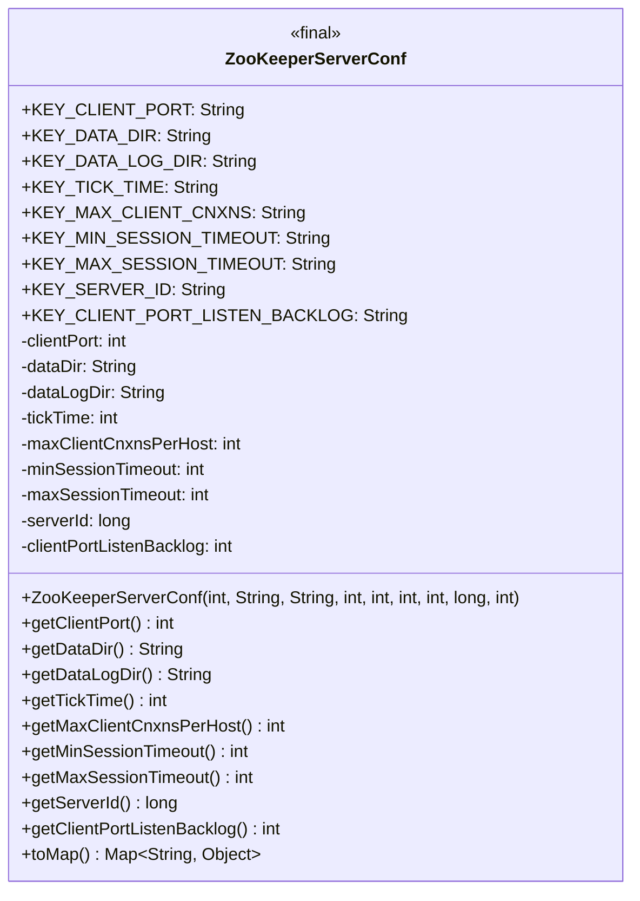
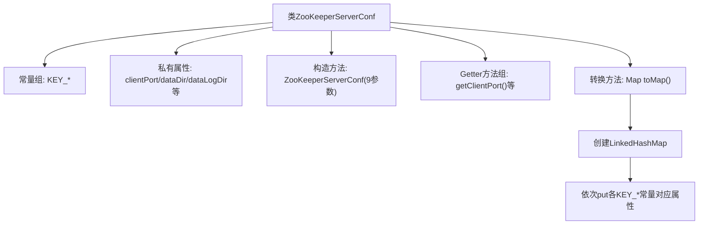

# 基础信息

|      |      |
|------|------|
| 名称 | ZooKeeperServerConf |
| 编码语言 | .java |
| 代码路径 | zookeeper/zookeeper-server/src/main/java/org/apache/zookeeper/server/ZooKeeperServerConf.java |
| 包名 | org.apache.zookeeper.server |
| 依赖项 | ['java.util.LinkedHashMap', 'java.util.Map'] |
| 概述说明 | ZooKeeperServerConf类定义了ZooKeeper服务器配置，包含客户端端口、数据目录、会话超时等参数，并提供获取方法和转换为Map的功能。 |

# 说明

ZooKeeperServerConf类定义了ZooKeeper服务器的配置参数，包括客户端端口、数据目录、数据日志目录、心跳间隔时间、每主机最大客户端连接数、最小和最大会话超时时间、服务器ID以及客户端端口监听队列长度。该类提供了获取这些参数的getter方法，并可将配置转换为包含所有参数的映射表。构造方法接收所有配置参数并初始化内部状态。

# 类列表 Class Summary

| 名称   | 类型  | 说明 |
|-------|------|-------------|
| ZooKeeperServerConf | class | ZooKeeperServerConf类定义了ZooKeeper服务器配置，包含客户端端口、数据目录、日志目录、会话超时等参数，并提供获取方法和转换为Map的功能。 |

## 类 ZooKeeperServerConf

|      |      |
|------|------|
| 访问范围 | public |
| 类型 | class |
| 名称 | ZooKeeperServerConf |
| 说明 | ZooKeeperServerConf类定义了ZooKeeper服务器配置，包含客户端端口、数据目录、日志目录、会话超时等参数，并提供获取方法和转换为Map的功能。 |

### UML类图

这段代码定义了一个ZooKeeper服务器配置类ZooKeeperServerConf，该类包含多个静态常量作为配置项的键名，以及对应的私有字段存储配置值。通过构造函数初始化这些配置项，并提供了一系列getter方法获取配置值，最后通过toMap方法将配置转换为Map结构。该类主要用于集中管理ZooKeeper服务器的各种配置参数，如客户端端口、数据目录、会话超时时间等，确保配置的一致性和易用性。

### 内部方法调用关系图

这段代码是ZooKeeper服务器的配置类，包含9个核心配置项的常量化定义、属性存储和访问方法。通过构造方法初始化配置参数，提供全套getter方法访问属性，并能通过toMap()方法将配置转换为有序映射。流程图展示了从类结构到常量定义、属性封装、构造初始化、数据获取以及格式转换的完整逻辑链条，体现了配置信息的结构化存储和标准化访问机制。

### 字段列表 Field List

| 名称  | 类型  | 说明 |
|-------|-------|------|
| clientPort | int | 私有整型变量clientPort，用于存储客户端端口号。 |
| KEY_DATA_LOG_DIR = "data_log_dir" | String | 定义常量字符串KEY_DATA_LOG_DIR，值为"data_log_dir"。 |
| maxSessionTimeout | int | 私有整型常量maxSessionTimeout，用于存储最大会话超时时间。 |
| tickTime | int | 私有整型变量tickTime，不可修改。 |
| dataLogDir | String | 私有字符串变量dataLogDir，用于存储日志目录路径。 |
| KEY_DATA_DIR = "data_dir" | String | 定义静态常量字符串KEY_DATA_DIR，值为"data_dir"。 |
| KEY_MAX_CLIENT_CNXNS = "max_client_cnxns" | String | 定义常量KEY_MAX_CLIENT_CNXNS，值为"max_client_cnxns"，用于限制客户端连接数。 |
| minSessionTimeout | int | 私有整型常量minSessionTimeout，用于存储最小会话超时时间。 |
| KEY_CLIENT_PORT_LISTEN_BACKLOG = "client_port_listen_backlog" | String | 该信息定义了一个静态常量字符串，表示客户端端口监听积压队列的配置键，用于系统参数设置。 |
| KEY_SERVER_ID = "server_id" | String | 定义常量字符串KEY_SERVER_ID，值为"server_id"。 |
| KEY_MIN_SESSION_TIMEOUT = "min_session_timeout" | String | 定义常量KEY_MIN_SESSION_TIMEOUT，值为"min_session_timeout"。 |
| dataDir | String | 私有常量字符串变量dataDir，用于存储数据目录路径。 |
| maxClientCnxnsPerHost | int | 私有整型变量maxClientCnxnsPerHost，限制每主机最大客户端连接数。 |
| KEY_CLIENT_PORT = "client_port" | String | 定义常量字符串KEY_CLIENT_PORT，值为"client_port"。 |
| KEY_MAX_SESSION_TIMEOUT = "max_session_timeout" | String | 定义常量字符串KEY_MAX_SESSION_TIMEOUT，值为"max_session_timeout"。 |
| serverId | long | 私有长整型变量serverId，用于存储服务器ID。 |
| KEY_TICK_TIME = "tick_time" | String | 定义静态常量KEY_TICK_TIME，值为字符串"tick_time"。 |
| clientPortListenBacklog | int | 私有整型变量clientPortListenBacklog，用于客户端端口监听队列长度。 |

### 方法列表 Method List

| 名称  | 类型  | 说明 |
|-------|-------|------|
| getClientPort | int | 获取客户端端口号的方法，返回整型值clientPort。 |
| getMinSessionTimeout | int | 获取最小会话超时时间的方法，返回minSessionTimeout值。 |
| getDataDir | String | 方法返回数据目录路径。 |
| getDataLogDir | String | 这是一个Java方法，返回名为dataLogDir的字符串变量。 |
| getTickTime | int | 获取tickTime的整数值方法。 |
| getClientPortListenBacklog | int | 方法返回客户端端口监听队列长度。 |
| getServerId | long | 获取服务器ID的方法，返回长整型数值serverId。 |
| getMaxSessionTimeout | int | 方法返回最大会话超时时间。 |
| getMaxClientCnxnsPerHost | int | 方法返回每个主机的最大客户端连接数限制。 |
| toMap | Map<String, Object> | 将对象属性转换为Map，包含客户端端口、数据目录、日志目录、时间间隔、最大连接数、会话超时范围和服务器ID等配置项。 |

