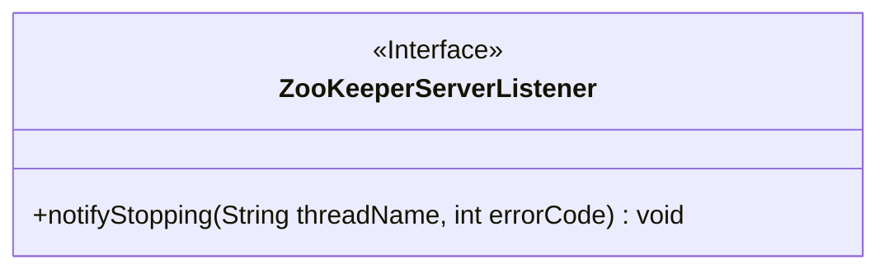
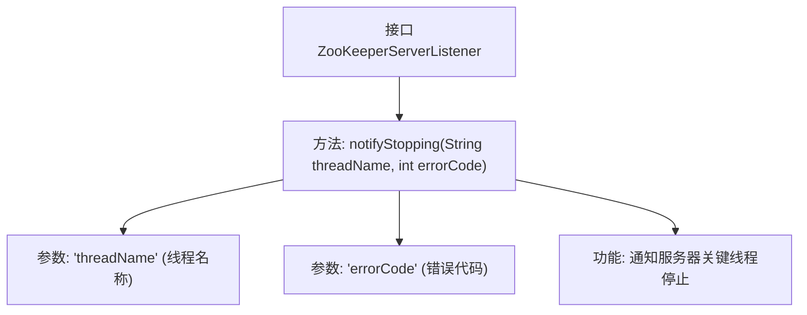

# 基础信息

|      |      |
|------|------|
| 名称 | ZooKeeperServerListener |
| 编码语言 | .java |
| 代码路径 | zookeeper/zookeeper-server/src/main/java/org/apache/zookeeper/server/ZooKeeperServerListener.java |
| 包名 | org.apache.zookeeper.server |
| 依赖项 | [] |
| 概述说明 | ZooKeeperServerListener接口定义了notifyStopping方法，用于在关键线程因致命错误停止时通知服务器，参数包括线程名和错误码。 |

# 说明

该内容定义了一个名为ZooKeeperServerListener的公共接口，包含一个方法notifyStopping。该方法用于在发生致命错误时通知服务器关键线程已停止。方法接收两个参数：threadName表示线程名称，errorCode表示错误代码。接口主要用于处理服务器关键线程停止时的通知机制。

# 类列表 Class Summary

| 名称   | 类型  | 说明 |
|-------|------|-------------|
| ZooKeeperServerListener | interface | ZooKeeperServerListener接口定义了notifyStopping方法，用于在关键线程因致命错误停止时通知服务器，参数包括线程名和错误码。 |

## 类 ZooKeeperServerListener

|      |      |
|------|------|
| 访问范围 | public |
| 类型 | interface |
| 名称 | ZooKeeperServerListener |
| 说明 | ZooKeeperServerListener接口定义了notifyStopping方法，用于在关键线程因致命错误停止时通知服务器，参数包括线程名和错误码。 |

### UML类图

这段代码定义了一个ZooKeeperServerListener接口，该接口包含一个notifyStopping方法，用于在关键线程停止时通知服务器，通常发生在发生致命错误时。接口方法接收线程名称和错误代码作为参数，不返回任何值。该接口可能被ZooKeeper服务器实现类用来处理线程异常终止的情况，属于观察者模式中的监听器角色。

### 内部方法调用关系图

该流程图展示了ZooKeeperServerListener接口的核心结构，重点描述了notifyStopping方法的定义及其参数作用。该接口用于在分布式系统中当关键线程因致命错误停止时发出通知，通过threadName标识故障线程，errorCode传递错误类型，是实现服务器容错机制的重要回调接口。流程清晰显示了方法签名与参数之间的关联关系。

### 字段列表 Field List

| 名称  | 类型  | 说明 |
|-------|-------|------|

### 方法列表 Method List

| 名称  | 类型  | 说明 |
|-------|-------|------|
| notifyStopping | void | 方法notifyStopping通知线程停止，参数为线程名threadName和错误码errorCode。 |

