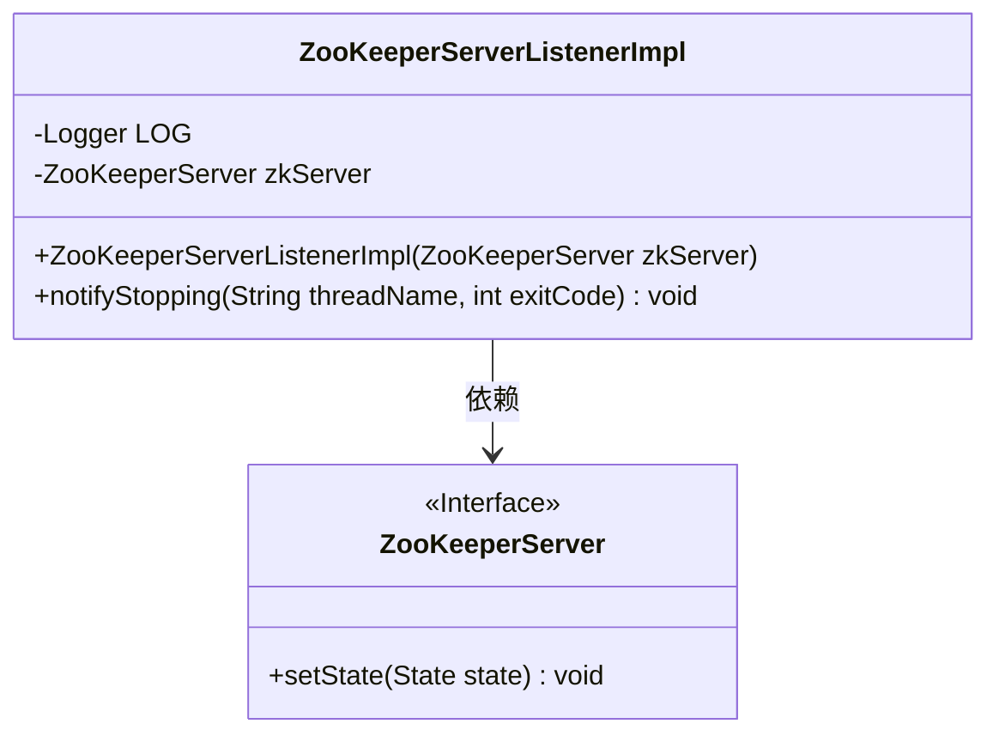
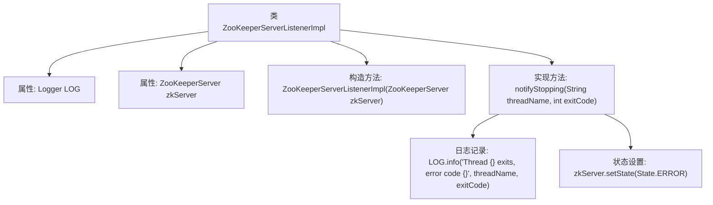

# 基础信息

|      |      |
|------|------|
| 名称 | ZooKeeperServerListenerImpl |
| 编码语言 | .java |
| 代码路径 | zookeeper/zookeeper-server/src/main/java/org/apache/zookeeper/server/ZooKeeperServerListenerImpl.java |
| 包名 | org.apache.zookeeper.server |
| 依赖项 | ['org.apache.zookeeper.server.ZooKeeperServer.State', 'org.slf4j.Logger', 'org.slf4j.LoggerFactory'] |
| 概述说明 | ZooKeeperServerListenerImpl类实现监听器接口，包含zkServer实例，在线程停止时记录日志并更新zkServer状态为ERROR。 |

# 说明

ZooKeeperServerListenerImpl类实现了ZooKeeperServerListener接口，用于监听ZooKeeper服务器的状态变化。该类包含一个私有的ZooKeeperServer实例和一个静态日志记录器。构造函数接收ZooKeeperServer对象并初始化成员变量。notifyStopping方法在服务器线程停止时被调用，记录线程名称和退出代码的日志信息，并将服务器状态设置为ERROR。

# 类列表 Class Summary

| 名称   | 类型  | 说明 |
|-------|------|-------------|
| ZooKeeperServerListenerImpl | class | ZooKeeperServerListenerImpl类实现ZooKeeperServerListener接口，监听线程停止事件并记录日志，同时更新zkServer状态为ERROR。 |

## 类 ZooKeeperServerListenerImpl

|      |      |
|------|------|
| 访问范围 | None |
| 类型 | class |
| 名称 | ZooKeeperServerListenerImpl |
| 说明 | ZooKeeperServerListenerImpl类实现ZooKeeperServerListener接口，监听线程停止事件并记录日志，同时更新zkServer状态为ERROR。 |

### UML类图

这段类图展示了ZooKeeperServerListenerImpl类实现了ZooKeeperServerListener接口（未显式画出），包含一个Logger实例和ZooKeeperServer依赖。核心功能是通过notifyStopping方法在服务停止时记录日志并更新服务器状态。ZooKeeperServer作为接口定义了状态设置方法，两者构成典型的观察者模式实现结构，用于处理服务器状态变更通知。

### 内部方法调用关系图

该流程图展示了ZooKeeperServerListenerImpl类的结构，包含两个私有属性（LOG日志记录器和zkServer服务器实例）、一个构造方法以及实现的notifyStopping方法。当调用notifyStopping时，会先记录线程退出日志，然后将服务器状态设置为ERROR。类实现了ZooKeeperServerListener接口，用于处理服务器停止时的状态变更和日志记录。

### 字段列表 Field List

| 名称  | 类型  | 说明 |
|-------|-------|------|
| zkServer | ZooKeeperServer | 私有不可变的ZooKeeper服务器实例。 |
| LOG = LoggerFactory.getLogger(ZooKeeperServerListenerImpl.class) | Logger | ZooKeeper服务器监听器实现类中定义了一个静态日志记录器实例。 |

### 方法列表 Method List

| 名称  | 类型  | 说明 |
|-------|-------|------|
| notifyStopping | void | 线程停止通知：记录线程退出及错误码，并将zkServer状态设为ERROR。 |

