# 基础信息

|      |      |
|------|------|
| 名称 | ZooKeeperServerMXBean |
| 编码语言 | .java |
| 代码路径 | zookeeper/zookeeper-server/src/main/java/org/apache/zookeeper/server/ZooKeeperServerMXBean.java |
| 包名 | org.apache.zookeeper.server |
| 依赖项 | [] |
| 概述说明 | ZooKeeper服务器监控接口，提供端口、版本、启动时间、请求延迟、连接数、会话超时、流量控制等关键指标及配置方法。 |

# 说明

ZooKeeperServerMXBean接口定义了ZooKeeper服务器的管理监控功能，包含获取服务器端口、版本、启动时间、请求延迟统计、数据包收发数量、认证失败计数、非MTLS连接数等核心指标。提供对TickTime、会话超时、客户端连接数限制等参数的读写控制，支持连接限流、请求节流、批量处理大小等高级配置。包含各类统计重置方法，可获取存活连接数、目录大小、安全端口信息，以及客户端响应大小、事务日志同步时间等性能数据。该接口全面覆盖服务器运行状态监控与关键参数调优能力。

# 类列表 Class Summary

| 名称   | 类型  | 说明 |
|-------|------|-------------|
| ZooKeeperServerMXBean | interface | ZooKeeper服务器管理接口，包含端口、版本、启动时间、请求延迟、连接数、会话超时、流量控制等配置和统计信息，支持重置统计数据和调整参数。 |

## 类 ZooKeeperServerMXBean

|      |      |
|------|------|
| 访问范围 | public |
| 类型 | interface |
| 名称 | ZooKeeperServerMXBean |
| 说明 | ZooKeeper服务器管理接口，包含端口、版本、启动时间、请求延迟、连接数、会话超时、流量控制等配置和统计信息，支持重置统计数据和调整参数。 |

### UML类图

```mermaid
classDiagram
    class ZooKeeperServerMXBean {
        <<Interface>>
        +String getClientPort()
        +String getVersion()
        +String getStartTime()
        +long getMinRequestLatency()
        +double getAvgRequestLatency()
        +long getMaxRequestLatency()
        +long getPacketsReceived()
        +long getPacketsSent()
        +long getFsyncThresholdExceedCount()
        +long getAuthFailedCount()
        +long getNonMTLSLocalConnCount()
        +long getNonMTLSRemoteConnCount()
        +long getOutstandingRequests()
        +int getTickTime()
        +void setTickTime(int tickTime)
        +int getMaxClientCnxnsPerHost()
        +void setMaxClientCnxnsPerHost(int max)
        +int getMinSessionTimeout()
        +void setMinSessionTimeout(int min)
        +int getMaxSessionTimeout()
        +void setMaxSessionTimeout(int max)
        +boolean getResponseCachingEnabled()
        +void setResponseCachingEnabled(boolean isEnabled)
        +int getConnectionMaxTokens()
        +void setConnectionMaxTokens(int val)
        +int getConnectionTokenFillTime()
        +void setConnectionTokenFillTime(int val)
        +int getConnectionTokenFillCount()
        +void setConnectionTokenFillCount(int val)
        +int getConnectionFreezeTime()
        +void setConnectionFreezeTime(int val)
        +double getConnectionDropIncrease()
        +void setConnectionDropIncrease(double val)
        +double getConnectionDropDecrease()
        +void setConnectionDropDecrease(double val)
        +double getConnectionDecreaseRatio()
        +void setConnectionDecreaseRatio(double val)
        +int getCommitProcMaxReadBatchSize()
        +void setCommitProcMaxReadBatchSize(int size)
        +int getCommitProcMaxCommitBatchSize()
        +void setCommitProcMaxCommitBatchSize(int size)
        +int getRequestThrottleLimit()
        +void setRequestThrottleLimit(int requests)
        +int getRequestThrottleStallTime()
        +void setRequestThrottleStallTime(int time)
        +boolean getRequestThrottleDropStale()
        +void setRequestThrottleDropStale(boolean drop)
        +int getThrottledOpWaitTime()
        +void setThrottledOpWaitTime(int val)
        +boolean getRequestStaleLatencyCheck()
        +void setRequestStaleLatencyCheck(boolean check)
        +boolean getRequestStaleConnectionCheck()
        +void setRequestStaleConnectionCheck(boolean check)
        +int getLargeRequestMaxBytes()
        +void setLargeRequestMaxBytes(int bytes)
        +int getLargeRequestThreshold()
        +void setLargeRequestThreshold(int threshold)
        +void resetStatistics()
        +void resetLatency()
        +void resetMaxLatency()
        +void resetFsyncThresholdExceedCount()
        +void resetNonMTLSConnCount()
        +void resetAuthFailedCount()
        +long getNumAliveConnections()
        +long getDataDirSize()
        +long getLogDirSize()
        +String getSecureClientPort()
        +String getSecureClientAddress()
        +long getTxnLogElapsedSyncTime()
        +int getJuteMaxBufferSize()
        +int getLastClientResponseSize()
        +int getMinClientResponseSize()
        +int getMaxClientResponseSize()
        +long getFlushDelay()
        +void setFlushDelay(long delay)
        +long getMaxWriteQueuePollTime()
        +void setMaxWriteQueuePollTime(long delay)
        +int getMaxBatchSize()
        +void setMaxBatchSize(int size)
        +int getMaxCnxns()
    }
```

这段代码定义了一个名为`ZooKeeperServerMXBean`的接口，该接口提供了对ZooKeeper服务器运行状态和配置参数的监控与管理功能。接口包含大量方法，主要分为三类：获取服务器状态信息（如端口号、版本、启动时间、请求延迟等）、获取和设置服务器配置参数（如会话超时、连接限制、请求节流等）、以及重置统计信息（如重置延迟统计、认证失败计数等）。该接口为JMX监控提供了标准化访问方式，适用于需要实时监控和动态调整ZooKeeper服务器性能的场景。

### 内部方法调用关系图

该流程图展示了ZooKeeperServerMXBean接口的完整方法结构，将42个方法按功能分为9大类：获取方法、设置方法、统计方法、连接控制、配置参数、目录大小、安全端口、响应大小和批量处理方法。接口主要提供ZooKeeper服务器的运行状态监控和配置管理能力，包括端口信息、版本号、请求延迟统计、连接数控制、会话超时设置等核心功能。每个方法组用不同颜色区块区分，箭头表示接口与方法组之间的包含关系。

### 字段列表 Field List

| 名称  | 类型  | 说明 |
|-------|-------|------|

### 方法列表 Method List

| 名称  | 类型  | 说明 |
|-------|-------|------|
| getLogDirSize | long | 获取日志目录大小的长整型方法。 |
| resetStatistics | void | 重置统计信息。 |
| getPacketsReceived | long | 获取接收到的数据包数量。 |
| getConnectionMaxTokens | int | 获取连接的最大令牌数。 |
| getRequestStaleConnectionCheck | boolean | 方法getRequestStaleConnectionCheck返回布尔值，用于检查请求是否为陈旧连接。 |
| getConnectionTokenFillCount | int | 获取连接令牌填充计数。 |
| setConnectionMaxTokens | void | 设置连接的最大令牌数为指定值。 |
| setRequestThrottleStallTime | void | 设置请求节流延迟时间的方法，参数为时间值。 |
| getMaxRequestLatency | long | 获取最大请求延迟时间的方法。 |
| getRequestThrottleStallTime | int | 获取请求限流停滞时间。 |
| getAvgRequestLatency | double | 获取平均请求延迟时间的方法。 |
| getDataDirSize | long | 获取数据目录大小的方法，返回长整型值。 |
| getNonMTLSLocalConnCount | long | 获取非MTLS本地连接数量。 |
| setRequestThrottleLimit | void | 设置请求限流阈值，参数为请求数量。 |
| getRequestThrottleDropStale | boolean | 方法getRequestThrottleDropStale返回布尔值，用于判断是否丢弃过期的请求限制。 |
| getSecureClientPort | String | 获取安全客户端端口号的方法。 |
| getRequestThrottleLimit | int | 获取请求限流阈值的方法。 |
| resetAuthFailedCount | void | 重置认证失败计数。 |
| getStartTime | String | 获取开始时间的字符串方法。 |
| getVersion | String | 获取版本号的方法。 |
| getMinRequestLatency | long | 获取最小请求延迟的方法。 |
| setCommitProcMaxCommitBatchSize | void | 设置提交处理的最大批量大小为指定数值。 |
| resetNonMTLSConnCount | void | 重置非MTLS连接计数。 |
| setMaxSessionTimeout | void | 设置会话最大超时时间。 |
| getMaxSessionTimeout | int | 获取最大会话超时时间。 |
| resetFsyncThresholdExceedCount | void | 重置文件同步阈值超限计数。 |
| getCommitProcMaxCommitBatchSize | int | 获取最大提交批处理大小的函数。 |
| getResponseCachingEnabled | boolean | 获取响应缓存是否启用的布尔值方法。 |
| getClientPort | String | 获取客户端端口号的方法。 |
| getConnectionDecreaseRatio | double | 获取连接减少比例的双精度数值。 |
| setMinSessionTimeout | void | 设置会话最小超时时间（参数：min）。 |
| resetMaxLatency | void | 重置最大延迟。 |
| setRequestThrottleDropStale | void | 设置请求节流时是否丢弃过时请求。 |
| setConnectionTokenFillCount | void | 设置连接令牌填充计数值。 |
| getNumAliveConnections | long | 获取当前活跃连接数的方法。 |
| setCommitProcMaxReadBatchSize | void | 设置提交处理的最大读取批次大小为指定数值。 |
| getMinSessionTimeout | int | 获取最小会话超时时间的方法。 |
| resetLatency | void | 重置延迟参数。 |
| setConnectionDecreaseRatio | void | 设置连接减少比率的函数，参数为双精度浮点数val。 |
| getSecureClientAddress | String | 获取客户端安全地址。 |
| setMaxClientCnxnsPerHost | void | 设置单个主机允许的最大客户端连接数。参数max为最大连接数。 |
| setConnectionDropDecrease | void | 设置连接断开减少值的方法，参数为双精度浮点数val。 |
| setMaxWriteQueuePollTime | void | 设置最大写入队列轮询时间为指定延迟值。 |
| getConnectionDropDecrease | double | 获取连接断开减少值的方法。 |
| getMaxWriteQueuePollTime | long | 获取最大写入队列轮询时间的方法。 |
| setLargeRequestMaxBytes | void | 设置大请求最大字节数的方法，参数为字节数。 |
| setTickTime | void | 设置定时器的时间间隔，参数为整数tickTime。 |
| getTxnLogElapsedSyncTime | long | 获取事务日志同步耗时的方法。 |
| getTickTime | int | 获取当前系统时间戳，返回整型数值。 |
| setConnectionDropIncrease | void | 设置连接断开率增长值。参数val表示增长数值。 |
| setRequestStaleConnectionCheck | void | 设置请求陈旧连接检查功能，参数为布尔值check。 |
| setResponseCachingEnabled | void | 启用或禁用响应缓存功能。 |
| getOutstandingRequests | long | 获取未完成请求的数量。 |
| getCommitProcMaxReadBatchSize | int | 获取提交处理最大读取批量大小的函数。 |
| getFlushDelay | long | 获取刷新延迟时间的方法。 |
| getConnectionDropIncrease | double | 获取连接断开增长率的双精度浮点数方法。 |
| getLargeRequestThreshold | int | 获取大请求阈值的方法。 |
| getMaxClientCnxnsPerHost | int | 获取每个主机的最大客户端连接数。 |
| getNonMTLSRemoteConnCount | long | 获取非MTLS远程连接数的方法。 |
| getMaxClientResponseSize | int | 获取客户端响应数据的最大长度。 |
| setConnectionFreezeTime | void | 设置连接冻结时间为指定整数值。 |
| setRequestStaleLatencyCheck | void | 设置请求陈旧延迟检查的开关。 |
| getMinClientResponseSize | int | 获取最小客户端响应大小的方法。 |
| getRequestStaleLatencyCheck | boolean | 方法返回布尔值，检查请求延迟是否过时。 |
| getLargeRequestMaxBytes | int | 获取大请求最大字节数的函数。 |
| getLastClientResponseSize | int | 获取最后一次客户端响应数据的大小。 |
| setFlushDelay | void | 设置刷新延迟时间（毫秒）。 |
| setThrottledOpWaitTime | void | 设置操作限流等待时间，参数为整数值。 |
| getAuthFailedCount | long | 获取认证失败次数的长整型方法。 |
| setLargeRequestThreshold | void | 设置大请求阈值的方法，参数为整型threshold。 |
| getFsyncThresholdExceedCount | long | 获取文件同步超阈值次数。 |
| getJuteMaxBufferSize | int | 获取Jute最大缓冲区大小的函数。 |
| setConnectionTokenFillTime | void | 设置连接令牌填充时间为指定整数值。 |
| getConnectionFreezeTime | int | 获取连接冻结时间。 |
| getPacketsSent | long | 
获取发送的数据包数量。 |
| getThrottledOpWaitTime | int | 获取限流操作等待时间的方法。 |
| getConnectionTokenFillTime | int | 获取连接令牌填充时间的函数。 |
| getMaxBatchSize | int | 获取最大批次大小的方法，返回整数值。 |
| setMaxBatchSize | void | 设置批量处理的最大数量限制。参数size指定具体数值。 |
| getMaxCnxns | int | 获取最大连接数的方法。 |

