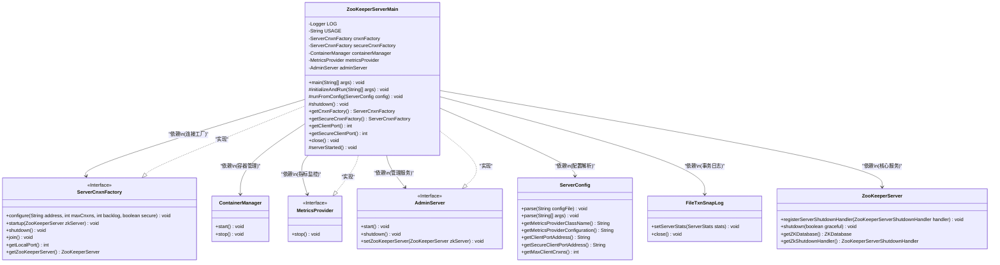
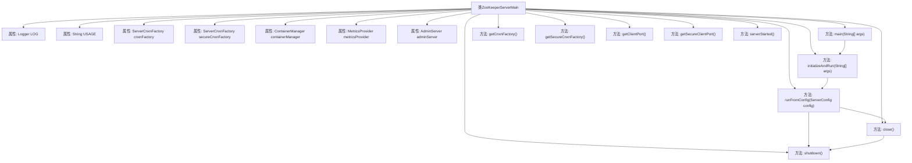

# 基础信息

|      |      |
|------|------|
| 名称 | ZooKeeperServerMain |
| 编码语言 | .java |
| 代码路径 | zookeeper/zookeeper-server/src/main/java/org/apache/zookeeper/server/ZooKeeperServerMain.java |
| 包名 | org.apache.zookeeper.server |
| 依赖项 | ['java.io.IOException', 'java.util.concurrent.CountDownLatch', 'java.util.concurrent.TimeUnit', 'javax.management.JMException', 'org.apache.yetus.audience.InterfaceAudience', 'org.apache.zookeeper.audit.ZKAuditProvider', 'org.apache.zookeeper.jmx.ManagedUtil', 'org.apache.zookeeper.metrics.MetricsProvider', 'org.apache.zookeeper.metrics.MetricsProviderLifeCycleException', 'org.apache.zookeeper.metrics.impl.MetricsProviderBootstrap', 'org.apache.zookeeper.server.admin.AdminServer', 'org.apache.zookeeper.server.admin.AdminServer.AdminServerException', 'org.apache.zookeeper.server.admin.AdminServerFactory', 'org.apache.zookeeper.server.auth.ProviderRegistry', 'org.apache.zookeeper.server.persistence.FileTxnSnapLog', 'org.apache.zookeeper.server.persistence.FileTxnSnapLog.DatadirException', 'org.apache.zookeeper.server.quorum.QuorumPeerConfig.ConfigException', 'org.apache.zookeeper.server.util.JvmPauseMonitor', 'org.apache.zookeeper.util.ServiceUtils', 'org.slf4j.Logger', 'org.slf4j.LoggerFactory'] |
| 概述说明 | ZooKeeperServerMain是ZooKeeper服务器的主类，负责启动和管理服务器。支持加密和非加密连接，处理配置、数据目录访问等异常，包含连接工厂、容器管理和监控功能。提供正常和异常关闭逻辑。 |

# 说明

ZooKeeperServerMain类是ZooKeeper服务器的主入口类，负责启动和管理服务器实例。它支持两种连接方式（加密和非加密），包含连接工厂、容器管理器、指标提供者和AdminServer等核心组件。main方法处理启动参数并捕获各类异常，异常时记录日志并退出。initializeAndRun方法解析配置并启动服务器。runFromConfig方法根据配置初始化指标提供者、事务日志、JVM暂停监控等，创建ZooKeeperServer实例并启动连接工厂。服务器运行期间通过CountDownLatch监控状态，支持优雅关闭。shutdown和close方法确保各组件正确停止。类中还包含多个测试可见方法用于获取连接工厂和端口信息。整个过程包含完善的错误处理和审计日志记录。

# 类列表 Class Summary

| 名称   | 类型  | 说明 |
|-------|------|-------------|
| ZooKeeperServerMain | class | ZooKeeper服务器主类，支持加密和非加密连接，处理配置、数据目录异常，启动管理服务器和容器管理，提供优雅关闭功能。 |

## 类 ZooKeeperServerMain

|      |      |
|------|------|
| 访问范围 | @InterfaceAudience.Public;public |
| 类型 | class |
| 名称 | ZooKeeperServerMain |
| 说明 | ZooKeeper服务器主类，支持加密和非加密连接，处理配置、数据目录异常，启动管理服务器和容器管理，提供优雅关闭功能。 |

### UML类图

类图描述：该图展示了ZooKeeperServerMain类的核心结构及其依赖关系。作为主服务入口，它通过ServerConfig解析配置，依赖ServerCnxnFactory处理客户端连接，使用ContainerManager管理容器生命周期，并通过MetricsProvider和AdminServer分别实现监控和管理功能。异常处理贯穿整个启动流程，确保服务稳定性。

### 内部方法调用关系图

这段代码是ZooKeeper服务器的主类，负责启动和管理ZooKeeper服务。它包含多个属性和方法，用于处理服务器配置、连接工厂、容器管理、度量指标提供者和Admin服务器等。主要流程包括初始化配置、运行服务器、处理异常和关闭服务。代码结构清晰，通过异常处理和日志记录确保服务的稳定性和可靠性。流程图展示了类的主要属性和方法之间的调用关系，帮助理解代码的执行流程。

### 字段列表 Field List

| 名称  | 类型  | 说明 |
|-------|-------|------|
| secureCnxnFactory | ServerCnxnFactory | 私有安全连接工厂变量secureCnxnFactory。 |
| containerManager | ContainerManager | 声明一个私有容器管理器变量containerManager。 |
| adminServer | AdminServer | 私有AdminServer实例变量adminServer。 |
| LOG = LoggerFactory.getLogger(ZooKeeperServerMain.class) | Logger | ZooKeeperServerMain类中定义了一个私有静态日志记录器LOG，用于记录日志信息。 |
| USAGE = "Usage: ZooKeeperServerMain configfile | port datadir [ticktime] [maxcnxns]" | String | ZooKeeper服务器启动命令格式：配置文件或端口 数据目录 [心跳间隔] [最大连接数]。 |
| cnxnFactory | ServerCnxnFactory | 私有ServerCnxnFactory类型变量cnxnFactory。 |
| metricsProvider | MetricsProvider | 声明一个私有MetricsProvider类型变量metricsProvider。 |

### 方法列表 Method List

| 名称  | 类型  | 说明 |
|-------|-------|------|
| getClientPort | int | 方法getClientPort返回客户端端口号，若cnxnFactory非空则返回其本地端口，否则返回0。 |
| initializeAndRun | void | 初始化并运行服务器配置：注册Log4j MBeans，处理可能的异常；解析命令行参数生成配置，根据参数数量选择不同解析方式；最后根据配置运行服务器。 |
| runFromConfig | void | 启动ZooKeeper服务器，初始化指标、日志和连接工厂，配置管理容器，并处理安全连接。监控服务器状态，异常时关闭资源。 |
| shutdown | void | 该方法用于关闭服务，依次停止容器管理器、连接工厂、安全连接工厂和管理服务器，若管理服务器关闭失败会记录警告日志。 |
| getCnxnFactory | ServerCnxnFactory | 获取服务器连接工厂实例的方法，返回cnxnFactory对象。 |
| main | void | Java主程序启动ZooKeeper服务器，捕获参数错误、配置异常、数据目录访问失败、管理服务启动失败等异常，记录日志并退出；正常结束时也记录日志并退出。 |
| getSecureCnxnFactory | ServerCnxnFactory | 获取安全连接工厂方法，返回secureCnxnFactory对象。 |
| getSecureClientPort | int | 获取安全客户端端口号，若存在安全连接工厂则返回其本地端口，否则返回0。 |
| close | void | 关闭连接工厂方法：检查主/备工厂状态，若未启动则返回；触发ZooKeeper服务器关闭处理，等待主工厂关闭；最后确保所有工厂资源释放。 |
| serverStarted | void | 服务器启动方法定义。 |

