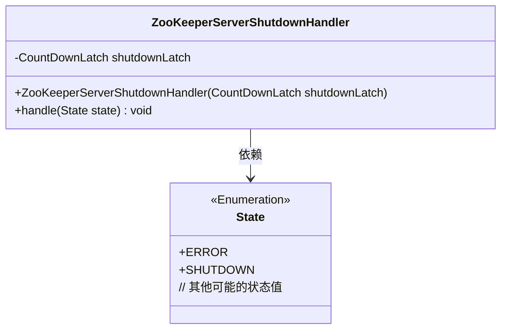
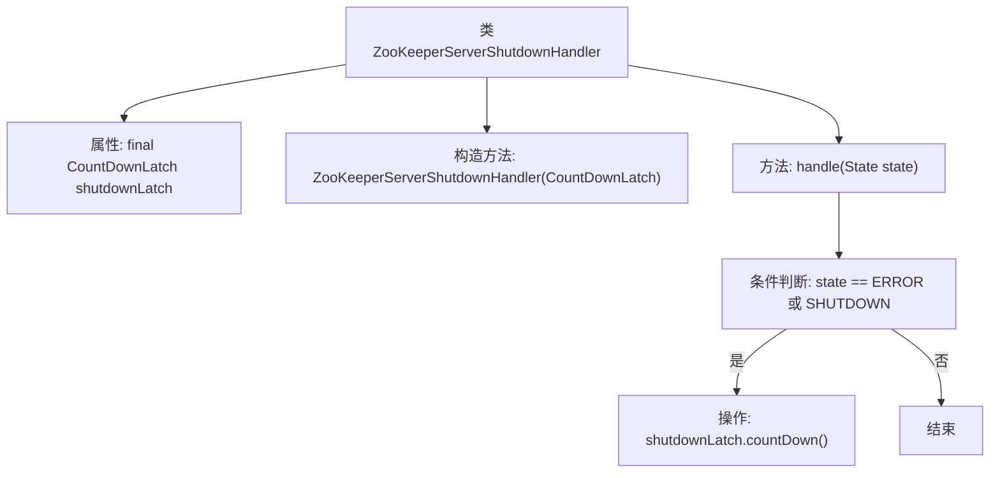

# 基础信息

|      |      |
|------|------|
| 名称 | ZooKeeperServerShutdownHandler |
| 编码语言 | .java |
| 代码路径 | zookeeper/zookeeper-server/src/main/java/org/apache/zookeeper/server/ZooKeeperServerShutdownHandler.java |
| 包名 | org.apache.zookeeper.server |
| 依赖项 | ['java.util.concurrent.CountDownLatch', 'org.apache.zookeeper.server.ZooKeeperServer.State'] |
| 概述说明 | ZooKeeperServerShutdownHandler类通过CountDownLatch在服务器状态变为ERROR或SHUTDOWN时触发关闭操作。 |

# 说明

这是一个ZooKeeper服务器关闭处理器的类实现。该类包含一个CountDownLatch类型的成员变量shutdownLatch，通过构造函数初始化。主要功能是当服务器状态变为ERROR或SHUTDOWN时，调用countDown方法减少计数器的值。该类用于监控服务器状态变化并在特定状态下触发关闭流程。

# 类列表 Class Summary

| 名称   | 类型  | 说明 |
|-------|------|-------------|
| ZooKeeperServerShutdownHandler | class | ZooKeeperServerShutdownHandler类通过CountDownLatch监控服务器状态，当状态变为ERROR或SHUTDOWN时触发countDown。 |

## 类 ZooKeeperServerShutdownHandler

|      |      |
|------|------|
| 访问范围 | public final |
| 类型 | class |
| 名称 | ZooKeeperServerShutdownHandler |
| 说明 | ZooKeeperServerShutdownHandler类通过CountDownLatch监控服务器状态，当状态变为ERROR或SHUTDOWN时触发countDown。 |

### UML类图

这段代码描述了一个ZooKeeper服务器关闭处理器，它通过CountDownLatch机制实现服务器状态监控。当服务器状态变为ERROR或SHUTDOWN时，会触发计数器减量操作。类图中包含ZooKeeperServerShutdownHandler及其依赖的State枚举，其中State枚举可能包含多种服务器状态值。该处理器通过构造函数注入CountDownLatch实例，并在特定状态变更时调用其countDown()方法。

### 内部方法调用关系图

该流程图展示了ZooKeeperServerShutdownHandler类的核心结构，包含一个final类型的CountDownLatch属性和两个主要方法。构造方法初始化shutdownLatch，handle方法根据服务器状态进行判断：当状态为ERROR或SHUTDOWN时触发countDown操作，否则直接结束。这种设计用于在服务器异常或关闭时通过门闩机制通知其他等待线程。

### 字段列表 Field List

| 名称  | 类型  | 说明 |
|-------|-------|------|
| shutdownLatch | CountDownLatch | 私有计数器锁，用于线程同步控制关闭操作。 |

### 方法列表 Method List

| 名称  | 类型  | 说明 |
|-------|-------|------|
| handle | void | 方法handle在状态为ERROR或SHUTDOWN时触发shutdownLatch计数减一。 |

