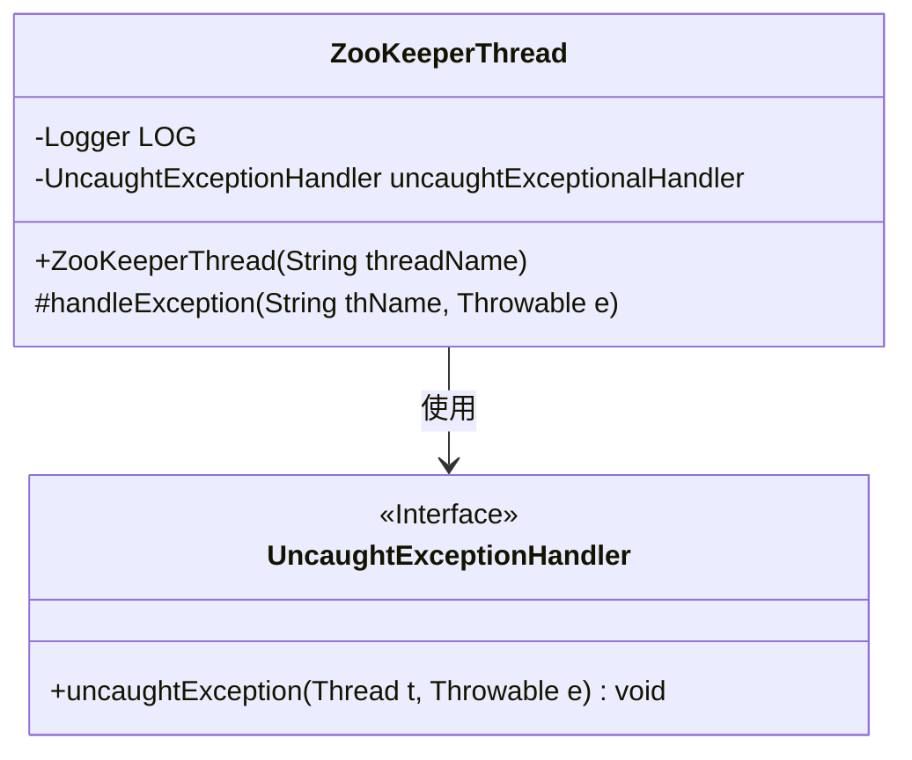
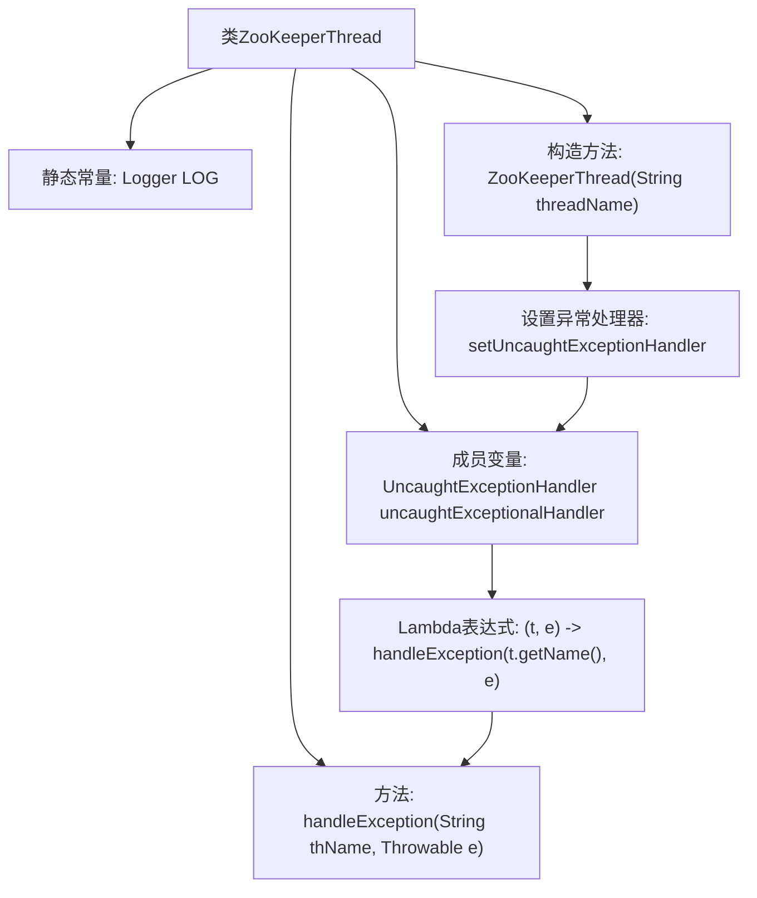

# 基础信息

|      |      |
|------|------|
| 名称 | ZooKeeperThread |
| 编码语言 | .java |
| 代码路径 | zookeeper/zookeeper-server/src/main/java/org/apache/zookeeper/server/ZooKeeperThread.java |
| 包名 | org.apache.zookeeper.server |
| 依赖项 | ['org.slf4j.Logger', 'org.slf4j.LoggerFactory'] |
| 概述说明 | ZooKeeperThread继承Thread类，自定义未捕获异常处理，记录线程名和异常信息。 |

# 说明

这段内容描述了一个名为ZooKeeperThread的Java线程类，继承自Thread类。该类包含一个静态日志记录器和一个未捕获异常处理器。构造函数接收线程名称参数，并设置自定义的未捕获异常处理器。异常处理器会调用handleException方法，该方法记录包含线程名称和异常详情的警告日志。整个类主要用于处理线程执行过程中未捕获的异常情况。

# 类列表 Class Summary

| 名称   | 类型  | 说明 |
|-------|------|-------------|
| ZooKeeperThread | class | ZooKeeperThread继承Thread类，自定义未捕获异常处理器，记录线程名和异常信息。 |

## 类 ZooKeeperThread

|      |      |
|------|------|
| 访问范围 | public |
| 类型 | class |
| 名称 | ZooKeeperThread |
| 说明 | ZooKeeperThread继承Thread类，自定义未捕获异常处理器，记录线程名和异常信息。 |

### UML类图

这段代码展示了一个继承自Thread的ZooKeeperThread类，主要用于处理线程中的未捕获异常。类中包含一个Logger用于记录日志，以及一个UncaughtExceptionHandler接口的实现，当线程发生未捕获异常时会调用handleException方法记录警告日志。该设计实现了线程安全的异常处理机制，通过lambda表达式简化了异常处理逻辑。

### 内部方法调用关系图

这段代码展示了一个继承自Thread的ZooKeeperThread类，主要用于处理线程中的未捕获异常。流程图清晰地描述了类结构，包括静态日志记录器、异常处理器成员变量、构造方法以及异常处理方法。构造方法中设置了自定义的未捕获异常处理器，该处理器通过Lambda表达式调用handleException方法记录异常日志。整个设计实现了线程异常的集中处理和日志记录功能，体现了良好的异常处理机制。

### 字段列表 Field List

| 名称  | 类型  | 说明 |
|-------|-------|------|
| uncaughtExceptionalHandler = (t, e) -> handleException(t.getName(), e) | UncaughtExceptionHandler | 私有异常处理器捕获未处理异常，调用handleException方法处理线程名和异常。 |
| LOG = LoggerFactory.getLogger(ZooKeeperThread.class) | Logger | ZooKeeperThread类中定义了一个私有静态日志记录器LOG。 |

### 方法列表 Method List

| 名称  | 类型  | 说明 |
|-------|-------|------|
| handleException | void | 线程异常处理：记录线程名和异常信息。 |

