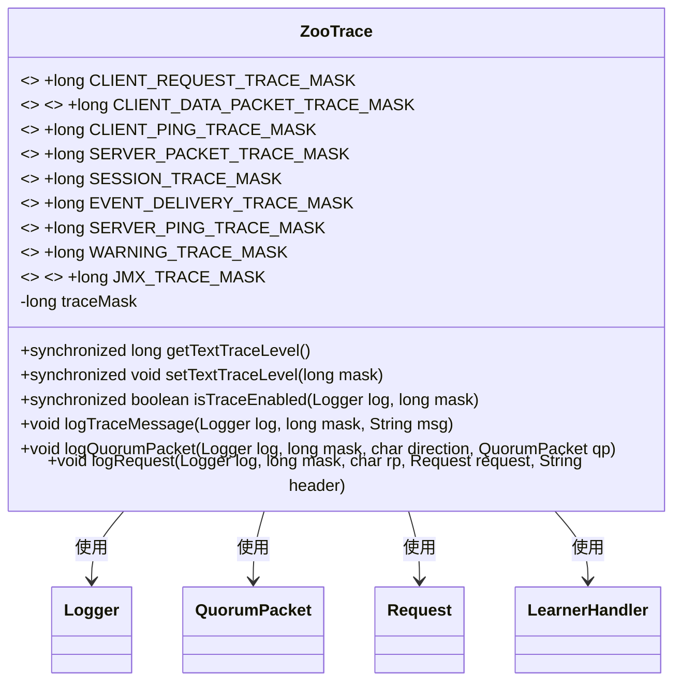

# 基础信息

|      |      |
|------|------|
| 名称 | ZooTrace |
| 编码语言 | .java |
| 代码路径 | zookeeper/zookeeper-server/src/main/java/org/apache/zookeeper/server/ZooTrace.java |
| 包名 | org.apache.zookeeper.server |
| 依赖项 | ['org.apache.zookeeper.server.quorum.LearnerHandler', 'org.apache.zookeeper.server.quorum.QuorumPacket', 'org.slf4j.Logger', 'org.slf4j.LoggerFactory'] |
| 概述说明 | ZooTrace类定义跟踪掩码常量，包含已废弃字段，提供设置、检查及日志记录功能，支持不同级别的跟踪输出。 |

# 说明

ZooTrace类是一个用于管理跟踪日志的实用工具类，包含多个静态常量定义不同跟踪类型的掩码值，其中CLIENT_DATA_PACKET_TRACE_MASK和JMX_TRACE_MASK已被标记为过时。默认跟踪掩码组合了客户端请求、服务器数据包、会话和警告跟踪。提供静态方法获取和设置当前跟踪掩码，并包含多个日志记录方法，如logTraceMessage、logQuorumPacket和logRequest，这些方法会检查跟踪是否启用后再记录相应信息。所有方法都是线程安全的，使用同步机制保护共享状态。

# 类列表 Class Summary

| 名称   | 类型  | 说明 |
|-------|------|-------------|
| ZooTrace | class | ZooTrace类定义跟踪掩码常量，提供日志级别设置与检查方法，支持不同场景的日志记录，部分字段已废弃。 |

## 类 ZooTrace

|      |      |
|------|------|
| 访问范围 | public |
| 类型 | class |
| 名称 | ZooTrace |
| 说明 | ZooTrace类定义跟踪掩码常量，提供日志级别设置与检查方法，支持不同场景的日志记录，部分字段已废弃。 |

### UML类图

该类图展示了ZooTrace类的结构和关系。ZooTrace是一个用于管理日志跟踪级别的工具类，包含多个静态常量定义不同的跟踪掩码（其中两个已标记为@Deprecated），以及控制跟踪级别的方法。核心功能包括获取/设置跟踪掩码、检查是否启用特定跟踪级别、以及多种日志记录方法（支持普通消息、QuorumPacket和Request对象的日志记录）。该类与Logger、QuorumPacket、Request和LearnerHandler等类存在依赖关系，用于实现具体的日志记录功能。

### 内部方法调用关系图

```mermaid
graph TD
    A["类ZooTrace"]
    B["常量: CLIENT_REQUEST_TRACE_MASK"]
    C["废弃常量: CLIENT_DATA_PACKET_TRACE_MASK"]
    D["常量: CLIENT_PING_TRACE_MASK"]
    E["常量: SERVER_PACKET_TRACE_MASK"]
    F["常量: SESSION_TRACE_MASK"]
    G["常量: EVENT_DELIVERY_TRACE_MASK"]
    H["常量: SERVER_PING_TRACE_MASK"]
    I["常量: WARNING_TRACE_MASK"]
    J["废弃常量: JMX_TRACE_MASK"]
    K["静态变量: traceMask"]
    L["方法: getTextTraceLevel"]
    M["方法: setTextTraceLevel"]
    N["方法: isTraceEnabled"]
    O["方法: logTraceMessage"]
    P["方法: logQuorumPacket"]
    Q["方法: logRequest"]

    A --> B
    A --> C
    A --> D
    A --> E
    A --> F
    A --> G
    A --> H
    A --> I
    A --> J
    A --> K
    A --> L
    A --> M
    A --> N
    A --> O
    O --> N
    P --> N
    Q --> N
    M --> K
```

这段代码定义了一个ZooTrace类，主要用于管理日志跟踪的掩码和提供相关的日志方法。类中包含多个静态常量用于定义不同类型的跟踪掩码，以及静态方法用于获取、设置跟踪级别和记录日志。流程图展示了类中常量、变量和方法之间的调用关系，特别是logTraceMessage、logQuorumPacket和logRequest方法都依赖于isTraceEnabled方法来判断是否启用跟踪。setTextTraceLevel方法会更新traceMask变量并记录日志。整个设计用于灵活控制不同级别的日志输出。

### 字段列表 Field List

| 名称  | 类型  | 说明 |
|-------|-------|------|
| traceMask = CLIENT_REQUEST_TRACE_MASK | SERVER_PACKET_TRACE_MASK | SESSION_TRACE_MASK | WARNING_TRACE_MASK | long | 私有静态变量traceMask组合了四种跟踪掩码：客户端请求、服务端数据包、会话和警告。 |
| CLIENT_PING_TRACE_MASK = 1 << 3 | long | 定义静态常量CLIENT_PING_TRACE_MASK，值为8（1左移3位），用于客户端PING跟踪掩码。 |
| JMX_TRACE_MASK = 1 << 9 | long | 已弃用的静态常量JMX_TRACE_MASK，值为1左移9位。 |
| SERVER_PACKET_TRACE_MASK = 1 << 4 | long | 定义静态常量SERVER_PACKET_TRACE_MASK，值为1左移4位（即16），用于服务器数据包跟踪掩码。 |
| EVENT_DELIVERY_TRACE_MASK = 1 << 6 | long | 定义常量EVENT_DELIVERY_TRACE_MASK，值为64（1左移6位）。 |
| SERVER_PING_TRACE_MASK = 1 << 7 | long | 定义静态常量SERVER_PING_TRACE_MASK，值为128（1左移7位）。 |
| CLIENT_DATA_PACKET_TRACE_MASK = 1 << 2 | long | 已弃用的静态常量，用于客户端数据包跟踪掩码，值为1左移2位。 |
| WARNING_TRACE_MASK = 1 << 8 | long | 定义静态常量WARNING_TRACE_MASK，值为256（1左移8位），用于位掩码操作。 |
| SESSION_TRACE_MASK = 1 << 5 | long | 定义静态常量SESSION_TRACE_MASK，值为32（1左移5位）。 |
| CLIENT_REQUEST_TRACE_MASK = 1 << 1 | long | 定义静态常量CLIENT_REQUEST_TRACE_MASK，值为二进制左移1位的结果（即2）。 |

### 方法列表 Method List

| 名称  | 类型  | 说明 |
|-------|-------|------|
| getTextTraceLevel | long | 获取当前文本跟踪级别，返回静态变量traceMask的值。 |
| isTraceEnabled | boolean | 静态同步方法检查日志跟踪是否启用，需满足日志启用且掩码匹配。 |
| setTextTraceLevel | void | 静态同步方法setTextTraceLevel设置跟踪掩码，记录日志信息。 |
| logTraceMessage | void | 静态方法logTraceMessage检查日志级别和掩码，若启用跟踪则记录消息。参数：日志对象log、掩码mask、消息msg。 |
| logQuorumPacket | void | 静态方法logQuorumPacket用于记录仲裁包日志，当跟踪日志启用时，通过logTraceMessage输出方向及包内容。 |
| logRequest | void | 静态方法logRequest用于记录请求日志，当满足条件时输出请求头和请求内容。 |

