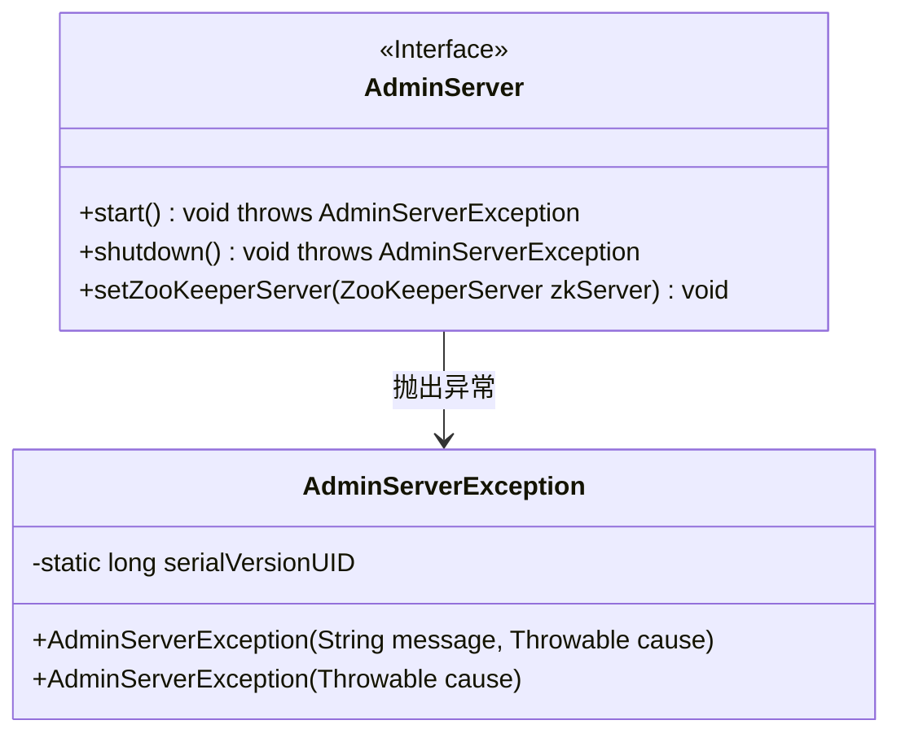
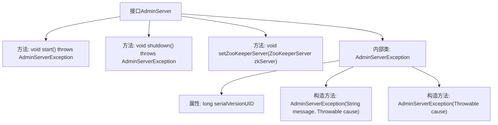

# 基础信息

|      |      |
|------|------|
| 名称 | AdminServer |
| 编码语言 | .java |
| 代码路径 | zookeeper/zookeeper-server/src/main/java/org/apache/zookeeper/server/admin/AdminServer.java |
| 包名 | org.apache.zookeeper.server.admin |
| 依赖项 | ['org.apache.yetus.audience.InterfaceAudience', 'org.apache.zookeeper.server.ZooKeeperServer'] |
| 概述说明 | 公共接口AdminServer提供启动、关闭和设置ZooKeeperServer功能，可能抛出AdminServerException异常。异常类提供两种构造方法。 |

# 说明

这是一个公开的AdminServer接口，定义了管理服务器的基本功能。接口包含三个方法：start用于启动服务器，shutdown用于关闭服务器，setZooKeeperServer用于设置ZooKeeper服务器实例。所有方法都可能抛出AdminServerException异常。该异常类也是公开的，提供了两种构造方式：一种接受错误信息和原因，另一种仅接受原因。异常类实现了标准的序列化版本控制。整个接口设计简洁，专注于管理服务器的核心生命周期操作和异常处理。

# 类列表 Class Summary

| 名称   | 类型  | 说明 |
|-------|------|-------------|
| AdminServer | interface | 公共接口AdminServer提供启动、关闭及设置ZooKeeperServer功能，可能抛出AdminServerException异常。异常类支持消息和原因构造。 |

## 类 AdminServer

|      |      |
|------|------|
| 访问范围 | @InterfaceAudience.Public;public |
| 类型 | interface |
| 名称 | AdminServer |
| 说明 | 公共接口AdminServer提供启动、关闭及设置ZooKeeperServer功能，可能抛出AdminServerException异常。异常类支持消息和原因构造。 |

### UML类图

这段类图描述了一个管理服务器接口及其异常类的结构。AdminServer接口定义了启动、关闭和设置ZooKeeper服务器的三个公共方法，这些方法可能抛出AdminServerException异常。AdminServerException作为嵌套类实现了两种构造方式：一种接受消息和原因，另一种仅接受原因。该设计体现了接口与异常处理的紧密关联，适用于需要统一管理服务器操作并处理相关异常的场景。

### 内部方法调用关系图

这段代码定义了一个公共接口`AdminServer`，包含三个核心方法：启动服务、关闭服务和设置ZooKeeper服务器实例。接口内部嵌套了一个自定义异常类`AdminServerException`，该类提供两种构造方式（带原因链的异常和纯原因异常）。流程图清晰展示了接口与内部异常类的层级关系，以及各自的方法和属性结构，体现了接口对外暴露的管理能力与异常处理机制。

### 字段列表 Field List

| 名称  | 类型  | 说明 |
|-------|-------|------|

### 方法列表 Method List

| 名称  | 类型  | 说明 |
|-------|-------|------|
| shutdown | void | 关闭服务，可能抛出AdminServerException异常。 |
| start | void | 方法声明：start()可能抛出AdminServerException异常。 |
| setZooKeeperServer | void | 设置ZooKeeper服务器实例。 |

