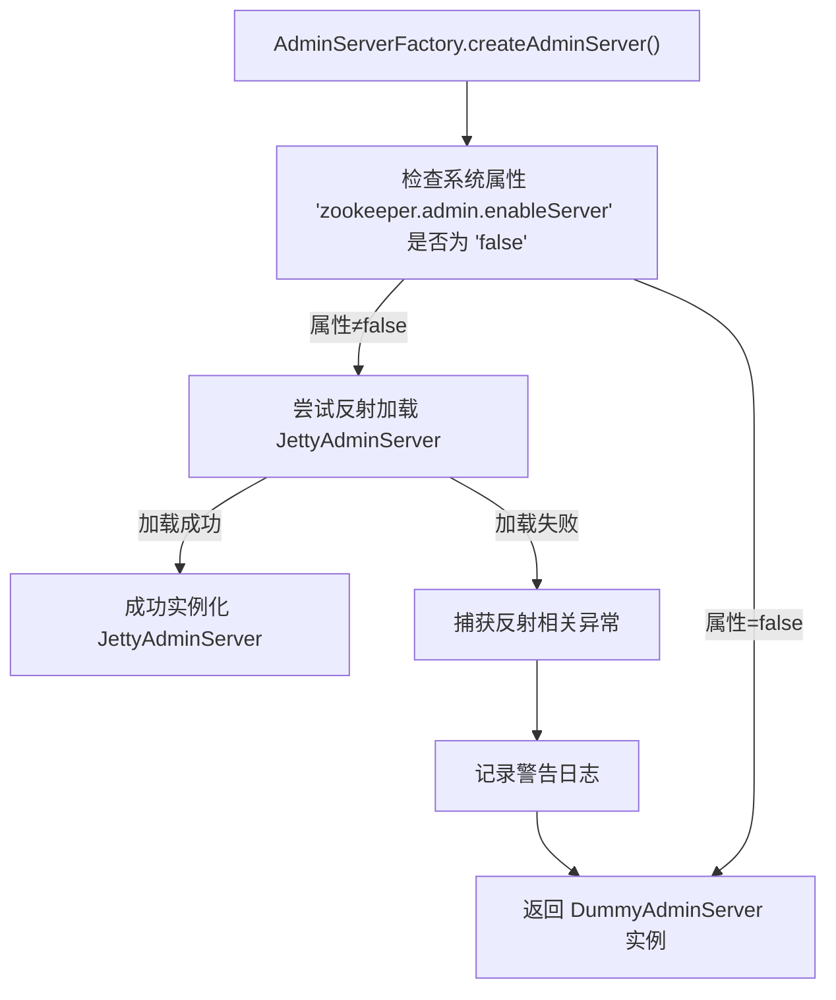

# 基础信息

|      |      |
|------|------|
| 名称 | AdminServerFactory |
| 编码语言 | .java |
| 代码路径 | zookeeper/zookeeper-server/src/main/java/org/apache/zookeeper/server/admin/AdminServerFactory.java |
| 包名 | org.apache.zookeeper.server.admin |
| 依赖项 | ['java.lang.reflect.InvocationTargetException', 'org.slf4j.Logger', 'org.slf4j.LoggerFactory'] |
| 概述说明 | AdminServerFactory根据系统属性决定创建JettyAdminServer或DummyAdminServer，使用反射避免直接依赖Jetty。 |

# 说明

AdminServerFactory类提供了创建AdminServer实例的静态方法。该方法首先检查系统属性zookeeper.admin.enableServer是否为false，若不是则尝试通过反射创建JettyAdminServer实例。若反射过程中出现任何异常（如类未找到、实例化失败等），则记录警告日志并返回DummyAdminServer实例。这种设计允许在不依赖Jetty的情况下运行ZooKeeper。

# 类列表 Class Summary

| 名称   | 类型  | 说明 |
|-------|------|-------------|
| AdminServerFactory | class | AdminServerFactory根据系统属性决定创建JettyAdminServer或DummyAdminServer，使用反射避免直接依赖Jetty。 |


## 类 AdminServerFactory

|      |      |
|------|------|
| 访问范围 | public |
| 类型 | class |
| 名称 | AdminServerFactory |
| 说明 | AdminServerFactory根据系统属性决定创建JettyAdminServer或DummyAdminServer，使用反射避免直接依赖Jetty。 |


### UML类图

```mermaid
classDiagram
    class AdminServerFactory {
        -Logger LOG
        +createAdminServer() AdminServer
    }

    class <<Interface>> AdminServer {
        <<Interface>>
    }

    class JettyAdminServer {
        +JettyAdminServer()
    }

    class DummyAdminServer {
        +DummyAdminServer()
    }

    AdminServerFactory --> AdminServer : 创建
    JettyAdminServer ..|> AdminServer : 实现
    DummyAdminServer ..|> AdminServer : 实现
```

这段代码展示了一个工厂模式实现，AdminServerFactory根据系统属性动态创建不同类型的AdminServer实现。当"zookeeper.admin.enableServer"不为false时，通过反射尝试加载JettyAdminServer；若失败则返回DummyAdminServer。类图清晰地展示了工厂类与接口的关系，以及JettyAdminServer和DummyAdminServer对AdminServer接口的实现，体现了运行时动态绑定的设计思想。


### 内部方法调用关系图



该流程图展示了AdminServerFactory的核心逻辑：首先检查系统属性决定是否启用管理服务器，若启用则通过反射动态加载JettyAdminServer，成功则返回实例，失败则捕获6类异常并记录日志后返回备用DummyAdminServer。流程完整覆盖了正常路径和异常处理路径，反映了通过系统配置开关和反射机制实现的插件式架构设计。

### 字段列表 Field List

| 名称  | 类型  | 说明 |
|-------|-------|------|
| LOG = LoggerFactory.getLogger(AdminServerFactory.class) | Logger | 定义AdminServerFactory类的私有静态日志常量LOG。 |

### 方法列表 Method List

| 名称  | 类型  | 说明 |
|-------|-------|------|
| createAdminServer | AdminServer | 创建AdminServer实例，检查系统属性启用后尝试加载JettyAdminServer，失败则返回DummyAdminServer。 |


