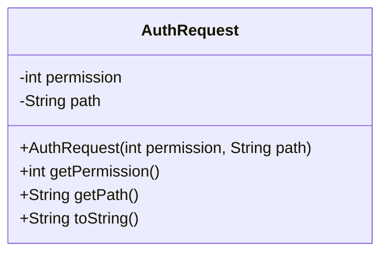
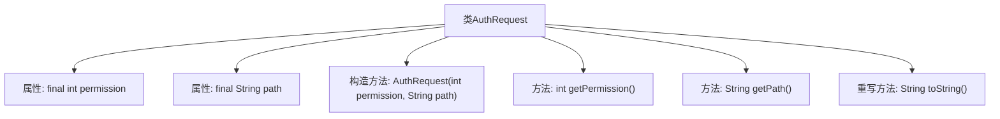

# 基础信息

|      |      |
|------|------|
| 名称 | AuthRequest |
| 编码语言 | .java |
| 代码路径 | zookeeper/zookeeper-server/src/main/java/org/apache/zookeeper/server/admin/AuthRequest.java |
| 包名 | org.apache.zookeeper.server.admin |
| 依赖项 | ['org.apache.zookeeper.ZooDefs'] |
| 概述说明 | AuthRequest类用于权限验证，包含权限值和路径字段，提供构造方法和getter，重写toString输出信息。 |

# 说明

AuthRequest类是一个用于权限验证的请求类，包含两个私有成员变量：permission表示所需权限级别，path表示ZNode路径。类提供了构造方法，接收这两个参数并初始化。提供getPermission和getPath方法分别获取权限和路径。重写了toString方法，返回包含权限和路径的格式化字符串。该类封装了权限验证所需的核心信息。

# 类列表 Class Summary

| 名称   | 类型  | 说明 |
|-------|------|-------------|
| AuthRequest | class | AuthRequest类用于权限验证，包含权限值和路径属性，提供构造方法和获取方法，并重写toString输出信息。 |

## 类 AuthRequest

|      |      |
|------|------|
| 访问范围 | public |
| 类型 | class |
| 名称 | AuthRequest |
| 说明 | AuthRequest类用于权限验证，包含权限值和路径属性，提供构造方法和获取方法，并重写toString输出信息。 |

### UML类图

这段代码定义了一个名为AuthRequest的类，用于封装权限验证请求的相关信息。该类包含两个私有字段：permission表示所需的权限级别，path表示ZooKeeper节点路径。提供了构造方法初始化这两个字段，以及对应的getter方法获取字段值。toString()方法重写了Object类的实现，用于返回对象的字符串表示形式。这个类主要用于在权限验证过程中传递请求参数，结构简单但功能明确。

### 内部方法调用关系图

这段代码定义了一个AuthRequest类，用于封装权限验证请求的相关信息。类中包含两个final属性(permission和path)，一个构造方法用于初始化这些属性，以及三个方法(getPermission、getPath和toString)用于获取属性值和格式化输出。该类的设计简洁明了，主要用于存储和传递权限验证所需的参数。

### 字段列表 Field List

| 名称  | 类型  | 说明 |
|-------|-------|------|
| permission | int | 私有整型权限变量。 |
| path | String | 私有字符串变量path，不可修改。 |

### 方法列表 Method List

| 名称  | 类型  | 说明 |
|-------|-------|------|
| getPermission | int | 获取权限值的方法，返回整数类型权限值。 |
| getPath | String | 这是一个Java方法，返回字符串类型的path变量值。 |
| toString | String | Java重写toString方法，返回AuthRequest对象的权限和路径信息。 |

