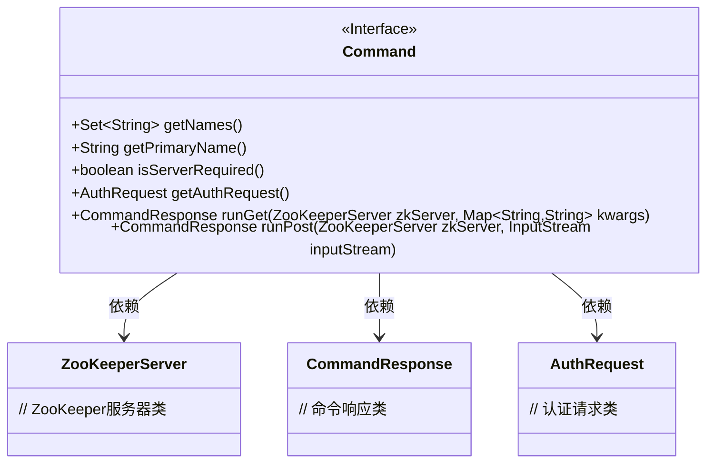
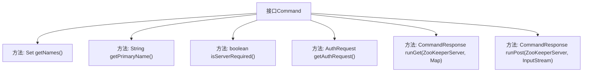

# 基础信息

|      |      |
|------|------|
| 名称 | Command |
| 编码语言 | .java |
| 代码路径 | zookeeper/zookeeper-server/src/main/java/org/apache/zookeeper/server/admin/Command.java |
| 包名 | org.apache.zookeeper.server.admin |
| 依赖项 | ['java.io.InputStream', 'java.util.Map', 'java.util.Set', 'org.apache.zookeeper.server.ZooKeeperServer'] |
| 概述说明 | Command接口定义了命令的基本结构：获取命令名称集合getNames()和主名称getPrimaryName()，检查是否需要服务器isServerRequired()，获取认证请求getAuthRequest()，以及处理HTTP GET和POST请求的runGet()和runPost()方法，均返回包含命令名和错误信息的CommandResponse。 |

# 说明

该接口定义了一个命令模式的结构，包含获取命令名称集合、主名称的方法，以及判断是否需要ZooKeeper服务器和认证请求的功能。接口提供了两种执行命令的方法：runGet处理HTTP GET请求，接收ZooKeeper服务器和参数字典；runPost处理HTTP POST请求，接收ZooKeeper服务器和输入流。两种方法均返回包含命令主名称和错误信息的响应对象，错误通过响应对象返回而非抛出异常。

# 类列表 Class Summary

| 名称   | 类型  | 说明 |
|-------|------|-------------|
| Command | interface | Command接口定义了命令的基本结构，包括命令名称集合、主名称、服务器需求、权限检查及GET/POST请求处理方法，返回包含命令名和错误的响应。 |

## 类 Command

|      |      |
|------|------|
| 访问范围 | public |
| 类型 | interface |
| 名称 | Command |
| 说明 | Command接口定义了命令的基本结构，包括命令名称集合、主名称、服务器需求、权限检查及GET/POST请求处理方法，返回包含命令名和错误的响应。 |

### UML类图

这段代码定义了一个Command接口，该接口用于处理ZooKeeper服务器的HTTP请求命令。接口包含获取命令名称集合、主名称、服务器需求状态和认证请求的方法，以及处理GET和POST请求的核心方法。接口依赖于ZooKeeperServer、CommandResponse和AuthRequest三个类，分别用于服务器交互、响应返回和认证请求处理。该设计支持多种命令名称别名，并强制要求错误通过响应对象返回而非异常抛出，体现了良好的错误处理机制和接口灵活性。

### 内部方法调用关系图

该流程图展示了Command接口的结构及其方法关系。Command接口定义了6个核心方法：getNames()获取命令别名集合，getPrimaryName()返回主名称，isServerRequired()检查是否需要ZooKeeper服务器，getAuthRequest()获取认证请求，以及runGet()和runPost()分别处理HTTP GET和POST请求。所有方法都直接隶属于Command接口，没有层级嵌套关系，体现了接口作为行为契约的特性。

### 字段列表 Field List

| 名称  | 类型  | 说明 |
|-------|-------|------|

### 方法列表 Method List

| 名称  | 类型  | 说明 |
|-------|-------|------|
| getAuthRequest | AuthRequest | 获取认证请求对象。 |
| getNames | Set<String> | 获取名称集合的方法。 |
| getPrimaryName | String | 获取主名称的字符串方法。 |
| runPost | CommandResponse | 运行ZooKeeper服务器的后处理命令，接收输入流参数。 |
| runGet | CommandResponse | ZooKeeperServer执行runGet命令，传入参数kwargs并返回结果。 |
| isServerRequired | boolean | 检查是否需要服务器支持。 |

