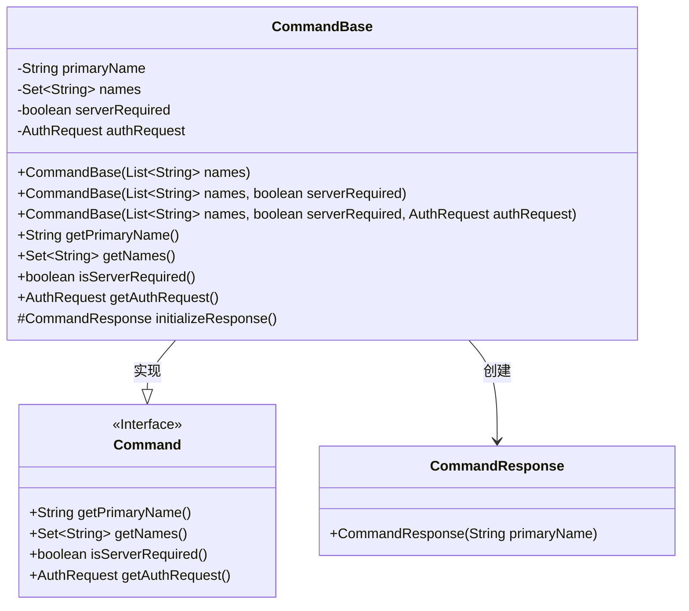
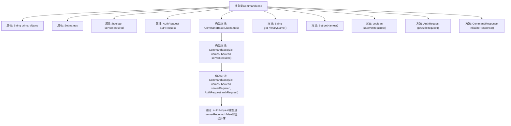

# 基础信息

|      |      |
|------|------|
| 名称 | CommandBase |
| 编码语言 | .java |
| 代码路径 | zookeeper/zookeeper-server/src/main/java/org/apache/zookeeper/server/admin/CommandBase.java |
| 包名 | org.apache.zookeeper.server.admin |
| 依赖项 | ['java.util.HashSet', 'java.util.List', 'java.util.Set'] |
| 概述说明 | 抽象类CommandBase实现Command接口，包含主名称、名称集合、服务要求和认证请求字段，提供初始化响应方法。 |

# 说明

这是一个抽象命令基类CommandBase，实现了Command接口。它包含命令的主要名称primaryName、所有可能名称集合names、是否需要服务器的标志serverRequired和认证请求authRequest。类提供了三个构造函数，分别接受名称列表、名称列表与服务器需求标志、名称列表与服务器需求标志及认证请求。构造函数会校验认证请求与服务器需求的逻辑关系。类还提供了获取各属性的方法，以及初始化命令响应的方法initializeResponse，该方法返回包含主名称且无错误的响应对象。

# 类列表 Class Summary

| 名称   | 类型  | 说明 |
|-------|------|-------------|
| CommandBase | class | 抽象类CommandBase实现Command接口，包含主名称、名称集合、服务要求和认证请求属性，提供初始化响应方法。 |

## 类 CommandBase

|      |      |
|------|------|
| 访问范围 | public abstract |
| 类型 | class |
| 名称 | CommandBase |
| 说明 | 抽象类CommandBase实现Command接口，包含主名称、名称集合、服务要求和认证请求属性，提供初始化响应方法。 |

### UML类图

这段代码展示了一个命令模式的基础实现，其中CommandBase是一个抽象类，实现了Command接口，提供了命令名称管理、服务器需求验证和权限检查等功能。CommandBase通过构造函数链式调用确保参数有效性，并提供了初始化响应的方法。类图中清晰地展示了接口实现关系和对CommandResponse的依赖关系。

### 内部方法调用关系图

这段代码描述了一个抽象命令基类CommandBase的结构，包含4个核心属性和5个关键方法。类通过三个重载构造函数实现参数化初始化，其中全参数构造器会验证authRequest与serverRequired的逻辑约束。所有属性都通过getter方法暴露，initializeResponse()方法提供了标准化的响应初始化功能。流程图清晰展示了属性继承关系、构造方法链式调用以及各方法的从属关系，特别突出了参数校验这一关键约束条件。

### 字段列表 Field List

| 名称  | 类型  | 说明 |
|-------|-------|------|
| names | Set<String> | 私有不可变字符串集合names。 |
| authRequest | AuthRequest | 私有不可变的AuthRequest认证请求对象。 |
| serverRequired | boolean | 私有布尔变量serverRequired，表示是否需要服务器。 |
| primaryName | String | 私有字符串变量primaryName，不可修改。 |

### 方法列表 Method List

| 名称  | 类型  | 说明 |
|-------|-------|------|
| getNames | Set<String> | 重写getNames方法，返回names集合。 |
| initializeResponse | CommandResponse | 方法initializeResponse返回一个以primaryName初始化的CommandResponse对象。 |
| isServerRequired | boolean | 重写方法isServerRequired，返回布尔值serverRequired。 |
| getAuthRequest | AuthRequest | 重写getAuthRequest方法，直接返回authRequest对象。 |
| getPrimaryName | String | 重写getPrimaryName方法，返回primaryName字段值。 |

