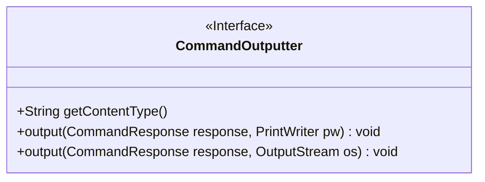
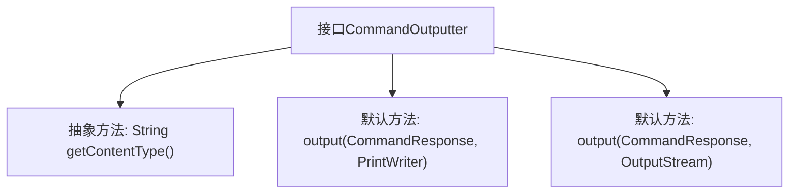

# 基础信息

|      |      |
|------|------|
| 名称 | CommandOutputter |
| 编码语言 | .java |
| 代码路径 | zookeeper/zookeeper-server/src/main/java/org/apache/zookeeper/server/admin/CommandOutputter.java |
| 包名 | org.apache.zookeeper.server.admin |
| 依赖项 | ['java.io.OutputStream', 'java.io.PrintWriter'] |
| 概述说明 | CommandOutputter接口定义命令输出方法，含内容类型获取和两种默认输出方式：PrintWriter和OutputStream。 |

# 说明

该内容定义了一个名为CommandOutputter的公共接口，主要用于处理命令输出的格式化与传输。接口包含三个关键方法：getContentType用于获取输出的MIME类型（如application/json）；output方法有两个重载版本，分别支持通过PrintWriter和OutputStream输出CommandResponse数据。两个output方法都提供了默认的空实现，允许子类按需覆盖。该接口设计灵活，适用于多种输出场景。

# 类列表 Class Summary

| 名称   | 类型  | 说明 |
|-------|------|-------------|
| CommandOutputter | interface | CommandOutputter接口定义命令输出方法，含获取MIME类型和两种默认输出方式（PrintWriter和OutputStream）。 |

## 类 CommandOutputter

|      |      |
|------|------|
| 访问范围 | public |
| 类型 | interface |
| 名称 | CommandOutputter |
| 说明 | CommandOutputter接口定义命令输出方法，含获取MIME类型和两种默认输出方式（PrintWriter和OutputStream）。 |

### UML类图

这段类图描述了一个名为CommandOutputter的接口，该接口定义了命令输出器的基本功能。接口包含三个方法：getContentType()用于获取输出内容的MIME类型，两个重载的output()方法分别支持通过PrintWriter和OutputStream两种方式输出CommandResponse数据。接口使用<<Interface>>标记明确表示其接口性质，所有方法均为公有方法，体现了输出器应具备的通用功能契约。

### 内部方法调用关系图

该流程图展示了CommandOutputter接口的结构，包含一个必须实现的抽象方法getContentType()和两个可选重写的默认输出方法。接口定义了命令响应输出的统一规范，支持通过PrintWriter或OutputStream两种方式输出数据，并强制要求实现类声明内容类型。这种设计允许灵活扩展不同格式的输出处理器，同时保持核心契约的一致性。

### 字段列表 Field List

| 名称  | 类型  | 说明 |
|-------|-------|------|

### 方法列表 Method List

| 名称  | 类型  | 说明 |
|-------|-------|------|
| output | void | 方法定义：输出CommandResponse到PrintWriter。 |
| getContentType | String | 获取内容类型的方法，返回字符串形式的内容类型信息。 |
| output | void | 方法output将CommandResponse写入OutputStream，无返回值。 |

