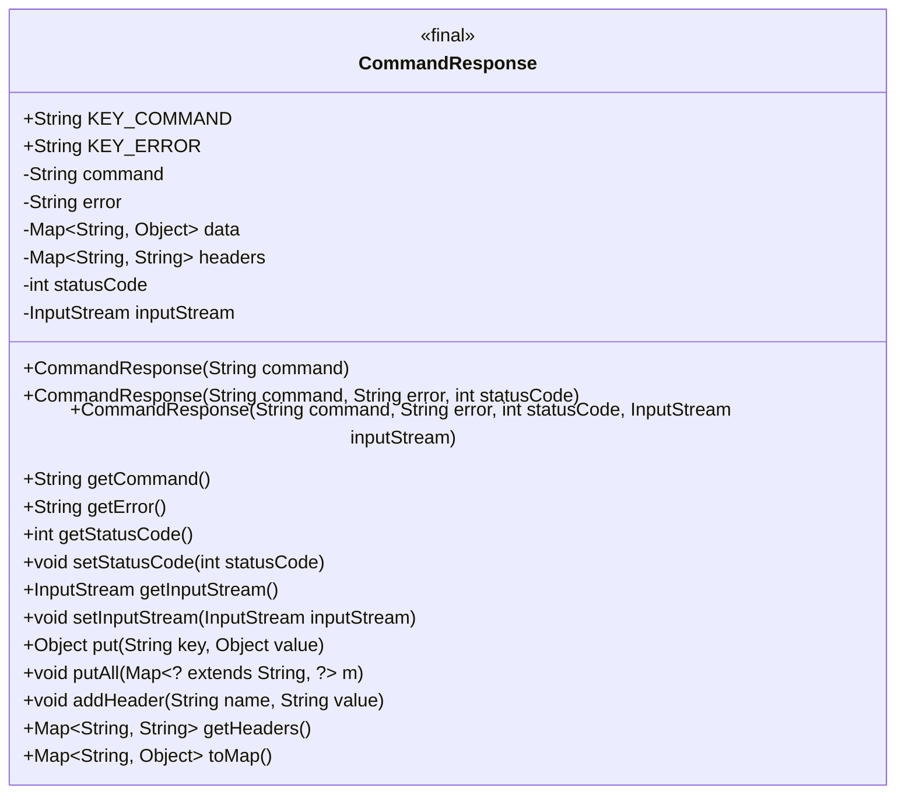
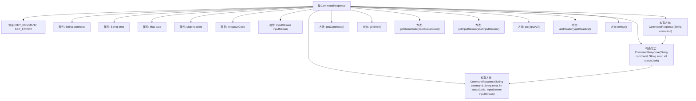

# 基础信息

|      |      |
|------|------|
| 名称 | CommandResponse |
| 编码语言 | .java |
| 代码路径 | zookeeper/zookeeper-server/src/main/java/org/apache/zookeeper/server/admin/CommandResponse.java |
| 包名 | org.apache.zookeeper.server.admin |
| 依赖项 | ['java.io.InputStream', 'java.util.HashMap', 'java.util.LinkedHashMap', 'java.util.Map', 'javax.servlet.http.HttpServletResponse'] |
| 概述说明 | CommandResponse类封装命令响应，包含命令名、错误信息、状态码、数据、头部和输入流，提供相关操作和转换方法。 |

# 说明

CommandResponse类用于封装命令响应数据，包含命令名称、错误信息、HTTP状态码、输入流、数据键值对和响应头。类中定义了KEY_COMMAND和KEY_ERROR常量作为映射键。构造函数支持不同参数组合初始化响应。提供获取和设置命令、错误、状态码、输入流的方法。支持添加键值对到数据映射，批量添加映射项，以及添加响应头。toMap方法将响应转换为包含命令、错误和数据键值对的可变映射。headers和data分别存储响应头和响应数据。

# 类列表 Class Summary

| 名称   | 类型  | 说明 |
|-------|------|-------------|
| CommandResponse | class | CommandResponse类封装命令响应，包含命令名、错误信息、状态码、数据、头部和输入流，提供构造方法和操作接口。 |

## 类 CommandResponse

|      |      |
|------|------|
| 访问范围 | public |
| 类型 | class |
| 名称 | CommandResponse |
| 说明 | CommandResponse类封装命令响应，包含命令名、错误信息、状态码、数据、头部和输入流，提供构造方法和操作接口。 |

### UML类图

类图描述：
CommandResponse类是一个用于封装命令响应数据的实体类，包含命令名称、错误信息、状态码、输入流以及响应数据和头部信息。该类提供了多个构造方法以适应不同场景，并包含对响应数据的操作方法如put、putAll等。通过toMap方法可将响应数据转换为可变的Map结构，便于后续处理。状态码和输入流支持动态修改，headers采用Map结构存储便于扩展。整体设计注重灵活性和数据封装性。

### 内部方法调用关系图

该流程图展示了CommandResponse类的完整结构，包含3个构造方法和11个主要方法。类通过链式构造函数初始化命令响应对象，核心功能包括状态码管理、数据存储(headers/data)、流处理(inputStream)和Map转换(toMap)。所有方法围绕HTTP响应处理设计，支持错误信息、状态码和二进制数据的封装，最终可通过toMap()方法转换为标准数据结构。

### 字段列表 Field List

| 名称  | 类型  | 说明 |
|-------|-------|------|
| data | Map<String, Object> | 私有不可变映射，键为字符串，值为对象。 |
| KEY_ERROR = "error" | String | 定义静态常量字符串KEY_ERROR，值为"error"。 |
| inputStream | InputStream | 私有输入流变量inputStream。 |
| error | String | 私有不可变字符串变量error。 |
| statusCode | int | 私有整型变量statusCode，用于存储状态码。 |
| command | String | 私有字符串类型变量command，不可修改。 |
| KEY_COMMAND = "command" | String | 定义静态常量字符串KEY_COMMAND，值为"command"。 |
| headers | Map<String, String> | 私有常量headers，类型为Map，键值对均为String。 |

### 方法列表 Method List

| 名称  | 类型  | 说明 |
|-------|-------|------|
| setStatusCode | void | 设置状态码的方法，将输入参数赋值给类的状态码变量。 |
| getInputStream | InputStream | 该方法返回一个输入流对象。 |
| getStatusCode | int | 方法返回状态码整数值。 |
| setInputStream | void | 方法setInputStream接收InputStream参数，并将其赋值给类的inputStream成员变量。 |
| getError | String | 方法getError返回字符串类型的error变量值。 |
| getCommand | String | 这是一个Java方法，返回字符串类型的command变量值。 |
| put | Object | 这是一个Java方法，功能是将键值对存入数据映射中，返回之前与键关联的值。 |
| putAll | void | 方法putAll接收一个Map参数m，将其所有键值对添加到当前data映射中。 |
| addHeader | void | 向headers映射中添加键值对，键为name，值为value。 |
| getHeaders | Map<String, String> | 这是一个Java方法，返回名为headers的Map对象，键值对类型均为String。 |
| toMap | Map<String, Object> | Java方法toMap将数据、命令和错误信息合并到LinkedHashMap中并返回。 |

