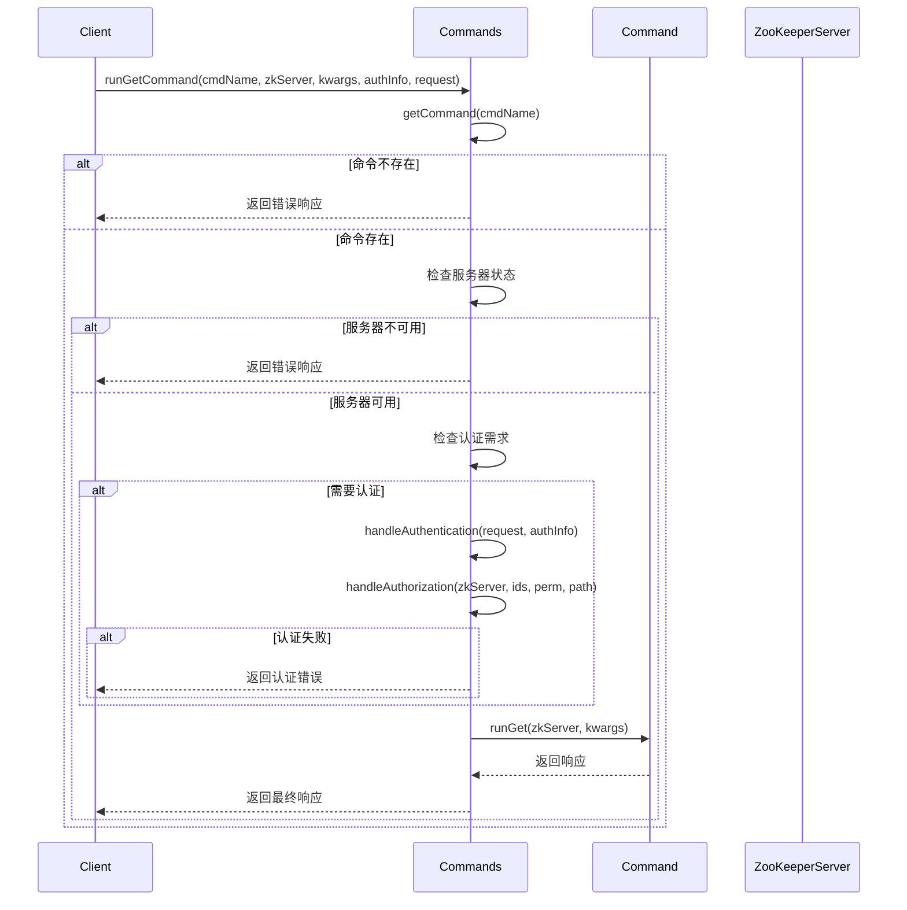

# 基础信息

|      |      |
|------|------|
| 名称 | Commands |
| 编码语言 | .java |
| 代码路径 | zookeeper/zookeeper-server/src/main/java/org/apache/zookeeper/server/admin/Commands.java |
| 包名 | org.apache.zookeeper.server.admin |
| 依赖项 | ['org.apache.zookeeper.server.persistence.FileSnap.SNAPSHOT_FILE_PREFIX', 'com.fasterxml.jackson.annotation.JsonProperty', 'edu.umd.cs.findbugs.annotations.SuppressFBWarnings', 'java.io.File', 'java.io.FileInputStream', 'java.io.InputStream', 'java.net.InetSocketAddress', 'java.nio.charset.StandardCharsets', 'java.util.Arrays', 'java.util.Collections', 'java.util.HashMap', 'java.util.HashSet', 'java.util.List', 'java.util.Map', 'java.util.Properties', 'java.util.Set', 'java.util.SortedMap', 'java.util.TreeMap', 'java.util.concurrent.TimeUnit', 'java.util.stream.Collectors', 'javax.servlet.http.HttpServletRequest', 'javax.servlet.http.HttpServletResponse', 'org.apache.zookeeper.Environment', 'org.apache.zookeeper.Environment.Entry', 'org.apache.zookeeper.KeeperException', 'org.apache.zookeeper.Version', 'org.apache.zookeeper.ZooDefs', 'org.apache.zookeeper.data.ACL', 'org.apache.zookeeper.data.Id', 'org.apache.zookeeper.server.DataNode', 'org.apache.zookeeper.server.DataTree', 'org.apache.zookeeper.server.ServerCnxnFactory', 'org.apache.zookeeper.server.ServerMetrics', 'org.apache.zookeeper.server.ZooKeeperServer', 'org.apache.zookeeper.server.ZooTrace', 'org.apache.zookeeper.server.auth.ProviderRegistry', 'org.apache.zookeeper.server.auth.ServerAuthenticationProvider', 'org.apache.zookeeper.server.persistence.SnapshotInfo', 'org.apache.zookeeper.server.persistence.Util', 'org.apache.zookeeper.server.quorum.Follower', 'org.apache.zookeeper.server.quorum.FollowerZooKeeperServer', 'org.apache.zookeeper.server.quorum.Leader', 'org.apache.zookeeper.server.quorum.LeaderZooKeeperServer', 'org.apache.zookeeper.server.quorum.MultipleAddresses', 'org.apache.zookeeper.server.quorum.QuorumPeer', 'org.apache.zookeeper.server.quorum.QuorumPeer.LearnerType', 'org.apache.zookeeper.server.quorum.QuorumZooKeeperServer', 'org.apache.zookeeper.server.quorum.ReadOnlyZooKeeperServer', 'org.apache.zookeeper.server.quorum.flexible.QuorumVerifier', 'org.apache.zookeeper.server.util.RateLimiter', 'org.apache.zookeeper.server.util.ZxidUtils', 'org.eclipse.jetty.http.HttpStatus', 'org.slf4j.Logger', 'org.slf4j.LoggerFactory'] |
| 概述说明 | Commands类管理ZooKeeper服务器命令，包括注册、执行GET/POST请求，处理认证授权，提供监控、配置、快照等操作。支持限流、错误处理，返回包含状态和数据的响应。内置多种命令如重置统计、获取配置、监控信息等。 |

# 说明

该代码定义了一个ZooKeeper服务器命令管理类Commands，包含以下核心功能：

1. 命令注册机制：通过registerCommand方法注册各类命令，支持多名称映射，维护命令名称与实例的映射关系。

2. 命令执行框架：提供runGetCommand和runPostCommand两种执行入口，统一处理认证授权、参数校验和错误处理。

3. 内置命令实现：包含37种管理命令，涵盖服务器状态监控（如stat、monitor）、配置管理（conf）、数据操作（snapshot、restore）、会话管理（watches）等核心功能。

4. 安全控制：通过AuthRequest机制实现命令级别的权限校验，支持多种认证方式。

5. 限流保护：对高风险操作（如snapshot/restore）实施速率限制。

6. 标准化响应：所有命令返回统一结构的CommandResponse，包含执行状态、错误信息和业务数据。

该模块作为ZooKeeper管理接口的核心实现，通过HTTP协议对外暴露丰富的运维管理能力，同时确保操作安全性和系统稳定性。

# 类列表 Class Summary

| 名称   | 类型  | 说明 |
|-------|------|-------------|
| Commands | class | Commands类管理ZooKeeper服务器命令，包含注册、执行GET/POST命令的方法，支持多种内置命令如监控、配置、快照等，并处理认证授权。 |


## 类 Commands

|      |      |
|------|------|
| 访问范围 | public |
| 类型 | class |
| 名称 | Commands |
| 说明 | Commands类管理ZooKeeper服务器命令，包含注册、执行GET/POST命令的方法，支持多种内置命令如监控、配置、快照等，并处理认证授权。 |


### UML类图

```mermaid
classDiagram
    class Commands {
        -static final Logger LOG
        -static final String ADMIN_RATE_LIMITER_INTERVAL
        -static final String AUTH_INFO_SEPARATOR
        -static final String ROOT_PATH
        -static Map~String, Command~ commands
        -static Set~String~ primaryNames
        +static registerCommand(Command command)
        +static CommandResponse runGetCommand(String cmdName, ZooKeeperServer zkServer, Map~String, String~ kwargs, String authInfo, HttpServletRequest request)
        +static CommandResponse runPostCommand(String cmdName, ZooKeeperServer zkServer, InputStream inputStream, String authInfo, HttpServletRequest request)
        -static CommandResponse runCommand(String cmdName, ZooKeeperServer zkServer, Map~String, String~ kwargs, InputStream inputStream, String authInfo, HttpServletRequest request, boolean isGet)
        -static List~Id~ handleAuthentication(HttpServletRequest request, String authInfo)
        -static void handleAuthorization(ZooKeeperServer zkServer, List~Id~ ids, int perm, String path)
        +static Set~String~ getPrimaryNames()
        +static Command getCommand(String cmdName)
    }

    class Command {
        <<Interface>>
        +String[] getNames()
        +String getPrimaryName()
        +boolean isServerRequired()
        +AuthRequest getAuthRequest()
        +CommandResponse runGet(ZooKeeperServer zkServer, Map~String, String~ kwargs)
        +CommandResponse runPost(ZooKeeperServer zkServer, InputStream inputStream)
    }

    class GetCommand {
        <<Abstract>>
        +GetCommand(List~String~ names)
        +GetCommand(List~String~ names, boolean serverRequired)
        +GetCommand(List~String~ names, boolean serverRequired, AuthRequest authRequest)
        +CommandResponse runGet(ZooKeeperServer zkServer, Map~String, String~ kwargs)
    }

    class PostCommand {
        <<Abstract>>
        +PostCommand(List~String~ names)
        +PostCommand(List~String~ names, boolean serverRequired)
        +PostCommand(List~String~ names, boolean serverRequired, AuthRequest authRequest)
        +CommandResponse runPost(ZooKeeperServer zkServer, InputStream inputStream)
    }

    class AuthRequest {
        +AuthRequest(int permission, String path)
        +int getPermission()
        +String getPath()
    }

    class CommandResponse {
        +CommandResponse(String command, String error, int statusCode)
        +void put(String key, Object value)
        +void putAll(Map~String, Object~ map)
        +void setStatusCode(int statusCode)
        +void addHeader(String name, String value)
        +void setInputStream(InputStream inputStream)
    }

    Commands --> Command : 注册/调用
    Commands --> AuthRequest : 使用
    Commands --> CommandResponse : 返回
    GetCommand --|> Command : 实现
    PostCommand --|> Command : 实现
    Command --> AuthRequest : 包含

    // 具体命令类继承关系
    class CnxnStatResetCommand
    class ConfCommand
    class ConsCommand
    class DigestCommand
    class DirsCommand
    class DumpCommand
    class EnvCommand
    class GetTraceMaskCommand
    class InitialConfigurationCommand
    class IsroCommand
    class LastSnapshotCommand
    class LeaderCommand
    class MonitorCommand
    class ObserverCnxnStatResetCommand
    class RestoreCommand
    class RuokCommand
    class SetTraceMaskCommand
    class SnapshotCommand
    class SrvrCommand
    class StatCommand
    class StatResetCommand
    class SyncedObserverConsCommand
    class SystemPropertiesCommand
    class VotingViewCommand
    class WatchCommand
    class WatchesByPathCommand
    class WatchSummaryCommand
    class ZabStateCommand

    CnxnStatResetCommand --|> GetCommand
    ConfCommand --|> GetCommand
    ConsCommand --|> GetCommand
    DigestCommand --|> GetCommand
    DirsCommand --|> GetCommand
    DumpCommand --|> GetCommand
    EnvCommand --|> GetCommand
    GetTraceMaskCommand --|> GetCommand
    InitialConfigurationCommand --|> GetCommand
    IsroCommand --|> GetCommand
    LastSnapshotCommand --|> GetCommand
    LeaderCommand --|> GetCommand
    MonitorCommand --|> GetCommand
    ObserverCnxnStatResetCommand --|> GetCommand
    RuokCommand --|> GetCommand
    SetTraceMaskCommand --|> GetCommand
    SrvrCommand --|> GetCommand
    StatCommand --|> SrvrCommand
    StatResetCommand --|> GetCommand
    SyncedObserverConsCommand --|> GetCommand
    SystemPropertiesCommand --|> GetCommand
    VotingViewCommand --|> GetCommand
    WatchCommand --|> GetCommand
    WatchesByPathCommand --|> GetCommand
    WatchSummaryCommand --|> GetCommand
    ZabStateCommand --|> GetCommand
    RestoreCommand --|> PostCommand
    SnapshotCommand --|> GetCommand
```

这段代码实现了一个ZooKeeper命令管理系统，包含核心的Commands类作为命令注册和执行入口，定义了Command接口和GetCommand/PostCommand抽象基类，以及30多个具体命令实现类。系统通过静态注册机制管理所有命令，支持GET/POST两种请求方式，包含完善的认证授权流程，并提供了丰富的监控和管理功能。类图展示了核心类之间的继承和依赖关系，包括命令注册、执行流程、响应处理和权限控制等关键组件。


### 内部方法调用关系图

```mermaid
graph TD
    A["类Commands"]
    B["静态常量: Logger LOG"]
    C["静态常量: String ADMIN_RATE_LIMITER_INTERVAL"]
    D["静态常量: long rateLimiterInterval"]
    E["静态常量: String AUTH_INFO_SEPARATOR"]
    F["静态常量: String ROOT_PATH"]
    G["静态Map: commands<String, Command>"]
    H["静态Set: primaryNames<String>"]
    I["静态方法: registerCommand(Command)"]
    J["静态方法: runGetCommand(...)"]
    K["静态方法: runPostCommand(...)"]
    L["私有静态方法: runCommand(...)"]
    M["私有静态方法: handleAuthentication(...)"]
    N["私有静态方法: handleAuthorization(...)"]
    O["静态方法: getPrimaryNames()"]
    P["静态方法: getCommand(String)"]
    Q["静态初始化块: 注册28个内置命令"]
    R["内部类: 28个具体命令类"]

    A --> B
    A --> C
    A --> D
    A --> E
    A --> F
    A --> G
    A --> H
    A --> I
    A --> J
    A --> K
    A --> L
    L --> M
    L --> N
    A --> O
    A --> P
    A --> Q
    Q --> R
```





这段代码实现了一个ZooKeeper命令管理系统，包含核心命令注册/执行框架和28个内置管理命令。主要功能包括：通过静态Map维护命令注册表，提供GET/POST两种执行入口，统一处理认证授权逻辑，支持命令限流，并内置丰富的服务器监控/管理命令。所有命令执行都遵循"不抛出异常"原则，通过CommandResponse对象返回执行结果和错误信息。系统通过静态初始化块自动注册内置命令，包括服务器状态查询、配置管理、快照备份等关键运维功能。

### 字段列表 Field List

| 名称  | 类型  | 说明 |
|-------|-------|------|
| LOG = LoggerFactory.getLogger(Commands.class) | Logger | 定义静态不可变日志对象LOG，使用LoggerFactory获取Commands类的日志实例。 |
| ROOT_PATH = "/" | String | 定义静态常量ROOT_PATH，值为根路径"/"。 |
| primaryNames = new HashSet<>() | Set<String> | 私有静态字符串集合primaryNames，使用HashSet实现。 |
| rateLimiterInterval = Integer.parseInt(System.getProperty(ADMIN_RATE_LIMITER_INTERVAL, "300000")) | long | 定义私有静态长整型变量rateLimiterInterval，默认值300000，可通过系统属性ADMIN_RATE_LIMITER_INTERVAL配置。 |
| ADMIN_RATE_LIMITER_INTERVAL = "zookeeper.admin.rateLimiterIntervalInMS" | String | 静态字符串常量定义，用于配置ZooKeeper管理端限流器的时间间隔（毫秒）。 |
| commands = new HashMap<>() | Map<String, Command> | 私有静态哈希映射，存储字符串到命令对象的键值对。 |
| AUTH_INFO_SEPARATOR = " " | String | 定义静态常量字符串AUTH_INFO_SEPARATOR，值为空格字符。 |

### 方法列表 Method List

| 名称  | 类型  | 说明 |
|-------|-------|------|
| runPostCommand | CommandResponse | 这是一个Java静态方法，名为runPostCommand，用于执行ZooKeeper服务器命令。它接收命令名、ZooKeeper服务器实例、输入流、认证信息和HTTP请求作为参数，并调用runCommand方法处理请求，返回CommandResponse对象。 |
| getPrimaryNames | Set<String> | 这是一个静态方法，返回名为primaryNames的字符串集合。 |
| getCommand | Command | 静态方法getCommand通过命令名从commands中获取对应Command对象。 |
| handleAuthentication | List<Id> | 处理HTTP请求认证，验证授权信息格式，调用对应认证提供者，返回认证ID列表，失败抛出异常。 |
| handleAuthorization | void | 私有方法处理ZooKeeper节点授权，检查节点存在性及ACL权限，异常时抛出NoNode或NoAuth。 |
| runCommand | CommandResponse | 方法runCommand执行ZooKeeper命令，检查命令有效性、服务器状态及权限验证，返回对应响应或执行命令。 |
| registerCommand | void | 注册命令方法：遍历命令所有名称，存入命令映射表，若名称已存在则警告重复注册，最后记录主名称。 |
| runGetCommand | CommandResponse | 静态方法runGetCommand执行获取命令，调用runCommand处理请求，参数包括命令名、ZooKeeper服务、参数字典、认证信息、HTTP请求等。 |


