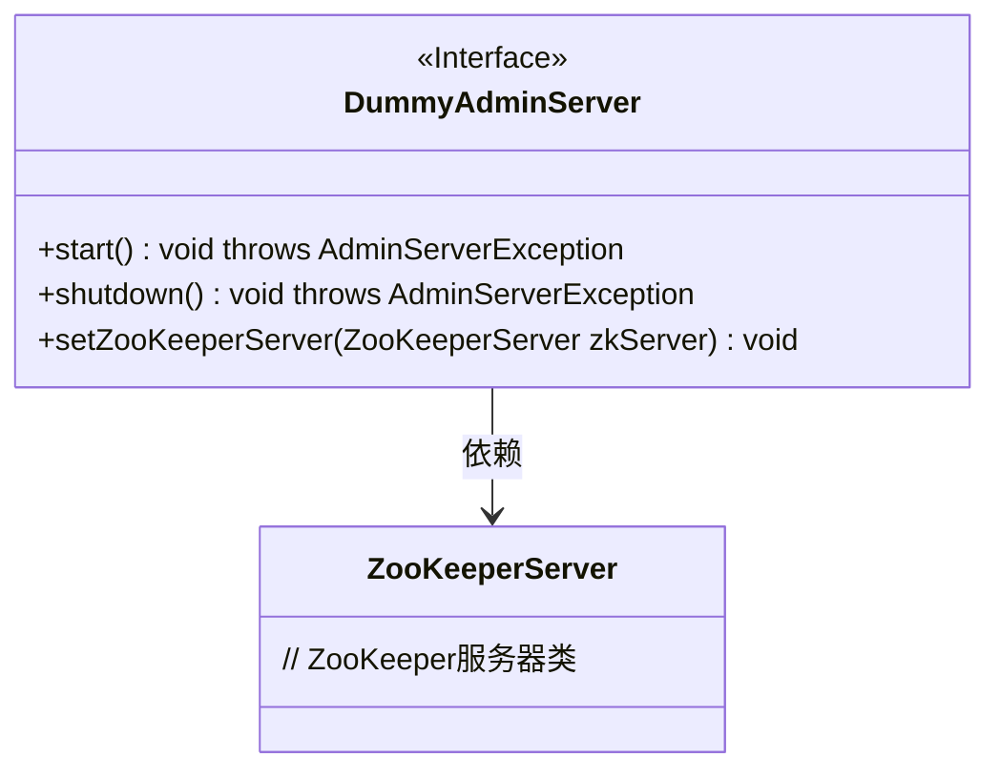
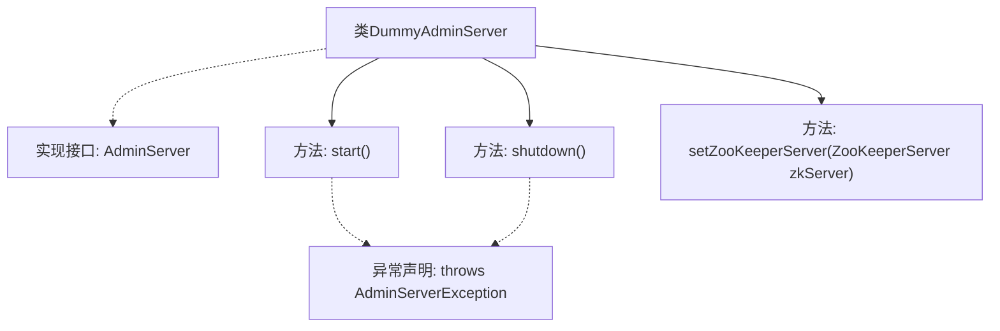

# 基础信息

|      |      |
|------|------|
| 名称 | DummyAdminServer |
| 编码语言 | .java |
| 代码路径 | zookeeper/zookeeper-server/src/main/java/org/apache/zookeeper/server/admin/DummyAdminServer.java |
| 包名 | org.apache.zookeeper.server.admin |
| 依赖项 | ['org.apache.zookeeper.server.ZooKeeperServer'] |
| 概述说明 | DummyAdminServer实现AdminServer接口，包含启动、关闭和设置ZooKeeperServer的空方法。 |

# 说明

这是一个名为DummyAdminServer的Java类，实现了AdminServer接口。该类包含三个空方法：start方法用于启动服务，可能抛出AdminServerException异常；shutdown方法用于关闭服务，同样可能抛出AdminServerException异常；setZooKeeperServer方法用于设置ZooKeeperServer实例，不抛出异常。该类是一个空实现，未提供具体功能逻辑。

# 类列表 Class Summary

| 名称   | 类型  | 说明 |
|-------|------|-------------|
| DummyAdminServer | class | DummyAdminServer实现AdminServer接口，提供空方法start、shutdown和setZooKeeperServer。 |

## 类 DummyAdminServer

|      |      |
|------|------|
| 访问范围 | public |
| 类型 | class |
| 名称 | DummyAdminServer |
| 说明 | DummyAdminServer实现AdminServer接口，提供空方法start、shutdown和setZooKeeperServer。 |

### UML类图

这段代码展示了一个实现了AdminServer接口的DummyAdminServer类，其中包含三个方法：启动(start)、关闭(shutdown)和设置ZooKeeper服务器(setZooKeeperServer)。该类与ZooKeeperServer存在依赖关系，主要用于管理ZooKeeper服务器的生命周期。作为接口实现类，它提供了空方法实现，可能用于测试或作为默认实现。类图清晰地反映了接口定义和类之间的依赖关系。

### 内部方法调用关系图

该流程图展示了DummyAdminServer类的结构，该类实现了AdminServer接口。主要包含三个方法：start()和shutdown()方法都声明可能抛出AdminServerException异常，setZooKeeperServer()方法用于设置ZooKeeper服务器实例。图中清晰地表示了类与接口的继承关系，以及各方法的异常声明情况，体现了这个空实现类的基本框架结构。

### 字段列表 Field List

| 名称  | 类型  | 说明 |
|-------|-------|------|

### 方法列表 Method List

| 名称  | 类型  | 说明 |
|-------|-------|------|
| start | void | 重写start方法，可能抛出AdminServerException异常。 |
| shutdown | void | 重写shutdown方法，可能抛出AdminServerException异常。 |
| setZooKeeperServer | void | 重写方法setZooKeeperServer，接收ZooKeeperServer参数但未实现具体逻辑。 |

