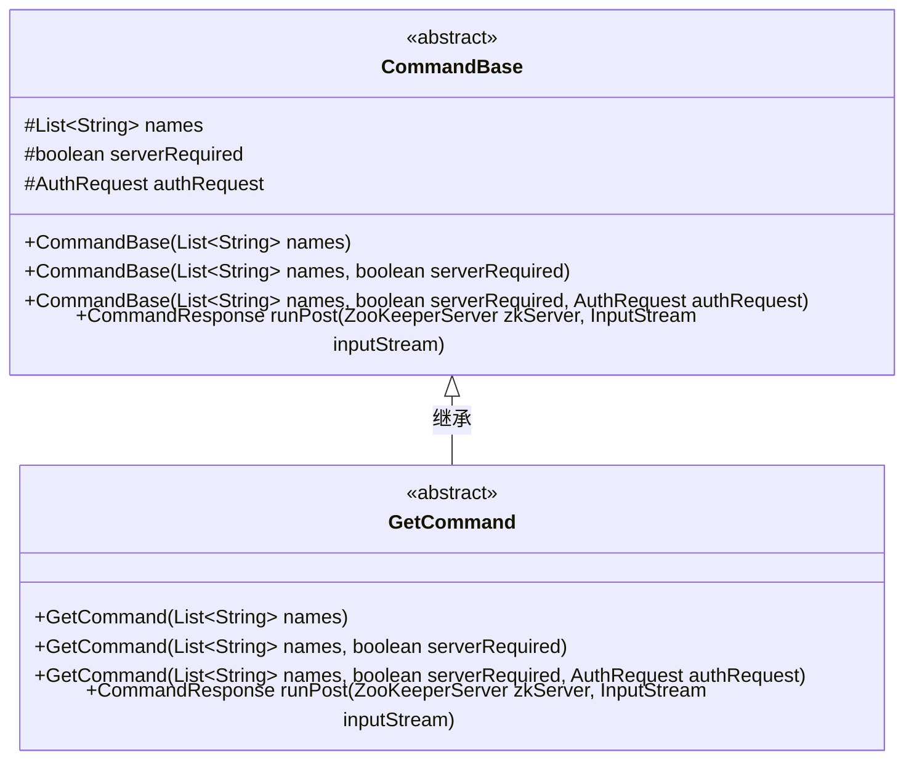
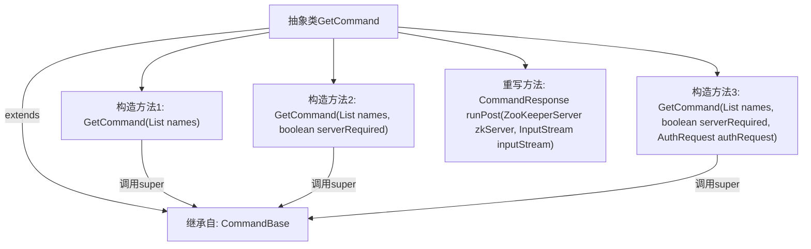

# 基础信息

|      |      |
|------|------|
| 名称 | GetCommand |
| 编码语言 | .java |
| 代码路径 | zookeeper/zookeeper-server/src/main/java/org/apache/zookeeper/server/admin/GetCommand.java |
| 包名 | org.apache.zookeeper.server.admin |
| 依赖项 | ['java.io.InputStream', 'java.util.List', 'org.apache.zookeeper.server.ZooKeeperServer'] |
| 概述说明 | GetCommand继承CommandBase，提供三种构造方法，支持名称列表、服务需求和认证请求参数。重写runPost方法，返回空响应。 |

# 说明

这是一个名为GetCommand的抽象类，继承自CommandBase基类。它提供了三个构造函数，分别接收不同参数组合：名称列表、名称列表加服务器需求标志、名称列表加服务器需求标志加认证请求。所有构造函数都调用父类构造函数进行初始化。该类重写了runPost方法，接收ZooKeeper服务器实例和输入流参数，但当前返回空值。该类设计用于处理获取类命令，支持多种初始化方式。

# 类列表 Class Summary

| 名称   | 类型  | 说明 |
|-------|------|-------------|
| GetCommand | class | 抽象类GetCommand继承CommandBase，提供三种构造方法，支持名称列表、服务要求和认证请求参数，重写runPost方法返回空响应。 |

## 类 GetCommand

|      |      |
|------|------|
| 访问范围 | public abstract |
| 类型 | class |
| 名称 | GetCommand |
| 说明 | 抽象类GetCommand继承CommandBase，提供三种构造方法，支持名称列表、服务要求和认证请求参数，重写runPost方法返回空响应。 |

### UML类图

该类图展示了GetCommand抽象类继承自CommandBase基类的结构。CommandBase包含三个保护级字段(names/serverRequired/authRequest)和三个重载构造函数，以及一个抽象方法runPost。GetCommand作为子类实现了三个与父类对应的构造函数，并重写了runPost方法（返回null）。图中清晰体现了父子类的继承关系，所有构造函数参数均使用泛型List<String>，符合命令模式中处理字符串集合的典型设计。

### 内部方法调用关系图

该流程图展示了抽象类GetCommand的结构，它继承自CommandBase类并包含三个重载构造方法。每个构造方法都通过super关键字调用父类构造方法，同时重写了runPost方法但返回null。类设计支持不同参数组合的实例化，体现了命令模式中参数化构造的典型实现方式，适用于需要服务端认证和输入流处理的场景。

### 字段列表 Field List

| 名称  | 类型  | 说明 |
|-------|-------|------|

### 方法列表 Method List

| 名称  | 类型  | 说明 |
|-------|-------|------|
| runPost | CommandResponse | 重写ZooKeeperServer的runPost方法，接收输入流并返回空响应。 |

