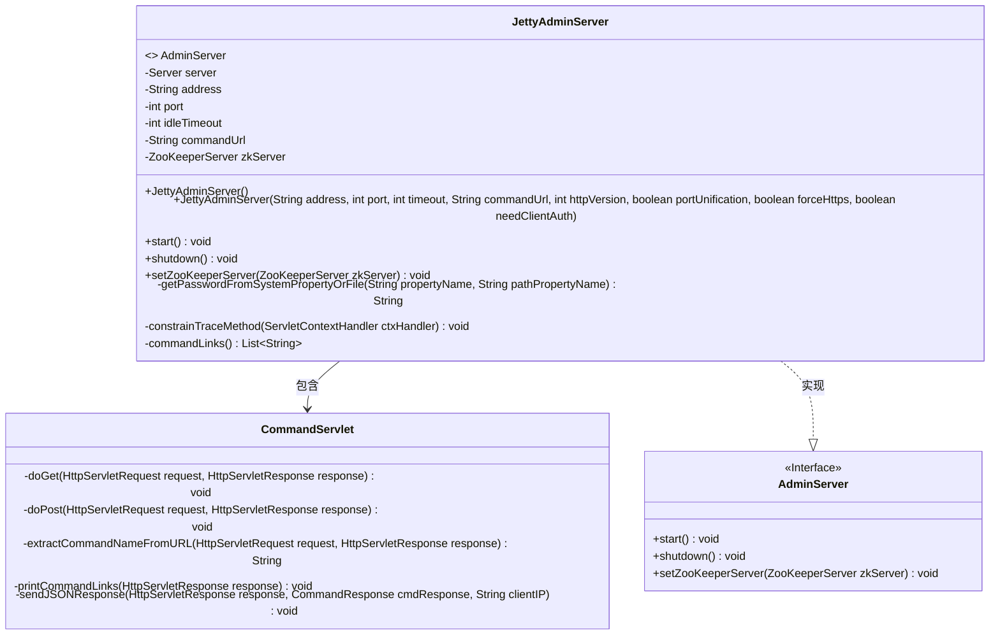
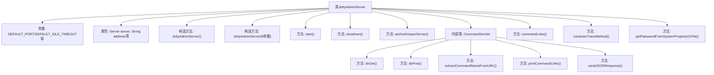
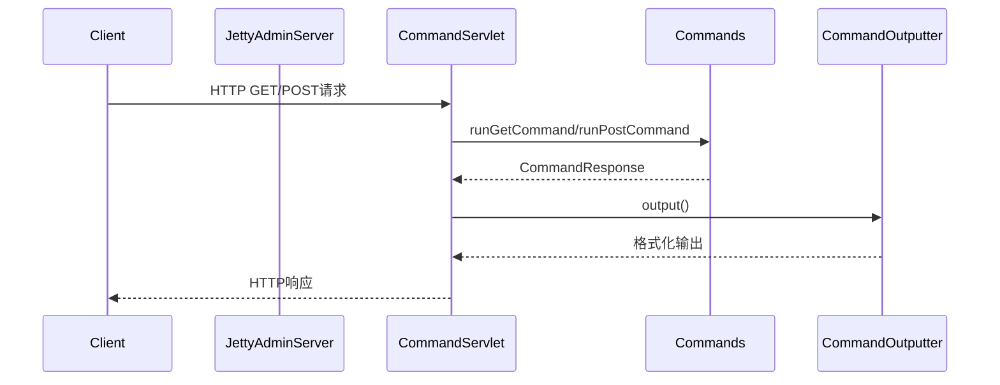

# 基础信息

|      |      |
|------|------|
| 名称 | JettyAdminServer |
| 编码语言 | .java |
| 代码路径 | zookeeper/zookeeper-server/src/main/java/org/apache/zookeeper/server/admin/JettyAdminServer.java |
| 包名 | org.apache.zookeeper.server.admin |
| 依赖项 | ['java.io.IOException', 'java.security.GeneralSecurityException', 'java.security.KeyStore', 'java.util.HashMap', 'java.util.List', 'java.util.Map', 'java.util.stream.Collectors', 'javax.servlet.ServletException', 'javax.servlet.http.HttpServlet', 'javax.servlet.http.HttpServletRequest', 'javax.servlet.http.HttpServletResponse', 'org.apache.zookeeper.common.QuorumX509Util', 'org.apache.zookeeper.common.SecretUtils', 'org.apache.zookeeper.common.X509Util', 'org.apache.zookeeper.server.ZooKeeperServer', 'org.apache.zookeeper.server.auth.IPAuthenticationProvider', 'org.eclipse.jetty.http.HttpHeader', 'org.eclipse.jetty.http.HttpVersion', 'org.eclipse.jetty.security.ConstraintMapping', 'org.eclipse.jetty.security.ConstraintSecurityHandler', 'org.eclipse.jetty.server.HttpConfiguration', 'org.eclipse.jetty.server.HttpConnectionFactory', 'org.eclipse.jetty.server.SecureRequestCustomizer', 'org.eclipse.jetty.server.Server', 'org.eclipse.jetty.server.ServerConnector', 'org.eclipse.jetty.server.SslConnectionFactory', 'org.eclipse.jetty.servlet.ServletContextHandler', 'org.eclipse.jetty.servlet.ServletHolder', 'org.eclipse.jetty.util.security.Constraint', 'org.eclipse.jetty.util.ssl.SslContextFactory', 'org.slf4j.Logger', 'org.slf4j.LoggerFactory'] |
| 概述说明 | JettyAdminServer是基于Jetty的ZooKeeper管理服务器，支持HTTP/HTTPS，提供命令执行接口，可配置端口、超时和SSL证书，内置启动、关闭及ZK服务器绑定功能。 |

# 说明

JettyAdminServer是一个基于Jetty框架实现的管理服务器，用于处理ZooKeeper管理命令。它支持HTTP和HTTPS连接，默认端口为8080，空闲超时时间为30000毫秒，命令URL为/commands。服务器可通过系统属性配置地址、端口、超时等参数。支持SSL/TLS加密，需加载密钥库和信任库证书。内置CommandServlet处理GET和POST请求，执行对应命令并返回JSON或流式响应。服务器提供启动、停止功能，并允许动态设置ZooKeeperServer实例。安全方面禁用TRACE方法，支持客户端认证。密码可从系统属性或文件读取，确保敏感信息安全性。

# 类列表 Class Summary

| 名称   | 类型  | 说明 |
|-------|------|-------------|
| JettyAdminServer | class | JettyAdminServer是基于Jetty的ZooKeeper管理服务器，支持HTTP/HTTPS，提供命令接口，可配置端口、超时和SSL证书，包含启动、关闭及ZK服务器设置功能。 |

## 类 JettyAdminServer

|      |      |
|------|------|
| 访问范围 | public |
| 类型 | class |
| 名称 | JettyAdminServer |
| 说明 | JettyAdminServer是基于Jetty的ZooKeeper管理服务器，支持HTTP/HTTPS，提供命令接口，可配置端口、超时和SSL证书，包含启动、关闭及ZK服务器设置功能。 |

### UML类图

这段代码展示了一个基于Jetty的AdminServer实现，主要用于管理ZooKeeper服务器。JettyAdminServer类实现了AdminServer接口，包含启动/停止服务器、设置ZooKeeper服务器等核心功能。内部通过CommandServlet处理HTTP请求，支持GET和POST方法执行命令。类图清晰地展示了主要组件及其关系：JettyAdminServer作为主类，实现了AdminServer接口，并内嵌了CommandServlet来处理HTTP请求。系统通过配置连接器、安全设置和上下文处理器来构建Web服务，同时支持HTTPS和基本认证功能。

### 内部方法调用关系图

该流程图展示了JettyAdminServer的核心结构和调用关系。类结构包含两个构造方法（分别处理默认参数和自定义参数）、服务生命周期控制方法（start/shutdown）、ZK服务器设置方法，以及关键内部类CommandServlet（处理HTTP请求）。时序图则展示了HTTP请求的处理流程：从客户端请求进入后，通过CommandServlet调用Commands执行具体操作，最后通过CommandOutputter返回响应。该设计实现了基于Jetty的可配置管理服务器，支持安全连接、命令路由和多种输出格式。

### 字段列表 Field List

| 名称  | 类型  | 说明 |
|-------|-------|------|
| server | Server | 私有服务器实例变量。 |
| DEFAULT_STS_MAX_AGE = 1 * 24 * 60 * 60 | int | 定义常量DEFAULT_STS_MAX_AGE，值为1天（86400秒）。 |
| idleTimeout | int | 私有整型变量idleTimeout，用于设置空闲超时时间。 |
| address | String | 私有字符串变量address，不可修改。 |
| LOG = LoggerFactory.getLogger(JettyAdminServer.class) | Logger | JettyAdminServer类的静态日志记录器实例，用于记录日志信息。 |
| DEFAULT_ADDRESS = "0.0.0.0" | String | 定义默认地址常量"0.0.0.0"。 |
| commandUrl | String | 私有字符串变量commandUrl，用于存储命令URL。 |
| DEFAULT_IDLE_TIMEOUT = 30000 | int | 静态常量DEFAULT_IDLE_TIMEOUT值为30000，表示默认空闲超时时间。 |
| DEFAULT_COMMAND_URL = "/commands" | String | 默认命令路径设为"/commands"。 |
| port | int | 私有整型端口变量。 |
| zkServer | ZooKeeperServer | 私有ZooKeeper服务器实例变量zkServer。 |
| DEFAULT_HTTP_VERSION = 11 | int | 定义静态常量DEFAULT_HTTP_VERSION，值为11，表示默认HTTP版本。 |
| DEFAULT_PORT = 8080 | int | 定义静态常量DEFAULT_PORT，默认值为8080。 |

### 方法列表 Method List

| 名称  | 类型  | 说明 |
|-------|-------|------|
| shutdown | void | 重写shutdown方法，尝试停止server，失败时抛出包含地址、端口和命令URL的AdminServerException。 |
| start | void | 重写start方法，尝试启动服务器，失败时抛出包含地址、端口和命令URL的自定义异常，成功则记录日志。 |
| setZooKeeperServer | void | 重写方法，设置ZooKeeper服务器实例到当前对象。 |
| commandLinks | List<String> | 该方法生成排序后的命令链接列表，将命令名转换为带URL的HTML链接格式，最终返回字符串列表。 |
| constrainTraceMethod | void | 该方法为Servlet上下文处理器添加安全约束，禁止TRACE方法访问所有路径，要求认证。通过约束映射和安全处理器实现。 |
| getPasswordFromSystemPropertyOrFile | String | 从系统属性或文件获取密码：优先检查系统属性propertyName，若pathPropertyName非空则从对应路径文件读取密码，最终返回密码值。 |

