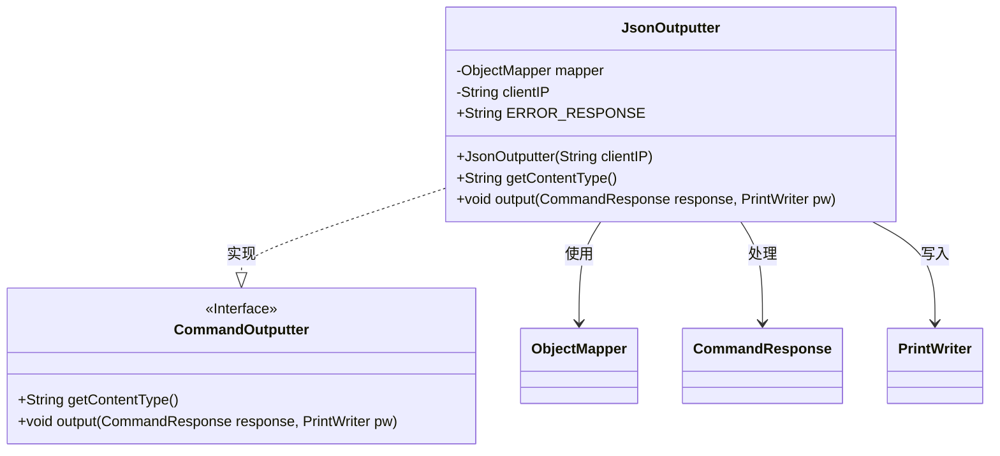
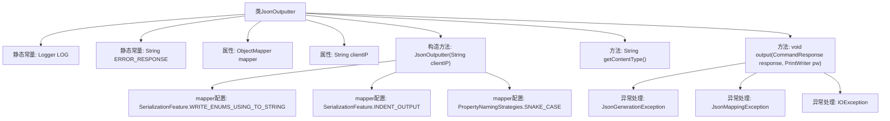

# 基础信息

|      |      |
|------|------|
| 名称 | JsonOutputter |
| 编码语言 | .java |
| 代码路径 | zookeeper/zookeeper-server/src/main/java/org/apache/zookeeper/server/admin/JsonOutputter.java |
| 包名 | org.apache.zookeeper.server.admin |
| 依赖项 | ['com.fasterxml.jackson.core.JsonGenerationException', 'com.fasterxml.jackson.databind.JsonMappingException', 'com.fasterxml.jackson.databind.ObjectMapper', 'com.fasterxml.jackson.databind.PropertyNamingStrategies', 'com.fasterxml.jackson.databind.SerializationFeature', 'java.io.IOException', 'java.io.PrintWriter', 'org.slf4j.Logger', 'org.slf4j.LoggerFactory'] |
| 概述说明 | JsonOutputter类实现CommandOutputter接口，将CommandResponse转为JSON输出，支持枚举转字符串、缩进和蛇形命名，异常时返回错误JSON。 |

# 说明

JsonOutputter类实现了CommandOutputter接口，用于将CommandResponse对象转换为JSON格式输出。该类包含一个ObjectMapper实例，配置了枚举序列化、缩进输出和蛇形命名策略。构造函数接收客户端IP参数。getContentType方法返回JSON内容类型。output方法尝试将响应转为JSON写入PrintWriter，若发生异常则记录日志并输出预设错误信息。错误处理涵盖JSON生成、映射和IO异常情况。

# 类列表 Class Summary

| 名称   | 类型  | 说明 |
|-------|------|-------------|
| JsonOutputter | class | JsonOutputter类实现CommandOutputter接口，将CommandResponse转为JSON输出，支持枚举转字符串、缩进和蛇形命名，异常时返回错误信息。 |

## 类 JsonOutputter

|      |      |
|------|------|
| 访问范围 | public |
| 类型 | class |
| 名称 | JsonOutputter |
| 说明 | JsonOutputter类实现CommandOutputter接口，将CommandResponse转为JSON输出，支持枚举转字符串、缩进和蛇形命名，异常时返回错误信息。 |

### UML类图

该类图展示了JsonOutputter类实现了CommandOutputter接口，用于将CommandResponse对象序列化为JSON格式输出。JsonOutputter内部使用ObjectMapper进行JSON处理，通过PrintWriter输出结果，并包含错误处理机制。类结构清晰地体现了接口实现关系和数据流转方向，其中ERROR_RESPONSE作为常量定义了错误时的默认JSON响应。

### 内部方法调用关系图

这段代码定义了一个JsonOutputter类，实现了CommandOutputter接口，用于将CommandResponse对象转换为JSON格式输出。类中包含构造方法初始化ObjectMapper并配置相关特性，getContentType方法返回内容类型，output方法处理响应输出并捕获可能的异常。流程图展示了类的结构、属性、方法及异常处理路径，清晰地呈现了JSON输出的处理流程和错误处理机制。

### 字段列表 Field List

| 名称  | 类型  | 说明 |
|-------|-------|------|
| mapper | ObjectMapper | 声明一个私有ObjectMapper对象mapper。 |
| ERROR_RESPONSE = "{\"error\": \"Exception writing command response to JSON\"}" | String | 定义静态常量ERROR_RESPONSE，值为JSON格式的错误响应字符串，表示写入命令响应到JSON时发生异常。 |
| LOG = LoggerFactory.getLogger(JsonOutputter.class) | Logger | 声明一个静态不可变日志对象LOG，用于JsonOutputter类的日志记录。 |
| clientIP | String | 私有字符串变量clientIP，用于存储客户端IP地址。 |

### 方法列表 Method List

| 名称  | 类型  | 说明 |
|-------|-------|------|
| getContentType | String | 重写方法返回JSON内容类型。 |
| output | void | 重写output方法，将CommandResponse转为JSON输出到PrintWriter，异常时记录日志并返回错误响应。 |

