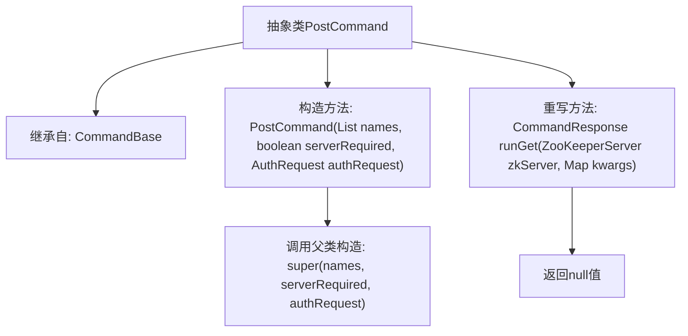

# 基础信息

|      |      |
|------|------|
| 名称 | PostCommand |
| 编码语言 | .java |
| 代码路径 | zookeeper/zookeeper-server/src/main/java/org/apache/zookeeper/server/admin/PostCommand.java |
| 包名 | org.apache.zookeeper.server.admin |
| 依赖项 | ['java.util.List', 'java.util.Map', 'org.apache.zookeeper.server.ZooKeeperServer'] |
| 概述说明 | 抽象类PostCommand继承CommandBase，定义带参构造方法，并重写runGet方法返回空响应。 |

# 说明

该内容定义了一个名为PostCommand的抽象类，继承自CommandBase类。PostCommand类包含一个受保护的构造函数，接收三个参数：names（字符串列表）、serverRequired（布尔值）和authRequest（AuthRequest对象）。构造函数通过super调用父类CommandBase的构造函数。此外，该类重写了runGet方法，接收ZooKeeperServer对象和kwargs（字符串映射）作为参数，但当前实现返回null。

# 类列表 Class Summary

| 名称   | 类型  | 说明 |
|-------|------|-------------|
| PostCommand | class | 抽象类PostCommand继承CommandBase，定义带参构造方法，并重写runGet方法返回空响应。 |


## 类 PostCommand

|      |      |
|------|------|
| 访问范围 | public abstract |
| 类型 | class |
| 名称 | PostCommand |
| 说明 | 抽象类PostCommand继承CommandBase，定义带参构造方法，并重写runGet方法返回空响应。 |


### UML类图

```mermaid
classDiagram
    class CommandBase {
        <<abstract>>
        +List~String~ names
        +boolean serverRequired
        +AuthRequest authRequest
        +CommandBase(List~String~ names, boolean serverRequired, AuthRequest authRequest)
        +CommandResponse runGet(ZooKeeperServer zkServer, Map~String,String~ kwargs)
    }
    
    class PostCommand {
        <<abstract>>
        +PostCommand(List~String~ names, boolean serverRequired, AuthRequest authRequest)
        +CommandResponse runGet(ZooKeeperServer zkServer, Map~String,String~ kwargs)
    }
    
    CommandBase <|-- PostCommand  // 继承关系
```

这段代码展示了一个抽象类PostCommand继承自CommandBase的类图结构。PostCommand作为命令模式的抽象基类，包含构造器和重写的runGet方法，通过继承关系复用CommandBase的成员变量和基础结构。AuthRequest和ZooKeeperServer作为依赖项出现，表明该类需要与认证系统和ZooKeeper服务进行交互。整体设计体现了模板方法模式，为具体命令实现提供基础框架。


### 内部方法调用关系图



这段流程图描述了PostCommand抽象类的结构。该类继承自CommandBase，包含一个需要三个参数的构造方法（names列表、serverRequired布尔值和authRequest认证请求），构造方法中会调用父类构造器。重写了runGet方法，接收ZooKeeperServer实例和kwargs参数映射，但直接返回null。整体展现了该类的继承关系和核心方法调用链，体现了其作为命令基类扩展的典型模式。

### 字段列表 Field List

| 名称  | 类型  | 说明 |
|-------|-------|------|

### 方法列表 Method List

| 名称  | 类型  | 说明 |
|-------|-------|------|
| runGet | CommandResponse | 这是一个Java方法重写，用于处理GET请求，返回空响应。 |


