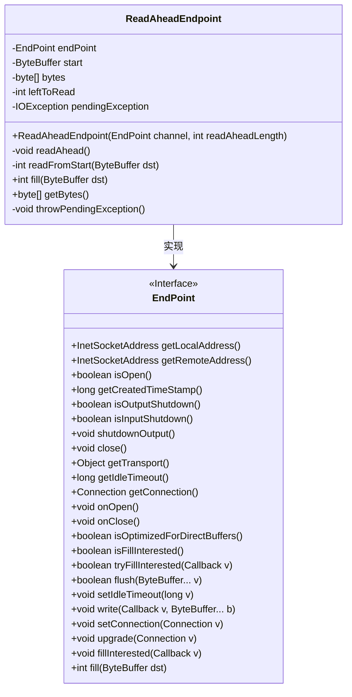
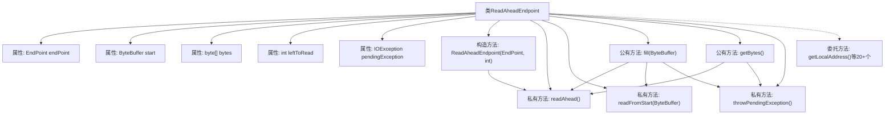

# 基础信息

|      |      |
|------|------|
| 名称 | ReadAheadEndpoint |
| 编码语言 | .java |
| 代码路径 | zookeeper/zookeeper-server/src/main/java/org/apache/zookeeper/server/admin/ReadAheadEndpoint.java |
| 包名 | org.apache.zookeeper.server.admin |
| 依赖项 | ['java.io.IOException', 'java.net.InetSocketAddress', 'java.nio.ByteBuffer', 'java.nio.channels.ReadPendingException', 'java.nio.channels.WritePendingException', 'org.eclipse.jetty.io.Connection', 'org.eclipse.jetty.io.EndPoint', 'org.eclipse.jetty.util.Callback'] |
| 概述说明 | 
ReadAheadEndpoint类实现EndPoint接口，封装底层EndPoint并预读数据到缓冲区。提供地址、连接状态、超时等代理方法，核心功能为预读填充和异常处理。构造函数初始化预读长度，通过同步方法确保线程安全。 |

# 说明

该代码定义了一个名为ReadAheadEndpoint的类，实现了EndPoint接口。它封装了另一个EndPoint实例，提供预读功能。构造函数接收一个EndPoint通道和预读长度参数，初始化字节缓冲区。类中包含多个方法委托给内部EndPoint实例处理，如地址获取、连接状态检查、读写操作等。核心功能包括readAhead方法执行预读操作，fill方法处理缓冲区填充，getBytes方法获取预读数据。类通过同步机制确保线程安全，并维护待处理异常状态。整体设计旨在增强原始EndPoint的读取性能，通过预读减少IO等待时间。

# 类列表 Class Summary

| 名称   | 类型  | 说明 |
|-------|------|-------------|
| ReadAheadEndpoint | class | ReadAheadEndpoint类实现了EndPoint接口，通过预读机制增强原始EndPoint功能，包含预读缓冲区管理和异常处理。 |

## 类 ReadAheadEndpoint

|      |      |
|------|------|
| 访问范围 | public |
| 类型 | class |
| 名称 | ReadAheadEndpoint |
| 说明 | ReadAheadEndpoint类实现了EndPoint接口，通过预读机制增强原始EndPoint功能，包含预读缓冲区管理和异常处理。 |

### UML类图

这段代码展示了一个`ReadAheadEndpoint`类，它实现了`EndPoint`接口，主要用于在读取数据时进行预读操作。类中包含私有成员如`ByteBuffer`和预读字节数组，以及核心方法`fill()`和`readAhead()`来处理数据读取逻辑。通过维护`pendingException`和`leftToRead`状态，实现了带缓冲区的安全读取机制，同时代理了所有接口方法到底层`EndPoint`实例。该设计适用于需要预读优化的网络通信场景。

### 内部方法调用关系图

该流程图展示了ReadAheadEndpoint类的核心结构和主要方法调用关系。该类作为装饰器模式实现，包含一个EndPoint委托对象和预读缓冲区相关属性。核心逻辑集中在fill()和getBytes()方法，它们通过readAhead()进行数据预读，使用readFromStart()处理缓冲区数据，并通过throwPendingException()处理异常状态。所有EndPoint接口方法都直接委托给内部endPoint对象执行。

### 字段列表 Field List

| 名称  | 类型  | 说明 |
|-------|-------|------|
| endPoint | EndPoint | 私有终结点成员变量endPoint。 |
| bytes | byte[] | 私有字节数组bytes。 |
| start | ByteBuffer | 私有不可变的ByteBuffer类型变量start。 |
| leftToRead | int | 私有整型变量leftToRead，用于记录待读取数据量。 |
| pendingException = null | IOException | 私有IO异常变量pendingException初始化为null。 |

### 方法列表 Method List

| 名称  | 类型  | 说明 |
|-------|-------|------|
| isOutputShutdown | boolean | 重写方法检查输出是否关闭，调用endPoint的同名方法返回结果。 |
| close | void | 重写close方法，调用endPoint.close()关闭资源。 |
| getConnection | Connection | 重写getConnection方法，直接返回endPoint的Connection对象。 |
| readAhead | void | 私有同步方法readAhead，当leftToRead大于0时循环填充数据，若填充失败或连接关闭则终止，更新剩余读取量并在完成时重置起始位置。 |
| readFromStart | int | 方法readFromStart从缓冲区start读取数据到dst，返回读取的字节数。若可读数据大于0，将数据复制到dst并更新位置，最后翻转dst缓冲区。 |
| fill | int | 覆盖方法fill，同步读取字节到缓冲区。先检查待读数据，若无则返回0。处理起始位置剩余数据，读取后返回总填充字节数。 |
| getBytes | byte[] | 该方法检查是否有未处理的异常，若无则尝试预读数据。随后复制内部字节数组并返回副本，确保数据隔离。异常时记录但不中断流程。 |
| throwPendingException | void | 该方法检查是否存在待处理异常，若有则抛出并清空异常对象。 |
| isFillInterested | boolean | 重写方法isFillInterested，直接返回endPoint的同名方法调用结果。 |
| onOpen | void | 重写父类方法，调用endPoint的onOpen()方法。 |
| shutdownOutput | void | 重写shutdownOutput方法，调用endPoint的shutdownOutput方法。 |
| isOptimizedForDirectBuffers | boolean | 该方法重写父类方法，检查端点是否优化直接缓冲区处理，返回布尔值结果。 |
| getCreatedTimeStamp | long | 重写getCreatedTimeStamp方法，直接返回endPoint的同名方法结果。 |
| tryFillInterested | boolean | 重写tryFillInterested方法，调用endPoint的同名方法并返回结果。 |
| fillInterested | void | Java方法重写，调用端点对象的fillInterested方法，可能抛出ReadPendingException异常。 |
| upgrade | void | 重写升级方法，调用endPoint的升级功能。 |
| getTransport | Object | 重写getTransport方法，返回endPoint的transport对象。 |
| isOpen | boolean | 重写isOpen方法，直接返回endPoint.isOpen()的结果。 |
| setConnection | void | 重写setConnection方法，将传入的Connection对象赋值给endPoint的connection属性。 |
| onClose | void | 重写onClose方法，调用endPoint的onClose方法。 |
| getRemoteAddress | InetSocketAddress | 重写方法getRemoteAddress，返回endPoint的远程地址。 |
| write | void | 重写write方法，调用endPoint.write处理写入操作，可能抛出WritePendingException异常。 |
| setIdleTimeout | void | 重写setIdleTimeout方法，调用endPoint的同名方法设置超时时间。 |
| getLocalAddress | InetSocketAddress | 重写getLocalAddress方法，返回endPoint的本地地址。 |
| getIdleTimeout | long | 重写getIdleTimeout方法，直接返回endPoint的同名方法结果。 |
| flush | boolean | 覆盖flush方法，调用endPoint.flush处理ByteBuffer数组，可能抛出IOException。 |
| isInputShutdown | boolean | 重写方法isInputShutdown，直接返回endPoint的对应状态。 |

