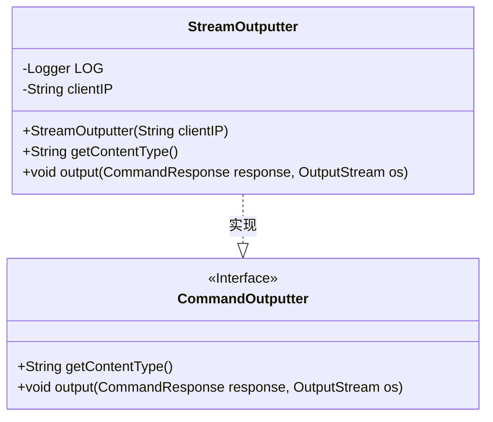
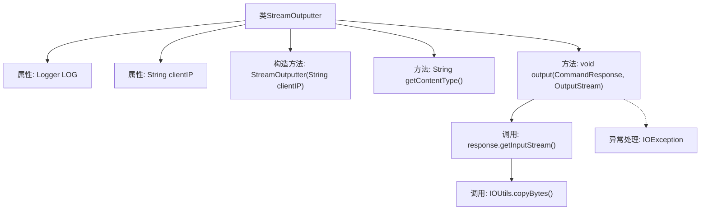

# 基础信息

|      |      |
|------|------|
| 名称 | StreamOutputter |
| 编码语言 | .java |
| 代码路径 | zookeeper/zookeeper-server/src/main/java/org/apache/zookeeper/server/admin/StreamOutputter.java |
| 包名 | org.apache.zookeeper.server.admin |
| 依赖项 | ['java.io.IOException', 'java.io.InputStream', 'java.io.OutputStream', 'org.apache.zookeeper.common.IOUtils', 'org.slf4j.Logger', 'org.slf4j.LoggerFactory'] |
| 概述说明 | StreamOutputter类实现CommandOutputter接口，处理二进制流输出，包含IP记录、内容类型定义及数据流复制功能，异常时记录日志。 |

# 说明

StreamOutputter类实现了CommandOutputter接口，用于处理二进制流输出。它包含一个记录日志的Logger实例和存储客户端IP的字段。构造函数接收客户端IP参数。getContentType方法返回二进制流类型。output方法将CommandResponse的输入流复制到输出流，使用1024字节缓冲区，并在异常时记录警告日志，包含客户端IP和异常信息。所有资源自动关闭。

# 类列表 Class Summary

| 名称   | 类型  | 说明 |
|-------|------|-------------|
| StreamOutputter | class | StreamOutputter类实现CommandOutputter接口，处理二进制流输出。构造函数接收客户端IP，输出类型为application/octet-stream。通过IOUtils.copyBytes将输入流复制到输出流，异常时记录日志。 |

## 类 StreamOutputter

|      |      |
|------|------|
| 访问范围 | public |
| 类型 | class |
| 名称 | StreamOutputter |
| 说明 | StreamOutputter类实现CommandOutputter接口，处理二进制流输出。构造函数接收客户端IP，输出类型为application/octet-stream。通过IOUtils.copyBytes将输入流复制到输出流，异常时记录日志。 |

### UML类图

这段类图展示了`StreamOutputter`类实现了`CommandOutputter`接口的结构关系。`StreamOutputter`包含私有日志记录器LOG和客户端IP地址字段，通过构造函数初始化IP地址，并实现了接口定义的`getContentType`和`output`方法。其中`output`方法通过IO流处理命令响应数据，异常时记录客户端IP的警告日志。类图清晰地反映了流式输出器的核心功能和异常处理机制。

### 内部方法调用关系图

这段代码定义了一个StreamOutputter类，实现了CommandOutputter接口，用于处理二进制流输出。类中包含日志记录器、客户端IP属性，构造方法初始化IP，getContentType方法返回流类型，output方法通过IOUtils工具将响应输入流复制到输出流，并捕获可能的IO异常记录日志。流程图展示了从构造初始化到流复制的完整调用链。

### 字段列表 Field List

| 名称  | 类型  | 说明 |
|-------|-------|------|
| LOG = LoggerFactory.getLogger(StreamOutputter.class) | Logger | 定义StreamOutputter类的私有静态日志常量LOG。 |
| clientIP | String | 私有字符串变量clientIP，用于存储客户端IP地址。 |

### 方法列表 Method List

| 名称  | 类型  | 说明 |
|-------|-------|------|
| output | void | 重写output方法，将CommandResponse的输入流复制到输出流，异常时记录日志。 |
| getContentType | String | 重写getContentType方法，返回二进制流类型"application/octet-stream"。 |

