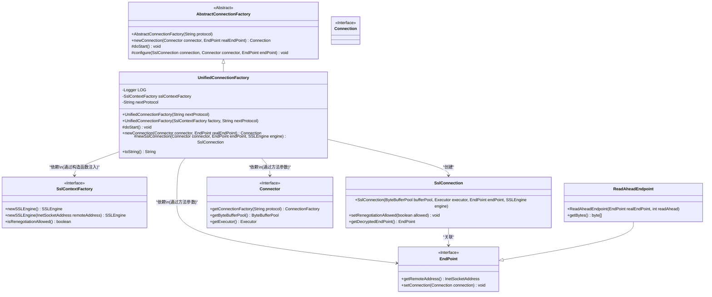
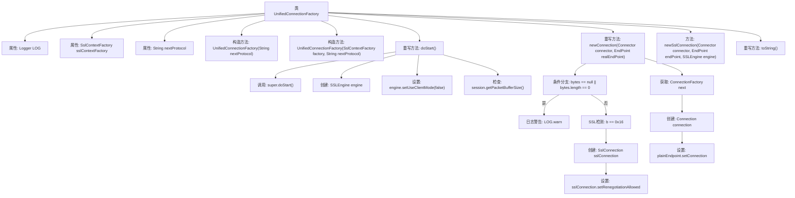
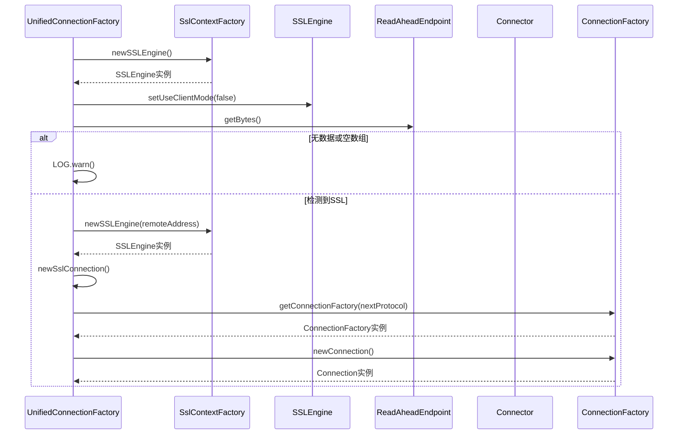

# 基础信息

|      |      |
|------|------|
| 名称 | UnifiedConnectionFactory |
| 编码语言 | .java |
| 代码路径 | zookeeper/zookeeper-server/src/main/java/org/apache/zookeeper/server/admin/UnifiedConnectionFactory.java |
| 包名 | org.apache.zookeeper.server.admin |
| 依赖项 | ['javax.net.ssl.SSLEngine', 'javax.net.ssl.SSLSession', 'org.apache.zookeeper.server.ServerMetrics', 'org.eclipse.jetty.io.Connection', 'org.eclipse.jetty.io.EndPoint', 'org.eclipse.jetty.io.ssl.SslConnection', 'org.eclipse.jetty.server.AbstractConnectionFactory', 'org.eclipse.jetty.server.ConnectionFactory', 'org.eclipse.jetty.server.Connector', 'org.eclipse.jetty.util.ssl.SslContextFactory', 'org.slf4j.Logger', 'org.slf4j.LoggerFactory'] |
| 概述说明 | UnifiedConnectionFactory是扩展AbstractConnectionFactory的SSL连接工厂类，支持SSL协议检测和连接创建，根据输入数据判断是否启用SSL加密，并配置相应连接参数。 |

# 说明

UnifiedConnectionFactory是一个继承自AbstractConnectionFactory的类，用于处理SSL和非SSL连接。它包含SslContextFactory和nextProtocol属性，提供两种构造函数来初始化这些属性。在doStart方法中，它配置SSLEngine并调整输入缓冲区大小。newConnection方法根据传入数据判断是否为SSL连接，创建相应的EndPoint和SslConnection。如果是SSL连接，会配置SSLEngine和SslConnection；否则直接使用普通连接。最后，它通过nextProtocol获取下一个连接工厂并返回相应连接。toString方法提供了类的字符串表示形式。

# 类列表 Class Summary

| 名称   | 类型  | 说明 |
|-------|------|-------------|
| UnifiedConnectionFactory | class | UnifiedConnectionFactory继承AbstractConnectionFactory，处理SSL连接。构造函数接收SslContextFactory和协议名。doStart初始化SSLEngine。newConnection根据数据判断是否SSL，创建相应连接。支持协议转发。 |

## 类 UnifiedConnectionFactory

|      |      |
|------|------|
| 访问范围 | public |
| 类型 | class |
| 名称 | UnifiedConnectionFactory |
| 说明 | UnifiedConnectionFactory继承AbstractConnectionFactory，处理SSL连接。构造函数接收SslContextFactory和协议名。doStart初始化SSLEngine。newConnection根据数据判断是否SSL，创建相应连接。支持协议转发。 |

### UML类图

类图描述：
该图展示了UnifiedConnectionFactory及其相关类的结构关系。UnifiedConnectionFactory继承自AbstractConnectionFactory，负责创建安全(SSL)和非安全连接。它依赖SslContextFactory来创建SSLEngine实例，并通过Connector和EndPoint接口与其他组件交互。ReadAheadEndpoint是EndPoint的实现类，用于预读连接数据。SslConnection类处理SSL加密连接，包含解密端点。整个设计体现了工厂模式，支持灵活创建不同类型的连接。

### 内部方法调用关系图

该流程图展示了UnifiedConnectionFactory类的核心结构和逻辑流程，重点描述了SSL连接处理的决策过程。类包含两个构造方法、SSL引擎初始化、连接模式设置和缓冲区大小检查等功能。时序图具体呈现了newConnection()方法中根据输入数据判断是否建立SSL连接的完整交互过程，包括异常情况处理和下游协议连接器的调用链。整个设计实现了对加密和非加密连接的统一处理能力。

### 字段列表 Field List

| 名称  | 类型  | 说明 |
|-------|-------|------|
| sslContextFactory | SslContextFactory | 私有SSL上下文工厂实例。 |
| LOG = LoggerFactory.getLogger(UnifiedConnectionFactory.class) | Logger | 定义私有静态日志常量LOG，用于UnifiedConnectionFactory类的日志记录。 |
| nextProtocol | String | 私有字符串变量nextProtocol，用于存储下一个协议。 |

### 方法列表 Method List

| 名称  | 类型  | 说明 |
|-------|-------|------|
| doStart | void | 重写doStart方法，初始化SSL引擎并设置服务端模式，根据会话包缓冲区大小调整输入缓冲区大小。 |
| newConnection | Connection | 方法重写，创建新连接。检查首字节判断是否为SSL连接。是则创建SSL连接并配置，否则创建普通连接。返回相应连接对象。 |
| newSslConnection | SslConnection | 创建一个新的SSL连接，使用给定的连接器、端点、SSL引擎及连接器的缓冲池和执行器。 |
| toString | String | Java重写toString方法，返回类名、哈希码、当前协议和下一协议，格式为"类名@哈希码{协议->下一协议}"。 |

