# 基础信息

|      |      |
|------|------|
| 名称 | admin |
| 编码语言 | .java |
| 代码路径 | zookeeper/zookeeper-server/src/main/java/org/apache/zookeeper/server/admin |
| 包名 | zookeeper.docs.zookeeper-server.src.main.java.org.apache.zookeeper.server.admin |
| 概述说明 | GetCommand抽象类继承CommandBase，支持多种初始化方式。AuthRequest类封装权限验证信息。CommandBase是命令基类，提供核心属性和方法。ReadAheadEndpoint实现预读功能。CommandOutputter接口处理命令输出。Commands类管理命令注册与执行。DummyAdminServer是空实现。StreamOutputter处理二进制流输出。AdminServer接口定义管理服务器功能。CommandResponse封装响应数据。UnifiedConnectionFactory处理SSL和非SSL连接。AdminServerFactory创建AdminServer实例。JettyAdminServer基于Jetty实现管理服务器。Command接口定义命令模式结构。JsonOutputter将响应转为JSON。PostCommand抽象类继承CommandBase。 |

# 说明

## 概述  
该模块是ZooKeeper的管理接口实现，核心职责为提供服务器运维命令的注册与执行框架。主要接口遵循HTTP协议，支持GET/POST请求，例如通过`/commands`端点暴露37种管理命令。关键数据结构包括`CommandResponse`响应封装类和`AuthRequest`权限请求类，前者类似REST响应体，后者存储路径与权限级别。外部依赖Jetty框架实现Web服务，例如`JettyAdminServer`处理HTTPS连接。  

## 主要业务场景  
模块支持服务器监控（如`stat`命令）、配置管理（如`conf`命令）等运维流程，采用同步命令执行模式。功能完整性体现在支持权限校验、限流保护等机制，例如`AuthRequest`实现命令级鉴权。主要使用场景包括集群状态查询与故障诊断，通过JSON或二进制流输出结果。API类型包含抽象命令基类（如`CommandBase`）和输出器接口（如`JsonOutputter`）。第三方集成案例为IDE插件通过HTTP接口获取服务器指标，例如`JettyAdminServer`默认监听8080端口。

### 包内部结构视图

```mermaid
graph TD
    admin --> GetCommand.java
    admin --> AuthRequest.java
    admin --> CommandBase.java
    admin --> ReadAheadEndpoint.java
    admin --> CommandOutputter.java
    admin --> Commands.java
    admin --> DummyAdminServer.java
    admin --> StreamOutputter.java
    admin --> AdminServer.java
    admin --> CommandResponse.java
    admin --> UnifiedConnectionFactory.java
    admin --> AdminServerFactory.java
    admin --> JettyAdminServer.java
    admin --> Command.java
    admin --> JsonOutputter.java
    admin --> PostCommand.java
```

该流程图展示了Zookeeper项目中admin目录下的文件结构关系。所有文件都直接隶属于admin目录，包含17个不同类型的Java文件，主要涉及命令处理、服务器管理、输出格式等功能模块。这些文件共同构成了Zookeeper服务器的管理功能组件，包括基础命令、请求处理、输出格式化和服务器实现等核心功能类。

# 文件列表 File List

| 名称   | 类型  | 说明 |
|-------|------|-------------|
| [GetCommand.java](GetCommand.md) | file | GetCommand继承CommandBase，提供三种构造方法，支持名称列表、服务需求和认证请求参数。重写runPost方法，返回空响应。 |
| [StreamOutputter.java](StreamOutputter.md) | file | StreamOutputter类实现CommandOutputter接口，处理二进制流输出，包含IP记录、内容类型定义及数据流复制功能，异常时记录日志。 |
| [DummyAdminServer.java](DummyAdminServer.md) | file | DummyAdminServer实现AdminServer接口，包含启动、关闭和设置ZooKeeperServer的空方法。 |
| [CommandOutputter.java](CommandOutputter.md) | file | CommandOutputter接口定义命令输出方法，含内容类型获取和两种默认输出方式：PrintWriter和OutputStream。 |
| [ReadAheadEndpoint.java](ReadAheadEndpoint.md) | file | 
ReadAheadEndpoint类实现EndPoint接口，封装底层EndPoint并预读数据到缓冲区。提供地址、连接状态、超时等代理方法，核心功能为预读填充和异常处理。构造函数初始化预读长度，通过同步方法确保线程安全。 |
| [AuthRequest.java](AuthRequest.md) | file | AuthRequest类用于权限验证，包含权限值和路径字段，提供构造方法和getter，重写toString输出信息。 |
| [PostCommand.java](PostCommand.md) | file | 抽象类PostCommand继承CommandBase，定义带参构造方法，并重写runGet方法返回空响应。 |
| [JsonOutputter.java](JsonOutputter.md) | file | JsonOutputter类实现CommandOutputter接口，将CommandResponse转为JSON输出，支持枚举转字符串、缩进和蛇形命名，异常时返回错误JSON。 |
| [Command.java](Command.md) | file | Command接口定义了命令的基本结构：获取命令名称集合getNames()和主名称getPrimaryName()，检查是否需要服务器isServerRequired()，获取认证请求getAuthRequest()，以及处理HTTP GET和POST请求的runGet()和runPost()方法，均返回包含命令名和错误信息的CommandResponse。 |
| [JettyAdminServer.java](JettyAdminServer.md) | file | JettyAdminServer是基于Jetty的ZooKeeper管理服务器，支持HTTP/HTTPS，提供命令执行接口，可配置端口、超时和SSL证书，内置启动、关闭及ZK服务器绑定功能。 |
| [AdminServerFactory.java](AdminServerFactory.md) | file | AdminServerFactory根据系统属性决定创建JettyAdminServer或DummyAdminServer，使用反射避免直接依赖Jetty。 |
| [CommandResponse.java](CommandResponse.md) | file | CommandResponse类封装命令响应，包含命令名、错误信息、状态码、数据、头部和输入流，提供相关操作和转换方法。 |
| [UnifiedConnectionFactory.java](UnifiedConnectionFactory.md) | file | UnifiedConnectionFactory是扩展AbstractConnectionFactory的SSL连接工厂类，支持SSL协议检测和连接创建，根据输入数据判断是否启用SSL加密，并配置相应连接参数。 |
| [AdminServer.java](AdminServer.md) | file | 公共接口AdminServer提供启动、关闭和设置ZooKeeperServer功能，可能抛出AdminServerException异常。异常类提供两种构造方法。 |
| [Commands.java](Commands.md) | file | Commands类管理ZooKeeper服务器命令，包括注册、执行GET/POST请求，处理认证授权，提供监控、配置、快照等操作。支持限流、错误处理，返回包含状态和数据的响应。内置多种命令如重置统计、获取配置、监控信息等。 |
| [CommandBase.java](CommandBase.md) | file | 抽象类CommandBase实现Command接口，包含主名称、名称集合、服务要求和认证请求字段，提供初始化响应方法。 |

