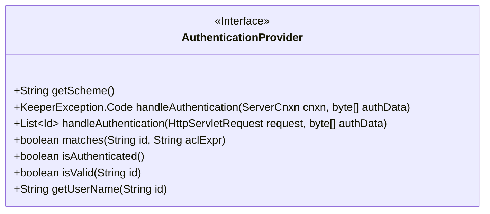
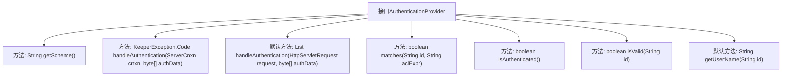

# 基础信息

|      |      |
|------|------|
| 名称 | AuthenticationProvider |
| 编码语言 | .java |
| 代码路径 | zookeeper/zookeeper-server/src/main/java/org/apache/zookeeper/server/auth/AuthenticationProvider.java |
| 包名 | org.apache.zookeeper.server.auth |
| 依赖项 | ['java.util.ArrayList', 'java.util.List', 'javax.servlet.http.HttpServletRequest', 'org.apache.zookeeper.KeeperException', 'org.apache.zookeeper.data.Id', 'org.apache.zookeeper.server.ServerCnxn'] |
| 概述说明 | 认证提供者接口定义：获取方案、处理认证、匹配ACL表达式、验证ID语法、提取用户名等功能。 |

# 说明

AuthenticationProvider接口定义了认证提供者的核心功能。它包含获取认证方案名称的方法getScheme，处理客户端认证数据的方法handleAuthentication，以及处理管理服务器请求认证的默认方法。接口还提供了检查ID与ACL表达式匹配的方法matches，验证认证是否有效的isAuthenticated，验证ID语法的isValid，以及提取用户名的默认方法getUserName。这些方法共同支持多种认证场景，包括客户端连接、管理请求和ACL验证。

# 类列表 Class Summary

| 名称   | 类型  | 说明 |
|-------|------|-------------|
| AuthenticationProvider | interface | 认证提供者接口定义：获取方案标识、处理客户端/管理员认证请求、匹配ACL表达式、验证ID有效性、检查认证状态及提取用户名。 |

## 类 AuthenticationProvider

|      |      |
|------|------|
| 访问范围 | public |
| 类型 | interface |
| 名称 | AuthenticationProvider |
| 说明 | 认证提供者接口定义：获取方案标识、处理客户端/管理员认证请求、匹配ACL表达式、验证ID有效性、检查认证状态及提取用户名。 |

### UML类图

这段代码定义了一个名为`AuthenticationProvider`的接口，用于处理认证相关的功能。接口包含7个方法：`getScheme()`获取认证方案标识，两个重载的`handleAuthentication()`分别处理客户端和管理员的认证请求，`matches()`检查ID与ACL表达式是否匹配，`isAuthenticated()`判断认证是否用于标识创建者，`isValid()`验证ID语法，以及`getUserName()`从认证信息中提取用户名。该接口为认证系统提供了标准化的操作规范，支持多种认证方案的实现和扩展。

### 内部方法调用关系图

这段流程图描述了AuthenticationProvider接口的结构及其方法关系。该接口定义了认证提供者的核心功能，包括获取认证方案(getScheme)、处理认证请求(handleAuthentication)、匹配ID与表达式(matches)、验证认证状态(isAuthenticated)、校验ID格式(isValid)以及提取用户名(getUserName)等。其中handleAuthentication和getUserName提供了默认实现，其他方法需要具体实现类来完成。接口设计灵活，支持多种认证方式，适用于服务器连接和HTTP请求两种场景的认证处理。

### 字段列表 Field List

| 名称  | 类型  | 说明 |
|-------|-------|------|

### 方法列表 Method List

| 名称  | 类型  | 说明 |
|-------|-------|------|
| isAuthenticated | boolean | 验证用户是否已认证 |
| matches | boolean | 方法matches检查id是否符合aclExpr规则，返回布尔值。 |
| handleAuthentication | List<Id> | 方法handleAuthentication接收HttpServletRequest和字节数组authData，返回空的ArrayList。 |
| handleAuthentication | KeeperException.Code | 处理认证请求，传入连接和认证数据，返回认证结果代码。 |
| getScheme | String | 获取字符串的协议方案。 |
| isValid | boolean | 检查字符串id是否有效。 |
| getUserName | String | 方法getUserName接收id参数并直接返回，适用于认证提供商的id仅含用户名的情况。 |

