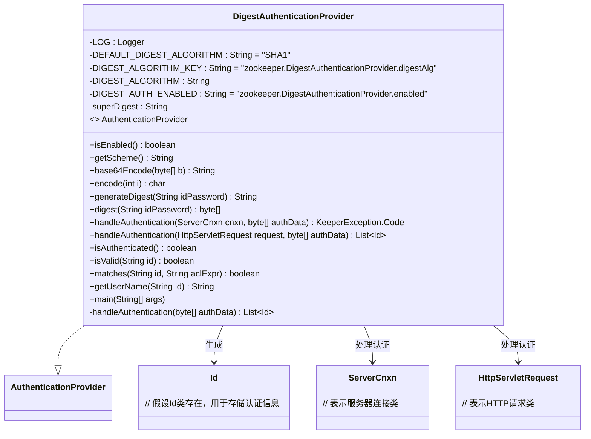
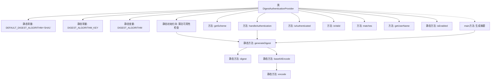

# 基础信息

|      |      |
|------|------|
| 名称 | DigestAuthenticationProvider |
| 编码语言 | .java |
| 代码路径 | zookeeper/zookeeper-server/src/main/java/org/apache/zookeeper/server/auth/DigestAuthenticationProvider.java |
| 包名 | org.apache.zookeeper.server.auth |
| 依赖项 | ['java.nio.charset.StandardCharsets.UTF_8', 'java.security.MessageDigest', 'java.security.NoSuchAlgorithmException', 'java.util.ArrayList', 'java.util.Collections', 'java.util.List', 'javax.servlet.http.HttpServletRequest', 'org.apache.zookeeper.KeeperException', 'org.apache.zookeeper.data.Id', 'org.apache.zookeeper.server.ServerCnxn', 'org.slf4j.Logger', 'org.slf4j.LoggerFactory'] |
| 概述说明 | 摘要：DigestAuthenticationProvider实现认证逻辑，支持SHA1摘要算法，提供超级用户访问控制，处理认证请求并生成摘要。 |

# 说明

该代码实现了一个基于摘要认证的认证提供者类DigestAuthenticationProvider。它支持SHA1算法作为默认摘要算法，可通过系统属性自定义。类中提供了生成摘要、Base64编码、处理认证请求等功能。包含对超级用户的支持，可通过系统属性配置超级用户摘要。主要方法包括生成用户密码摘要、验证认证信息、处理HTTP请求认证等。还提供了命令行工具用于生成摘要字符串。认证流程包括解析认证数据、生成摘要、与超级用户摘要比对、返回认证结果等步骤。

# 类列表 Class Summary

| 名称   | 类型  | 说明 |
|-------|------|-------------|
| DigestAuthenticationProvider | class | DigestAuthenticationProvider实现ZooKeeper的摘要认证，支持SHA1算法，提供生成摘要、验证用户和超级用户功能，通过系统属性配置启用状态和超级用户密码。 |

## 类 DigestAuthenticationProvider

|      |      |
|------|------|
| 访问范围 | public |
| 类型 | class |
| 名称 | DigestAuthenticationProvider |
| 说明 | DigestAuthenticationProvider实现ZooKeeper的摘要认证，支持SHA1算法，提供生成摘要、验证用户和超级用户功能，通过系统属性配置启用状态和超级用户密码。 |

### UML类图

这段代码定义了一个`DigestAuthenticationProvider`类，实现了`AuthenticationProvider`接口，用于处理基于摘要（Digest）的认证逻辑。该类包含静态日志记录器、默认算法配置、系统属性读取等功能，提供生成摘要、Base64编码、认证处理等核心方法。通过系统属性控制认证启用状态，支持超级用户认证，并能处理不同来源（直接连接或HTTP）的认证请求。类图展示了它与认证接口、ID类及网络组件的交互关系，体现了完整的认证流程和扩展性设计。

### 内部方法调用关系图

这段代码实现了一个基于摘要认证的提供者类，主要用于Zookeeper的ACL认证。核心功能包括：通过静态初始化块预检查算法可用性，提供摘要生成和Base64编码工具方法，处理认证请求并返回认证状态。流程图展示了类结构关系，重点突出静态初始化、摘要生成链式调用（generateDigest→digest→base64Encode→encode）以及主方法调用路径。认证流程支持超级用户鉴别，并通过系统属性配置算法和启用状态，体现了防御性编程思想。

### 字段列表 Field List

| 名称  | 类型  | 说明 |
|-------|-------|------|
| DIGEST_AUTH_ENABLED = "zookeeper.DigestAuthenticationProvider.enabled" | String | 摘要：定义常量DIGEST_AUTH_ENABLED，用于启用ZooKeeper的摘要认证功能。 |
| superDigest = System.getProperty("zookeeper.DigestAuthenticationProvider.superDigest") | String | 私有静态常量superDigest获取系统属性zookeeper.DigestAuthenticationProvider.superDigest的值。 |
| LOG = LoggerFactory.getLogger(DigestAuthenticationProvider.class) | Logger | 私有静态日志常量LOG，用于DigestAuthenticationProvider类的日志记录。 |
| DIGEST_ALGORITHM_KEY = "zookeeper.DigestAuthenticationProvider.digestAlg" | String | 定义常量DIGEST_ALGORITHM_KEY，用于指定ZooKeeper的摘要认证算法。 |
| DIGEST_ALGORITHM = System.getProperty(DIGEST_ALGORITHM_KEY, DEFAULT_DIGEST_ALGORITHM) | String | 定义私有静态字符串常量DIGEST_ALGORITHM，其值从系统属性获取，未设置则使用默认值。 |
| DEFAULT_DIGEST_ALGORITHM = "SHA1" | String | 私有静态常量字符串DEFAULT_DIGEST_ALGORITHM默认值为SHA1。 |

### 方法列表 Method List

| 名称  | 类型  | 说明 |
|-------|-------|------|
| getScheme | String | 方法返回字符串"digest"，表示获取的协议方案为摘要认证。 |
| encode | char | 私有方法将0-63整数编码为Base64字符，规则：0-25转A-Z，26-51转a-z，52-61转0-9，62为+，63为/。 |
| handleAuthentication | List<Id> | 重写handleAuthentication方法，接收HTTP请求和认证数据，调用同名方法处理认证数据并返回ID列表。 |
| isValid | boolean | 检查ID格式是否有效，要求以冒号分隔且仅有两部分。 |
| isEnabled | boolean | 检查系统属性DIGEST_AUTH_ENABLED是否为true，记录日志并返回布尔值。 |
| digest | byte[] | Java方法：使用指定算法对字符串进行哈希处理，返回字节数组。 |
| matches | boolean | 该方法检查字符串id是否与aclExpr相等，返回布尔结果。 |
| handleAuthentication | List<Id> | 方法处理认证数据，生成ID列表。若认证数据生成的摘要匹配超级摘要，则添加超级ID。无论匹配与否，都会添加基于方案和摘要的ID。异常时记录错误。返回不可修改的ID列表。 |
| generateDigest | String | 静态方法生成摘要：分割ID密码，计算摘要并Base64编码，返回ID加编码摘要。 |
| base64Encode | String | 私有静态方法base64Encode将字节数组编码为Base64字符串，处理填充并返回结果。 |
| handleAuthentication | KeeperException.Code | 方法处理认证，验证authData生成ID列表。若列表为空返回认证失败，否则为连接添加认证信息并返回成功。 |
| getUserName | String | 重写getUserName方法，直接按冒号分割ID并返回第一部分，无需格式校验。 |
| isAuthenticated | boolean | 该方法始终返回true，表示用户已通过认证。 |
| main | void | Java主方法遍历输入参数，生成并打印每个参数的摘要值。 |

