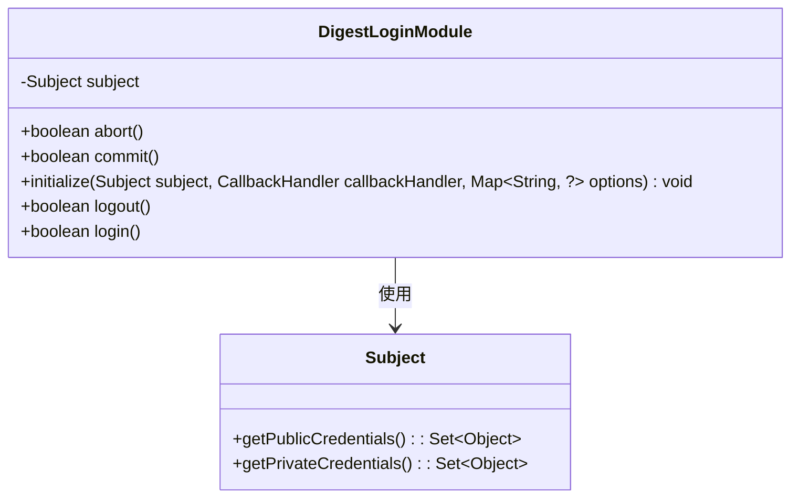
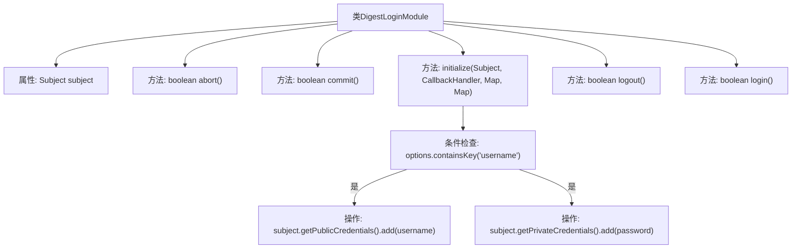

# 基础信息

|      |      |
|------|------|
| 名称 | DigestLoginModule |
| 编码语言 | .java |
| 代码路径 | zookeeper/zookeeper-server/src/main/java/org/apache/zookeeper/server/auth/DigestLoginModule.java |
| 包名 | org.apache.zookeeper.server.auth |
| 依赖项 | ['java.util.Map', 'javax.security.auth.Subject', 'javax.security.auth.callback.CallbackHandler', 'javax.security.auth.spi.LoginModule'] |
| 概述说明 | DigestLoginModule实现登录模块，处理用户名密码初始化，不直接认证，交由SASLClient后续处理。提供提交、注销等基础功能。 |

# 说明

这段代码定义了一个名为DigestLoginModule的类，实现了LoginModule接口，用于处理基于DIGEST-MD5认证的登录流程。该类包含标准的登录模块方法：initialize初始化方法从配置中获取用户名和密码，并将它们分别添加到主题的公共和私有凭证中；login方法不执行实际登录操作，认证由后续的SASLClient处理；commit和logout方法返回成功状态；abort方法返回失败状态。整个模块主要用于Zookeeper客户端的JAAS配置。

# 类列表 Class Summary

| 名称   | 类型  | 说明 |
|-------|------|-------------|
| DigestLoginModule | class | DigestLoginModule实现LoginModule接口，处理用户名密码认证。initialize方法从options获取凭证并存入subject，login和logout直接返回true，无实际认证逻辑，认证由SASLClient后续完成。 |

## 类 DigestLoginModule

|      |      |
|------|------|
| 访问范围 | public |
| 类型 | class |
| 名称 | DigestLoginModule |
| 说明 | DigestLoginModule实现LoginModule接口，处理用户名密码认证。initialize方法从options获取凭证并存入subject，login和logout直接返回true，无实际认证逻辑，认证由SASLClient后续完成。 |

### UML类图

这段类图展示了DigestLoginModule实现JAAS登录模块的核心结构。该类通过initialize方法从配置选项获取用户名密码，并存入Subject对象的公开/私有凭证集。作为认证模块，它提供了标准JAAS接口方法(login/logout/commit/abort)，但实际Zookeeper认证延迟到SASLClient阶段处理。Subject类作为主体身份容器，提供了凭证存储功能，两者通过依赖关系协作完成DIGEST-MD5认证流程。

### 内部方法调用关系图

该流程图描述了DigestLoginModule类的结构和主要方法调用关系。类包含subject属性及5个核心方法：abort()和commit()返回简单布尔值，initialize()处理JAAS配置的凭证存储，logout()和login()提供登录状态管理。重点展示了initialize()方法内部逻辑：检查options是否包含username键，若存在则将username存入公共凭证、password存入私有凭证。login()方法仅返回true，实际认证由外部SASLClient完成。整体呈现了Zookeeper客户端的DIGEST-MD5认证模块的骨架逻辑。

### 字段列表 Field List

| 名称  | 类型  | 说明 |
|-------|-------|------|
| subject | Subject | 声明一个私有Subject类型的成员变量subject。 |

### 方法列表 Method List

| 名称  | 类型  | 说明 |
|-------|-------|------|
| abort | boolean | 方法abort()返回固定值false，表示不执行中止操作。 |
| initialize | void | 初始化方法，处理Subject和凭证存储，从options获取用户名密码并存入subject的公共和私有凭证中。 |
| logout | boolean | 方法logout()直接返回true，表示登出操作成功。 |
| commit | boolean | 方法commit()返回布尔值true，无其他逻辑。 |
| login | boolean | 这是一个登录方法，仅返回true，实际认证通过SASLClient对象在后续完成。 |

