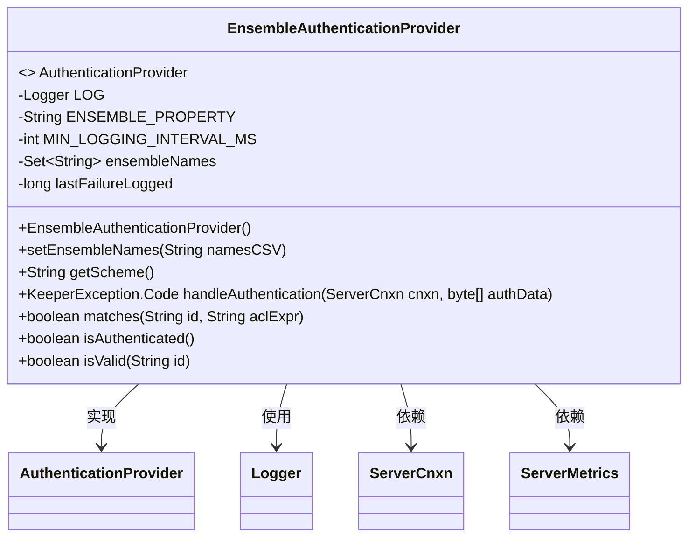
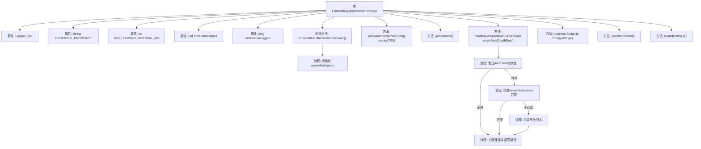

# 基础信息

|      |      |
|------|------|
| 名称 | EnsembleAuthenticationProvider |
| 编码语言 | .java |
| 代码路径 | zookeeper/zookeeper-server/src/main/java/org/apache/zookeeper/server/auth/EnsembleAuthenticationProvider.java |
| 包名 | org.apache.zookeeper.server.auth |
| 依赖项 | ['java.nio.charset.StandardCharsets', 'java.util.HashSet', 'java.util.Set', 'org.apache.zookeeper.KeeperException', 'org.apache.zookeeper.server.ServerCnxn', 'org.apache.zookeeper.server.ServerMetrics', 'org.slf4j.Logger', 'org.slf4j.LoggerFactory'] |
| 概述说明 | EnsembleAuthenticationProvider实现认证逻辑，检查客户端提供的ensemble名称是否匹配预设集合。匹配则认证成功，否则关闭连接并记录错误。不参与ACL验证。 |

# 说明

EnsembleAuthenticationProvider是一个实现AuthenticationProvider接口的类，用于处理ZooKeeper的ensemble认证。它通过系统属性zookeeper.ensembleAuthName获取预设的ensemble名称集合，并在构造函数中初始化。主要功能包括验证客户端提供的ensemble名称是否匹配预设集合，若匹配则认证成功，否则记录警告并关闭连接。该类还实现了其他接口方法，但均返回false，表明不参与ACL验证。日志记录设有最小间隔限制以避免频繁输出。

# 类列表 Class Summary

| 名称   | 类型  | 说明 |
|-------|------|-------------|
| EnsembleAuthenticationProvider | class | 实现ZooKeeper集群认证的EnsembleAuthenticationProvider类，通过系统属性配置合法集群名，验证客户端提交的集群名并记录失败日志，不参与ACL校验。 |

## 类 EnsembleAuthenticationProvider

|      |      |
|------|------|
| 访问范围 | public |
| 类型 | class |
| 名称 | EnsembleAuthenticationProvider |
| 说明 | 实现ZooKeeper集群认证的EnsembleAuthenticationProvider类，通过系统属性配置合法集群名，验证客户端提交的集群名并记录失败日志，不参与ACL校验。 |

### UML类图

这段代码定义了一个实现`AuthenticationProvider`接口的`EnsembleAuthenticationProvider`类，主要用于处理ZooKeeper集群的认证逻辑。类中包含核心方法`handleAuthentication`，通过校验客户端传入的认证数据与预设的集群名称集合进行匹配，并记录成功/失败指标。私有字段`lastFailureLogged`用于控制错误日志频率，避免日志泛滥。其他接口方法默认返回`false`，表明该类不参与ACL校验。

### 内部方法调用关系图

这段代码实现了一个Zookeeper的认证提供者，主要功能是通过检查客户端提供的ensemble名称来验证连接合法性。流程图展示了从类结构到核心认证处理的完整逻辑：初始化时读取系统属性设置ensembleNames集合；认证时先检查数据有效性，再验证名称是否在预配置集合中，失败时会限频记录日志并关闭连接。所有ACL相关方法均返回false，表明这不是一个完整的权限提供者实现。

### 字段列表 Field List

| 名称  | 类型  | 说明 |
|-------|-------|------|
| ensembleNames | Set<String> | 私有字符串集合变量ensembleNames，用于存储名称。 |
| LOG = LoggerFactory.getLogger(EnsembleAuthenticationProvider.class) | Logger | 声明一个私有静态日志常量，用于记录EnsembleAuthenticationProvider类的日志信息。 |
| MIN_LOGGING_INTERVAL_MS = 1000 | int | 私有静态常量MIN_LOGGING_INTERVAL_MS定义为1000毫秒，表示最小日志记录间隔。 |
| ENSEMBLE_PROPERTY = "zookeeper.ensembleAuthName" | String | 定义静态常量ENSEMBLE_PROPERTY，值为zookeeper.ensembleAuthName。 |
| lastFailureLogged | long | 私有长整型变量，记录最后一次失败日志的时间戳。 |

### 方法列表 Method List

| 名称  | 类型  | 说明 |
|-------|-------|------|
| matches | boolean | Java方法重写，matches方法始终返回false，不处理id和aclExpr参数。 |
| getScheme | String | 重写getScheme方法，返回固定字符串"ensemble"。 |
| handleAuthentication | KeeperException.Code | 处理认证逻辑：空数据或空集合直接通过；匹配集合名则认证成功；不匹配则记录失败日志并关闭连接，返回错误码。 |
| setEnsembleNames | void | 该方法将输入的逗号分隔字符串拆分为多个名称，去除空格后存入HashSet集合。 |
| isAuthenticated | boolean | 重写方法isAuthenticated，始终返回false。 |
| isValid | boolean | Java方法重写，验证ID无效，直接返回false。 |

