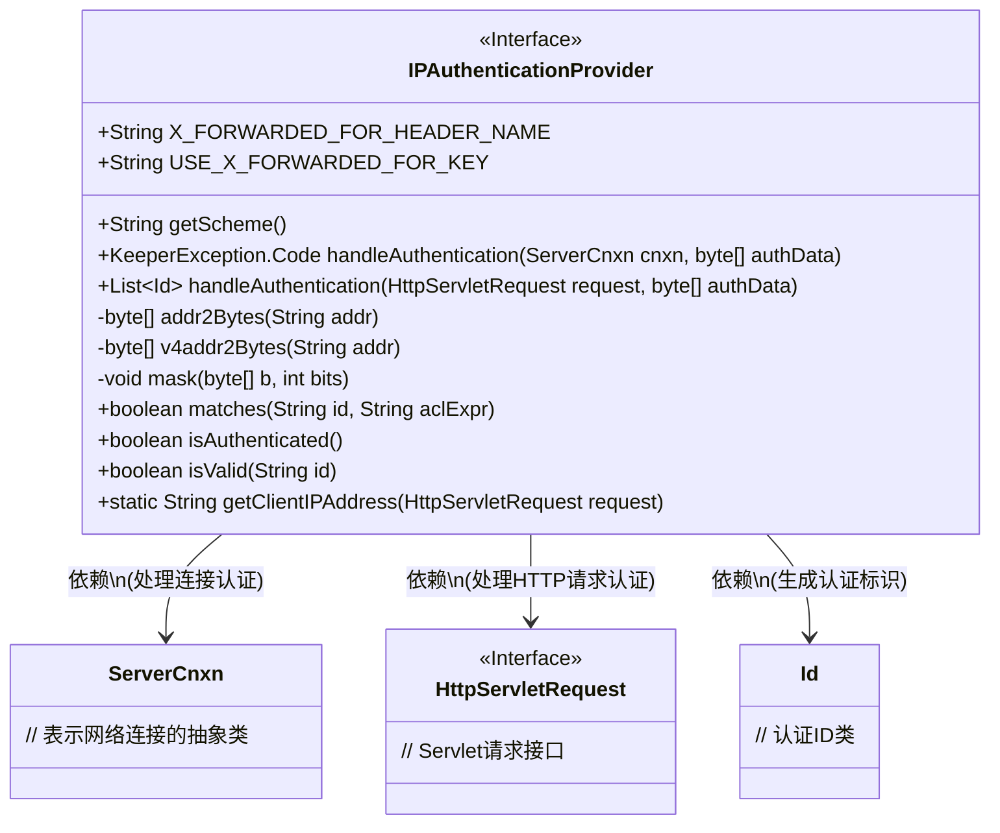
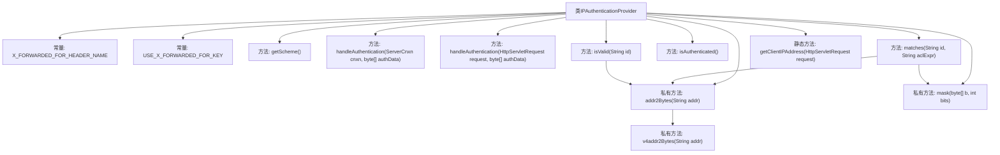
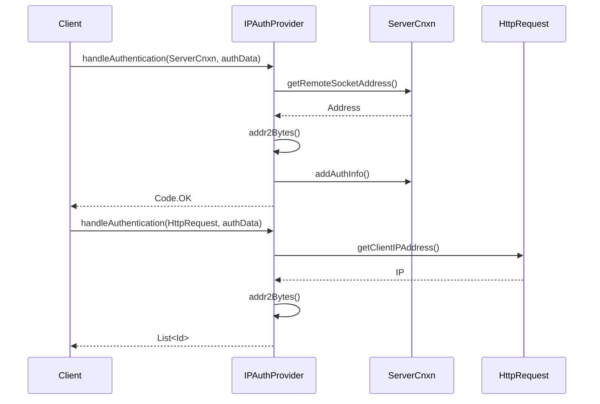

# 基础信息

|      |      |
|------|------|
| 名称 | IPAuthenticationProvider |
| 编码语言 | .java |
| 代码路径 | zookeeper/zookeeper-server/src/main/java/org/apache/zookeeper/server/auth/IPAuthenticationProvider.java |
| 包名 | org.apache.zookeeper.server.auth |
| 依赖项 | ['java.util.ArrayList', 'java.util.Collections', 'java.util.List', 'java.util.StringTokenizer', 'javax.servlet.http.HttpServletRequest', 'org.apache.zookeeper.KeeperException', 'org.apache.zookeeper.data.Id', 'org.apache.zookeeper.server.ServerCnxn'] |
| 概述说明 | IP认证提供者类，实现基于IP的认证，支持IPv4地址转换与匹配，处理X-Forwarded-For头获取客户端IP，提供认证和验证功能。 |

# 说明

该代码实现了一个基于IP地址的认证提供者类IPAuthenticationProvider。主要功能包括处理客户端IP认证、验证IP地址格式有效性以及匹配IP地址与访问控制表达式。类中定义了处理HTTP请求和普通连接两种认证方式，支持从X-Forwarded-For头获取客户端真实IP。包含IPv4地址转换、子网掩码计算等辅助方法，可验证IP地址格式和CIDR表示法的有效性。整体实现了基于IP地址的认证机制，支持代理服务器场景下的真实IP获取。

# 类列表 Class Summary

| 名称   | 类型  | 说明 |
|-------|------|-------------|
| IPAuthenticationProvider | class | IP认证提供者类，实现IP地址认证，支持IPv4转换、子网掩码匹配，可处理X-Forwarded-For头获取客户端真实IP。 |

## 类 IPAuthenticationProvider

|      |      |
|------|------|
| 访问范围 | public |
| 类型 | class |
| 名称 | IPAuthenticationProvider |
| 说明 | IP认证提供者类，实现IP地址认证，支持IPv4转换、子网掩码匹配，可处理X-Forwarded-For头获取客户端真实IP。 |

### UML类图

这段代码定义了一个IP认证提供者类，主要用于处理基于IP地址的认证逻辑。类中包含处理直接连接和HTTP请求的两种认证方式，支持IPv4地址解析和子网掩码匹配，并能通过X-Forwarded-For头获取真实客户端IP。核心功能包括地址转换、掩码计算、ACL表达式匹配等，适用于需要IP白名单控制的场景。

### 内部方法调用关系图

该流程图展示了IPAuthenticationProvider类的完整结构，包含两个核心认证处理方法（分别处理ServerCnxn和HttpServletRequest）、IP地址转换/掩码操作工具方法、以及X-Forwarded-For头处理逻辑。时序图则重点描述了两种认证流程：通过ServerCnxn获取socket地址进行认证，以及通过HttpServletRequest获取客户端IP进行认证的过程，两者最终都会调用addr2Bytes()方法进行IP地址格式验证。

### 字段列表 Field List

| 名称  | 类型  | 说明 |
|-------|-------|------|
| USE_X_FORWARDED_FOR_KEY = "zookeeper.IPAuthenticationProvider.usexforwardedfor" | String | 该代码定义了一个静态常量字符串，用于配置ZooKeeper的IP认证提供器是否使用X-Forwarded-For头信息。 |
| X_FORWARDED_FOR_HEADER_NAME = "X-Forwarded-For" | String | 定义常量X_FORWARDED_FOR_HEADER_NAME，值为"X-Forwarded-For"。 |

### 方法列表 Method List

| 名称  | 类型  | 说明 |
|-------|-------|------|
| getScheme | String | 方法返回字符串"ip"，表示使用的协议方案。 |
| isAuthenticated | boolean | 代码定义了一个公开方法isAuthenticated，返回固定值false，表示未认证状态。 |
| matches | boolean | 方法matches检查ID是否符合ACL表达式。将ACL表达式分割为地址和位数，验证位数有效性，对地址和ID进行掩码处理并逐字节比较。匹配返回true，否则false。 |
| handleAuthentication | List<Id> | Java方法重写，处理认证请求，获取客户端IP并生成不可修改的ID列表返回。 |
| handleAuthentication | KeeperException.Code | 这是一个处理认证的Java方法，接收连接和数据参数，获取远程IP地址并添加认证信息，最后返回成功状态码。 |
| mask | void | 私有方法mask处理字节数组，从指定位数开始屏蔽后续位。计算起始字节和掩码，循环应用掩码至数组末尾。 |
| v4addr2Bytes | byte[] | 将IPv4地址字符串转换为字节数组，检查格式和数值范围，无效则返回null。 |
| addr2Bytes | byte[] | 私有方法将字符串地址转为字节数组，暂仅支持IPv4，IPv6待实现。 |
| isValid | boolean | 检查ID有效性：分割字符串验证地址和位数，地址无效或位数超出范围则返回false，否则返回true。 |
| getClientIPAddress | String | 获取客户端IP地址的方法：若未启用X-Forwarded-For则返回远程地址；否则解析头部首个IP（格式为"client, proxy1..."），无头部时仍返回远程地址。 |

