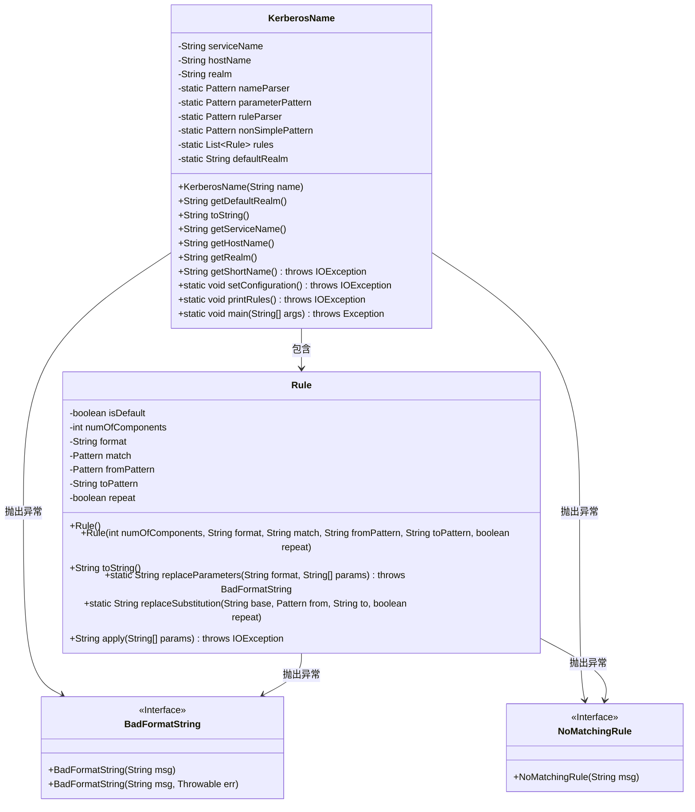

# 基础信息

|      |      |
|------|------|
| 名称 | KerberosName |
| 编码语言 | .java |
| 代码路径 | zookeeper/zookeeper-server/src/main/java/org/apache/zookeeper/server/auth/KerberosName.java |
| 包名 | org.apache.zookeeper.server.auth |
| 依赖项 | ['java.io.IOException', 'java.util.ArrayList', 'java.util.List', 'java.util.regex.Matcher', 'java.util.regex.Pattern', 'org.apache.zookeeper.server.util.KerberosUtil'] |
| 概述说明 | KerberosName类用于解析和转换Kerberos名称，包含服务名、主机名和域名字段。支持规则匹配和转换，提供默认域配置及短名称生成功能。 |

# 说明

KerberosName类用于解析和处理Kerberos主体名称，包含服务名、主机名和领域三个主要组件。通过正则表达式解析名称格式，支持默认领域配置和规则映射。提供获取短名称功能，基于预定义的转换规则将Kerberos名称转换为操作系统用户名。包含异常处理类BadFormatString和NoMatchingRule，以及规则解析和参数替换等内部方法。支持通过系统属性配置规则，并包含测试主方法。

# 类列表 Class Summary

| 名称   | 类型  | 说明 |
|-------|------|-------------|
| KerberosName | class | KerberosName类用于解析和转换Kerberos主体名称，包含服务名、主机名和域。支持规则匹配和参数替换，可将完整名称转换为短名称。提供默认域配置和规则解析功能。 |

## 类 KerberosName

|      |      |
|------|------|
| 访问范围 | public |
| 类型 | class |
| 名称 | KerberosName |
| 说明 | KerberosName类用于解析和转换Kerberos主体名称，包含服务名、主机名和域。支持规则匹配和参数替换，可将完整名称转换为短名称。提供默认域配置和规则解析功能。 |

### UML类图

这段代码定义了一个KerberosName类，用于解析和处理Kerberos主体名称。该类包含三个主要部分：KerberosName核心类处理名称解析和转换，Rule内部类实现名称转换规则，以及两个自定义异常类。KerberosName通过正则表达式解析名称组件（服务名、主机名和域），并提供规则引擎将Kerberos名称映射为操作系统用户名。静态初始化块会加载Kerberos配置并初始化转换规则，整个过程包含严格的错误检查和异常处理机制。

### 内部方法调用关系图

```mermaid
graph TD
    A["类KerberosName"]
    B["属性: String serviceName"]
    C["属性: String hostName"]
    D["属性: String realm"]
    E["静态属性: Pattern nameParser"]
    F["静态属性: Pattern parameterPattern"]
    G["静态属性: Pattern ruleParser"]
    H["静态属性: Pattern nonSimplePattern"]
    I["静态属性: List<Rule> rules"]
    J["静态属性: String defaultRealm"]
    K["静态初始化块: 加载默认realm和规则"]
    L["构造方法: KerberosName(String name)"]
    M["方法: String getDefaultRealm()"]
    N["方法: String toString()"]
    O["方法: String getServiceName()"]
    P["方法: String getHostName()"]
    Q["方法: String getRealm()"]
    R["方法: String getShortName()"]
    S["静态方法: List<Rule> parseRules(String rules)"]
    T["静态方法: void setConfiguration()"]
    U["静态方法: void printRules()"]
    V["main方法: 测试功能"]

    A --> B
    A --> C
    A --> D
    A --> E
    A --> F
    A --> G
    A --> H
    A --> I
    A --> J
    A --> K
    A --> L
    A --> M
    A --> N
    A --> O
    A --> P
    A --> Q
    A --> R
    A --> S
    A --> T
    A --> U
    A -.-> V

    L -->|解析| E
    K -->|调用| T
    T -->|调用| S
    R -->|遍历| I
    V -->|创建| L
    V -->|调用| R
```

该流程图展示了KerberosName类的完整结构，包含主要属性、构造方法、实例方法和静态方法的调用关系。核心功能是通过正则表达式解析Kerberos名称，并实现名称转换规则。静态初始化块负责加载默认realm和映射规则，getShortName()方法应用规则转换名称，整个过程涉及多个正则匹配和参数替换操作。类设计考虑了Kerberos名称的多种格式和异常情况处理。

### 字段列表 Field List

| 名称  | 类型  | 说明 |
|-------|-------|------|
| nameParser = Pattern.compile("([^/@]*)(/([^/@]*))?@([^/@]*)") | Pattern | 定义私有静态常量正则表达式，用于解析格式为"名称/可选部分@域名"的字符串。 |
| realm | String | 私有字符串类型变量realm，不可修改。 |
| parameterPattern = Pattern.compile("([^$]*)(\\$(\\d*))?") | Pattern | 定义静态正则表达式模式，用于匹配含$符号的参数格式，如"text$1"。 |
| hostName | String | 私有字符串变量hostName，用于存储主机名。 |
| nonSimplePattern = Pattern.compile("[/@]") | Pattern | 定义私有静态常量正则表达式，匹配斜杠或@符号。 |
| defaultRealm | String | 私有静态字符串变量defaultRealm。 |
| serviceName | String | 私有字符串变量serviceName。 |
| rules | List<Rule> | 私有静态规则列表变量。 |
| ruleParser = Pattern.compile(        "\\s*((DEFAULT)|(RULE:\\[(\\d*):([^\\]]*)](\\(([^)]*)\\))?"        + "(s/([^/]*)/([^/]*)/(g)?)?))") | Pattern | Java正则表达式模式，用于解析包含DEFAULT或RULE规则的字符串，支持替换操作和分组捕获。 |

### 方法列表 Method List

| 名称  | 类型  | 说明 |
|-------|-------|------|
| toString | String | 重写toString方法，拼接服务名、主机名和域，用斜杠和@分隔。 |
| getServiceName | String | 这是一个Java方法，返回字符串类型的serviceName变量值。 |
| getHostName | String | 方法getHostName返回hostName字符串。 |
| getDefaultRealm | String | 方法返回默认域名字符串。 |
| getRealm | String | 这是一个Java方法，返回字符串类型的realm值。 |
| parseRules | List<Rule> | 解析字符串生成规则列表，处理无效规则，支持两种规则类型，返回结果列表。 |
| setConfiguration | void | 静态方法setConfiguration读取系统属性zookeeper.security.auth_to_local，默认值DEFAULT，并调用parseRules解析规则。 |
| getShortName | String | 方法getShortName根据hostName和realm是否存在，组合参数并应用规则集rules，返回首个匹配结果，若无匹配则抛出NoMatchingRule异常。 |
| printRules | void | 静态方法printRules遍历规则列表，按序号打印每条规则内容。 |
| main | void | Java主方法遍历参数，将每个参数转换为KerberosName对象并输出全名和短名。 |

