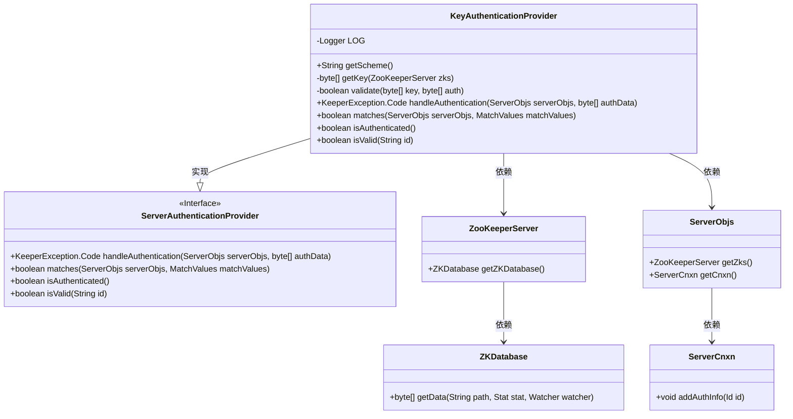
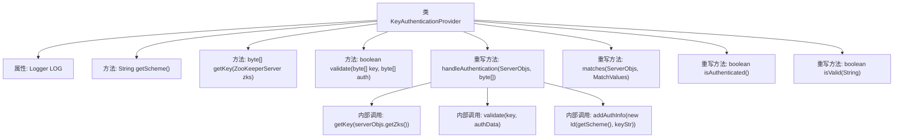
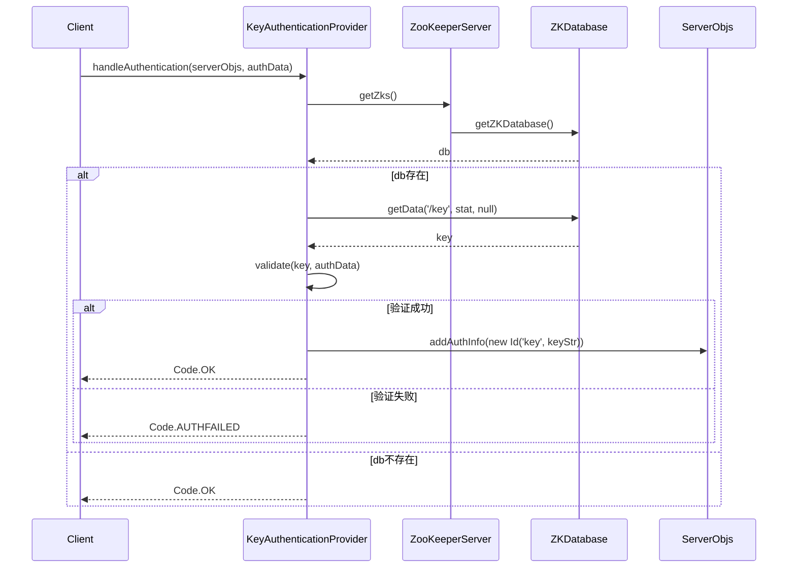

# 基础信息

|      |      |
|------|------|
| 名称 | KeyAuthenticationProvider |
| 编码语言 | .java |
| 代码路径 | zookeeper/zookeeper-server/src/main/java/org/apache/zookeeper/server/auth/KeyAuthenticationProvider.java |
| 包名 | org.apache.zookeeper.server.auth |
| 依赖项 | ['java.nio.charset.StandardCharsets.UTF_8', 'org.apache.zookeeper.KeeperException', 'org.apache.zookeeper.KeeperException.NoNodeException', 'org.apache.zookeeper.data.Id', 'org.apache.zookeeper.data.Stat', 'org.apache.zookeeper.server.ZKDatabase', 'org.apache.zookeeper.server.ZooKeeperServer', 'org.slf4j.Logger', 'org.slf4j.LoggerFactory'] |
| 概述说明 | KeyAuthenticationProvider实现密钥认证，从ZooKeeper获取密钥并验证客户端数据是否为密钥倍数。验证失败返回AUTHFAILED，成功则添加认证信息并返回OK。 |

# 说明

KeyAuthenticationProvider是一个继承自ServerAuthenticationProvider的类，用于实现基于密钥的认证机制。它定义了密钥认证方案，通过ZooKeeper数据库获取存储在/key节点的密钥数据。验证逻辑要求认证数据必须是密钥的整数倍，否则返回失败。处理认证时，若验证通过会将密钥信息添加到连接上下文中，并返回成功状态码。该类还包含匹配认证信息、检查认证状态和ID有效性的方法，默认均返回true。日志记录用于调试认证过程。

# 类列表 Class Summary

| 名称   | 类型  | 说明 |
|-------|------|-------------|
| KeyAuthenticationProvider | class | KeyAuthenticationProvider是ZooKeeper的密钥认证类，通过验证密钥与认证数据的倍数关系实现身份验证，默认允许无密钥时通过，验证失败返回AUTHFAILED。 |

## 类 KeyAuthenticationProvider

|      |      |
|------|------|
| 访问范围 | public |
| 类型 | class |
| 名称 | KeyAuthenticationProvider |
| 说明 | KeyAuthenticationProvider是ZooKeeper的密钥认证类，通过验证密钥与认证数据的倍数关系实现身份验证，默认允许无密钥时通过，验证失败返回AUTHFAILED。 |

### UML类图

这段代码展示了一个基于密钥认证的ZooKeeper认证提供者实现。KeyAuthenticationProvider继承自ServerAuthenticationProvider接口，主要功能包括：从ZooKeeper节点获取密钥、验证客户端提供的认证数据是否符合密钥规则（要求认证数据是密钥的整数倍）、处理认证请求并返回结果。该实现通过ZooKeeper数据库获取存储在/key节点的密钥数据，验证逻辑包含数值格式检查和取模运算，认证成功后会将密钥信息添加到连接上下文中。类图中清晰地展示了与ZooKeeper核心组件（如ZooKeeperServer、ZKDatabase）和网络连接对象（ServerObjs、ServerCnxn）的依赖关系。

### 内部方法调用关系图

流程图描述：该流程图展示了KeyAuthenticationProvider类的核心结构和内部调用关系。类包含日志属性LOG和6个主要方法，其中handleAuthentication是核心认证逻辑，会调用getKey获取密钥并通过validate验证。时序图详细描述了认证流程：客户端发起请求后，依次通过ZooKeeperServer获取数据库，查询密钥数据，验证通过后添加认证信息或返回错误码。整体采用"默认允许"策略，确保密钥可被初始化写入。

### 字段列表 Field List

| 名称  | 类型  | 说明 |
|-------|-------|------|
| LOG = LoggerFactory.getLogger(KeyAuthenticationProvider.class) | Logger | KeyAuthenticationProvider类中定义了一个私有静态日志记录器LOG。 |

### 方法列表 Method List

| 名称  | 类型  | 说明 |
|-------|-------|------|
| getScheme | String | 方法返回字符串"key"。 |
| handleAuthentication | KeeperException.Code | 这是一个Java方法，用于处理认证逻辑。它通过验证传入的认证数据与密钥是否匹配来决定认证结果。验证失败返回AUTHFAILED，成功则添加认证信息并返回OK。默认允许无密钥时通过认证。 |
| getKey | byte[] | 从ZooKeeper数据库获取/key节点数据，异常时记录错误并返回null。 |
| validate | boolean | 验证函数检查key和auth的数值关系：将两者转为字符串后解析为整数，若key非零且auth不是key的倍数则返回false，异常时记录错误并返回false，否则返回true。 |
| matches | boolean | 重写matches方法，比较matchValues的ID与AclExpr是否相等。 |
| isAuthenticated | boolean | Java方法重写，始终返回true表示已认证。 |
| isValid | boolean | Java方法重写，校验ID始终返回true。 |

