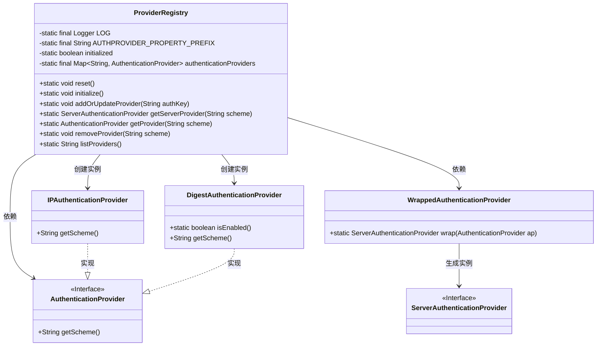
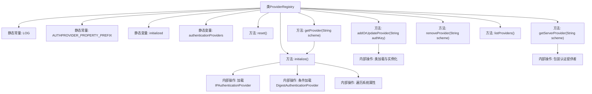

# 基础信息

|      |      |
|------|------|
| 名称 | ProviderRegistry |
| 编码语言 | .java |
| 代码路径 | zookeeper/zookeeper-server/src/main/java/org/apache/zookeeper/server/auth/ProviderRegistry.java |
| 包名 | org.apache.zookeeper.server.auth |
| 依赖项 | ['java.util.Enumeration', 'java.util.HashMap', 'java.util.Map', 'org.apache.zookeeper.server.ZooKeeperServer', 'org.slf4j.Logger', 'org.slf4j.LoggerFactory'] |
| 概述说明 | ProviderRegistry类管理认证提供者，支持初始化、重置、添加、移除和查询功能，使用同步机制确保线程安全。 |

# 说明

ProviderRegistry是一个用于管理认证提供者的工具类，采用单例模式确保线程安全。它通过静态Map存储认证提供者实例，支持初始化、重置、添加、更新、移除和查询功能。初始化时默认加载IP和Digest认证提供者，并通过系统属性动态加载其他提供者。所有操作均通过同步块保证线程安全，并提供错误日志记录。

# 类列表 Class Summary

| 名称   | 类型  | 说明 |
|-------|------|-------------|
| ProviderRegistry | class | ProviderRegistry类管理认证提供者，包含初始化、添加、删除和查询功能，使用同步块保证线程安全，支持IP和Digest认证，可通过系统属性动态加载提供者。 |

## 类 ProviderRegistry

|      |      |
|------|------|
| 访问范围 | public |
| 类型 | class |
| 名称 | ProviderRegistry |
| 说明 | ProviderRegistry类管理认证提供者，包含初始化、添加、删除和查询功能，使用同步块保证线程安全，支持IP和Digest认证，可通过系统属性动态加载提供者。 |

### UML类图

这段代码定义了一个ProviderRegistry类，用于管理各种AuthenticationProvider的注册和获取。它通过静态Map存储提供者实例，提供初始化、添加、删除、查询等功能。核心逻辑包括同步控制、动态类加载和提供者包装，支持IP和摘要认证等具体实现。类图展示了与接口和实现类之间的层级关系及依赖。

### 内部方法调用关系图

流程图描述：该流程图展示了ProviderRegistry类的完整结构，包含静态变量、核心方法和内部调用关系。初始化流程(initialize)会依次加载IP认证提供者、有条件加载摘要认证提供者，并遍历系统属性进行动态加载。关键方法addOrUpdateProvider通过反射机制实例化认证提供者，getProvider方法在未初始化时自动触发初始化。所有操作都通过同步块保证线程安全，认证提供者存储在静态Map中统一管理。

### 字段列表 Field List

| 名称  | 类型  | 说明 |
|-------|-------|------|
| AUTHPROVIDER_PROPERTY_PREFIX = "zookeeper.authProvider." | String | 定义常量字符串AUTHPROVIDER_PROPERTY_PREFIX，值为"zookeeper.authProvider."，用于ZooKeeper认证提供者的属性前缀。 |
| LOG = LoggerFactory.getLogger(ProviderRegistry.class) | Logger | 私有静态日志常量LOG，用于ProviderRegistry类的日志记录。 |
| authenticationProviders = new HashMap<>() | Map<String, AuthenticationProvider> | 私有静态常量Map，存储字符串到认证提供者的映射。 |
| initialized = false | boolean | 私有静态布尔变量initialized初始值为false。 |

### 方法列表 Method List

| 名称  | 类型  | 说明 |
|-------|-------|------|
| getServerProvider | ServerAuthenticationProvider | 获取指定认证方案的服务器端认证提供者，通过包装基础提供者实现。 |
| addOrUpdateProvider | void | 静态方法`addOrUpdateProvider`通过同步块注册或更新认证提供者。检查`authKey`前缀匹配后，加载指定类并实例化，存入`authenticationProviders`映射。异常时记录警告日志。 |
| getProvider | AuthenticationProvider | 静态方法getProvider根据传入的scheme参数返回对应的认证提供者，若未初始化则先执行初始化。 |
| reset | void | 同步重置ProviderRegistry状态：初始化标志置为false，清空认证提供者列表。 |
| initialize | void | 静态方法initialize()同步初始化认证提供者：注册IP和Digest（若启用），遍历系统属性并更新提供者，标记完成。 |
| removeProvider | void | 移除指定认证提供者。 |
| listProviders | String | 该方法遍历认证提供者集合，将所有提供者名称拼接成字符串返回。 |

