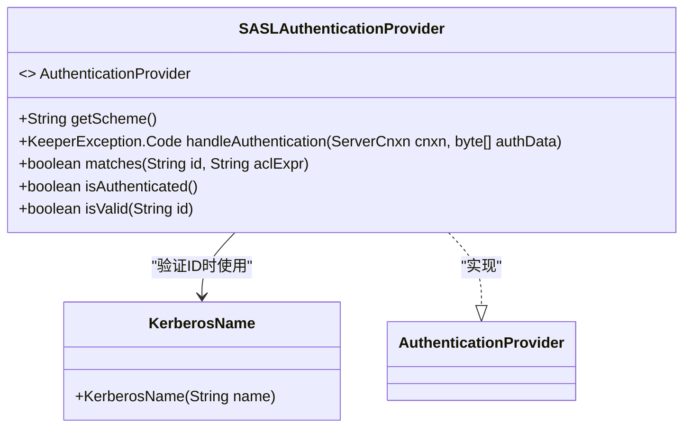
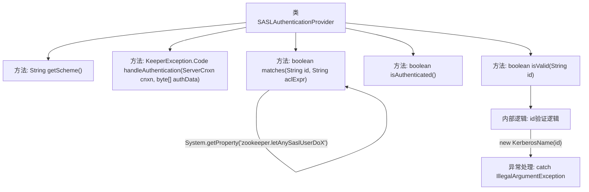

# 基础信息

|      |      |
|------|------|
| 名称 | SASLAuthenticationProvider |
| 编码语言 | .java |
| 代码路径 | zookeeper/zookeeper-server/src/main/java/org/apache/zookeeper/server/auth/SASLAuthenticationProvider.java |
| 包名 | org.apache.zookeeper.server.auth |
| 依赖项 | ['org.apache.zookeeper.KeeperException', 'org.apache.zookeeper.server.ServerCnxn'] |
| 概述说明 | SASL认证提供者类，实现认证接口。提供SASL方案名称，处理认证失败，匹配用户ID与ACL表达式，验证Kerberos名称有效性。认证状态默认为真。 |

# 说明

SASLAuthenticationProvider是一个实现AuthenticationProvider接口的类，用于处理SASL认证。它定义了getScheme方法返回"sasl"标识认证方案。handleAuthentication方法目前仅返回AUTHFAILED，但未来可能用于会话初始化的认证处理。matches方法检查用户ID是否匹配ACL表达式或具有超级用户权限，同时支持通过系统属性zookeeper.letAnySaslUserDoX配置的读取权限用户。isAuthenticated方法始终返回true表示已认证。isValid方法通过KerberosName验证ID是否符合Kerberos主体名称的语法规则，若构造KerberosName不抛出异常则视为有效。

# 类列表 Class Summary

| 名称   | 类型  | 说明 |
|-------|------|-------------|
| SASLAuthenticationProvider | class | SASL认证提供者类，实现认证接口。包含获取方案、处理认证、匹配ID与ACL表达式、验证认证状态及ID有效性方法。支持Kerberos名称验证，超级用户或特定属性用户可匹配ACL。 |

## 类 SASLAuthenticationProvider

|      |      |
|------|------|
| 访问范围 | public |
| 类型 | class |
| 名称 | SASLAuthenticationProvider |
| 说明 | SASL认证提供者类，实现认证接口。包含获取方案、处理认证、匹配ID与ACL表达式、验证认证状态及ID有效性方法。支持Kerberos名称验证，超级用户或特定属性用户可匹配ACL。 |

### UML类图

这段代码展示了一个SASL认证提供者类，实现了AuthenticationProvider接口，主要用于处理基于SASL的认证逻辑。该类包含五个关键方法：获取认证方案、处理认证请求、匹配用户ID与ACL表达式、检查认证状态以及验证ID有效性。其中isValid方法依赖KerberosName类来验证Kerberos主体名称的合法性，当名称不符合Kerberos语法时会抛出异常。matches方法支持超级用户匹配和通过系统属性配置的特殊访问控制，整体设计体现了SASL认证与Kerberos的典型集成模式。

### 内部方法调用关系图

这段代码是SASL认证提供者的实现类，主要包含5个核心方法：获取认证方案标识(getScheme)、处理认证请求(handleAuthentication)、匹配用户权限(matches)、检查认证状态(isAuthenticated)和验证ID有效性(isValid)。其中isValid方法通过KerberosName构造函数验证ID格式，matches方法实现了基于系统属性的灵活权限控制。流程图清晰展示了类结构和方法间的调用关系，特别是isValid方法的异常处理分支和matches方法的多条件判断逻辑。

### 字段列表 Field List

| 名称  | 类型  | 说明 |
|-------|-------|------|

### 方法列表 Method List

| 名称  | 类型  | 说明 |
|-------|-------|------|
| getScheme | String | 方法返回字符串"sasl"，表示使用SASL认证方案。 |
| isAuthenticated | boolean | 该方法始终返回true，表示用户已通过认证。 |
| matches | boolean | 检查ID是否匹配超级用户或ACL表达式，或系统属性允许的SASL用户访问。 |
| handleAuthentication | KeeperException.Code | 该方法处理认证但实际不应被调用，因为SASL认证在会话初始化时已完成。当前返回认证失败，未来可能改为在初始化时调用SASL认证提供者的处理方法。 |
| isValid | boolean | 该方法验证ID是否符合Kerberos主体名称语法，通过尝试创建KerberosName对象判断有效性，成功返回true，失败返回false。 |

