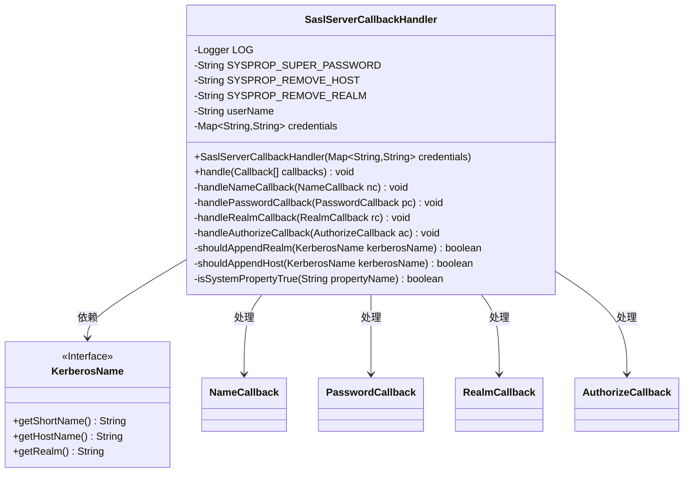
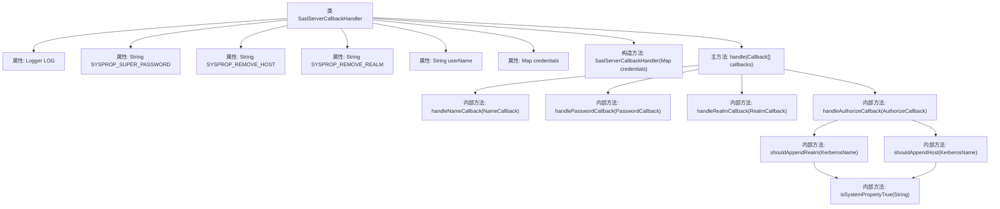
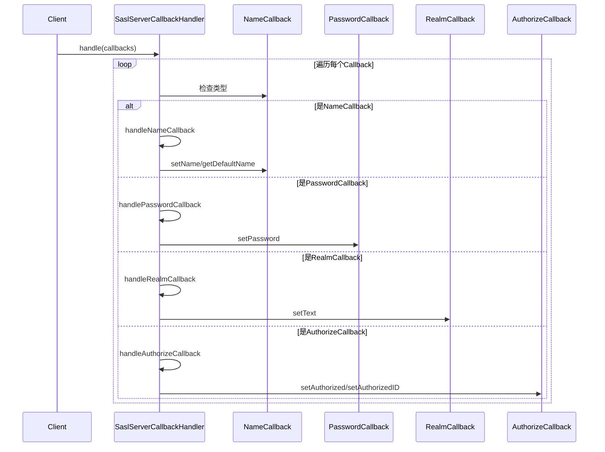

# 基础信息

|      |      |
|------|------|
| 名称 | SaslServerCallbackHandler |
| 编码语言 | .java |
| 代码路径 | zookeeper/zookeeper-server/src/main/java/org/apache/zookeeper/server/auth/SaslServerCallbackHandler.java |
| 包名 | org.apache.zookeeper.server.auth |
| 依赖项 | ['java.io.IOException', 'java.util.Map', 'javax.security.auth.callback.Callback', 'javax.security.auth.callback.CallbackHandler', 'javax.security.auth.callback.NameCallback', 'javax.security.auth.callback.PasswordCallback', 'javax.security.auth.callback.UnsupportedCallbackException', 'javax.security.sasl.AuthorizeCallback', 'javax.security.sasl.RealmCallback', 'org.slf4j.Logger', 'org.slf4j.LoggerFactory'] |
| 概述说明 | SaslServerCallbackHandler处理SASL回调，支持用户名、密码、域和授权验证。超级用户密码通过系统属性设置，Kerberos名称根据系统属性调整。包含日志记录和错误处理。 |

# 说明

SaslServerCallbackHandler是一个实现了CallbackHandler接口的类，用于处理SASL服务器认证过程中的回调。它包含四个系统属性配置：超级密码、移除主机和域名的设置。类中维护了用户名和凭证映射表，通过handle方法处理不同类型的回调，包括名称、密码、域和授权回调。名称回调验证用户是否存在，密码回调根据用户名设置密码（支持超级用户特殊密码），域回调处理客户端提供的域信息，授权回调处理认证和授权ID，并根据系统属性决定是否包含主机和域名信息。整个过程会记录相关日志信息。

# 类列表 Class Summary

| 名称   | 类型  | 说明 |
|-------|------|-------------|
| SaslServerCallbackHandler | class | SaslServerCallbackHandler处理SASL回调，支持用户名、密码、域和授权验证，支持超级密码和Kerberos名称规范化。 |

## 类 SaslServerCallbackHandler

|      |      |
|------|------|
| 访问范围 | public |
| 类型 | class |
| 名称 | SaslServerCallbackHandler |
| 说明 | SaslServerCallbackHandler处理SASL回调，支持用户名、密码、域和授权验证，支持超级密码和Kerberos名称规范化。 |

### UML类图

这段代码实现了一个SASL服务器回调处理器，主要用于处理Kerberos认证过程中的各种回调请求。类图展示了SaslServerCallbackHandler与多个回调类型（NameCallback、PasswordCallback等）的交互关系，以及依赖KerberosName接口获取认证信息。该类通过系统属性和凭据映射来验证用户身份，处理包括用户名、密码、域和授权等多种回调类型，支持超级用户密码配置和Kerberos名称规范化规则。

### 内部方法调用关系图

这段代码实现了一个SASL服务器回调处理器，主要用于处理不同类型的认证回调请求。流程图展示了类的结构和方法调用关系，时序图则详细描述了处理回调时的交互流程。该类支持四种回调类型处理（用户名、密码、域和授权），通过系统属性控制认证行为，并包含完善的日志记录机制。核心功能包括验证用户凭证、处理超级用户密码、规范化Kerberos名称等，适用于ZooKeeper的SASL认证场景。

### 字段列表 Field List

| 名称  | 类型  | 说明 |
|-------|-------|------|
| LOG = LoggerFactory.getLogger(SaslServerCallbackHandler.class) | Logger | 类SaslServerCallbackHandler中定义了一个私有静态常量LOG，用于记录日志。 |
| SYSPROP_REMOVE_REALM = "zookeeper.kerberos.removeRealmFromPrincipal" | String | 系统属性常量，用于控制是否从Kerberos主体中移除域名。 |
| userName | String | 私有字符串变量userName。 |
| credentials | Map<String, String> | 私有映射类型变量credentials，键值均为字符串。 |
| SYSPROP_REMOVE_HOST = "zookeeper.kerberos.removeHostFromPrincipal" | String | 私有静态常量SYSPROP_REMOVE_HOST用于控制是否从主体中移除主机名，值为"zookeeper.kerberos.removeHostFromPrincipal"。 |
| SYSPROP_SUPER_PASSWORD = "zookeeper.SASLAuthenticationProvider.superPassword" | String | 系统属性常量SYSPROP_SUPER_PASSWORD用于定义ZooKeeper的SASL认证超级密码。 |

### 方法列表 Method List

| 名称  | 类型  | 说明 |
|-------|-------|------|
| shouldAppendRealm | boolean | 检查是否应附加Kerberos域名：未设置移除域名的系统属性且域名非空时返回真。 |
| handleRealmCallback | void | 处理RealmCallback，记录客户端提供的默认领域文本并设置为回调文本。 |
| handleNameCallback | void | 处理名称回调，检查用户是否在凭据库中。若不存在则记录警告并返回；存在则设置用户名并存储。 |
| isSystemPropertyTrue | boolean | 检查系统属性是否为true，若属性值为"true"则返回true，否则返回false。 |
| handleAuthorizeCallback | void | 处理授权回调，验证客户端ID，根据系统属性规范授权ID，设置授权状态和ID，记录日志，异常处理。 |
| handlePasswordCallback | void | 处理密码回调：超级用户使用系统属性密码，普通用户从凭证库获取，无凭证则记录警告。 |
| handle | void | 处理回调数组，根据不同类型调用对应处理方法：NameCallback、PasswordCallback、RealmCallback、AuthorizeCallback。 |
| shouldAppendHost | boolean | 检查是否应附加主机名：未禁用系统属性且KerberosName包含主机名时返回true。 |

