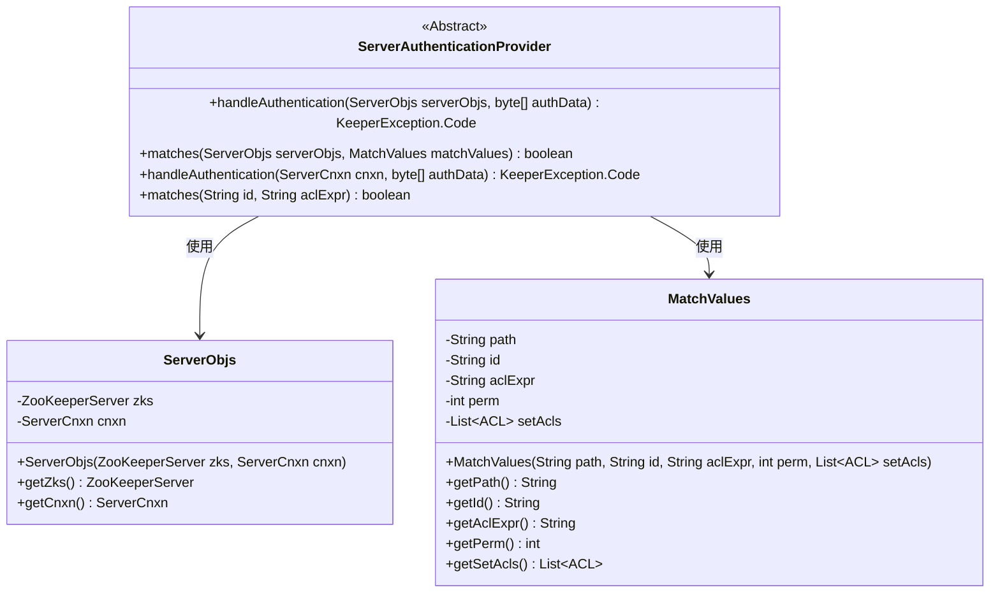

# 基础信息

|      |      |
|------|------|
| 名称 | ServerAuthenticationProvider |
| 编码语言 | .java |
| 代码路径 | zookeeper/zookeeper-server/src/main/java/org/apache/zookeeper/server/auth/ServerAuthenticationProvider.java |
| 包名 | org.apache.zookeeper.server.auth |
| 依赖项 | ['java.util.List', 'org.apache.zookeeper.KeeperException', 'org.apache.zookeeper.data.ACL', 'org.apache.zookeeper.server.ServerCnxn', 'org.apache.zookeeper.server.ZooKeeperServer'] |
| 概述说明 | ServerAuthenticationProvider是抽象类，提供ZooKeeper服务器认证功能，包含ServerObjs和MatchValues两个内部类，分别封装服务器连接信息和匹配值，定义handleAuthentication和matches抽象方法用于处理认证和匹配逻辑。 |

# 说明

ServerAuthenticationProvider是一个抽象类，实现了AuthenticationProvider接口，用于处理ZooKeeper服务器的认证逻辑。它包含两个静态内部类：ServerObjs封装了ZooKeeperServer实例和接收认证信息的ServerCnxn连接对象；MatchValues存储了路径、ID、ACL表达式、权限值和待设置的ACL列表等匹配参数。该类提供了两个抽象方法：handleAuthentication处理客户端认证数据并返回结果码，matches检查ID是否匹配ACL表达式。类中还重写了父接口的两个方法，但直接抛出UnsupportedOperationException异常表示不支持。

# 类列表 Class Summary

| 名称   | 类型  | 说明 |
|-------|------|-------------|
| ServerAuthenticationProvider | class | ServerAuthenticationProvider是ZooKeeper的认证提供者抽象类，包含ServerObjs和MatchValues两个内部类，分别封装服务器连接信息和认证匹配值。提供handleAuthentication和matches抽象方法处理认证和权限匹配。 |

## 类 ServerAuthenticationProvider

|      |      |
|------|------|
| 访问范围 | public abstract |
| 类型 | class |
| 名称 | ServerAuthenticationProvider |
| 说明 | ServerAuthenticationProvider是ZooKeeper的认证提供者抽象类，包含ServerObjs和MatchValues两个内部类，分别封装服务器连接信息和认证匹配值。提供handleAuthentication和matches抽象方法处理认证和权限匹配。 |

### UML类图

该代码展示了一个ZooKeeper服务器认证系统的核心结构。ServerAuthenticationProvider作为抽象基类，定义了处理认证请求和匹配ACL规则的接口，包含两个嵌套类：ServerObjs封装服务器连接和ZooKeeper实例，MatchValues存储路径、ID、ACL表达式等认证匹配参数。主类通过依赖关系使用这两个辅助类来完成认证逻辑，其中抽象方法需要子类实现具体认证方案，而final方法则禁止子类重写。整体设计体现了认证流程与具体实现的分离，支持灵活扩展不同的认证机制。

### 内部方法调用关系图

```mermaid
graph TD
    A["抽象类ServerAuthenticationProvider"]
    B["嵌套类ServerObjs"]
    C["属性: ZooKeeperServer zks"]
    D["属性: ServerCnxn cnxn"]
    E["构造方法: ServerObjs(ZooKeeperServer zks, ServerCnxn cnxn)"]
    F["方法: getZks()"]
    G["方法: getCnxn()"]
    H["嵌套类MatchValues"]
    I["属性: String path"]
    J["属性: String id"]
    K["属性: String aclExpr"]
    L["属性: int perm"]
    M["属性: List<ACL> setAcls"]
    N["构造方法: MatchValues(String path, String id, String aclExpr, int perm, List<ACL> setAcls)"]
    O["方法: getPath()"]
    P["方法: getId()"]
    Q["方法: getAclExpr()"]
    R["方法: getPerm()"]
    S["方法: getSetAcls()"]
    T["抽象方法: handleAuthentication(ServerObjs serverObjs, byte[] authData)"]
    U["抽象方法: matches(ServerObjs serverObjs, MatchValues matchValues)"]
    V["重写方法: handleAuthentication(ServerCnxn cnxn, byte[] authData)"]
    W["重写方法: matches(String id, String aclExpr)"]

    A --> B
    B --> C
    B --> D
    B --> E
    B --> F
    B --> G
    A --> H
    H --> I
    H --> J
    H --> K
    H --> L
    H --> M
    H --> N
    H --> O
    H --> P
    H --> Q
    H --> R
    H --> S
    A --> T
    A --> U
    A --> V
    A --> W
```

该流程图展示了ServerAuthenticationProvider抽象类的结构，包含两个嵌套类ServerObjs和MatchValues。ServerObjs类用于封装ZooKeeper服务器实例和连接对象，提供构造方法和getter方法；MatchValues类用于存储路径、ID、ACL表达式等匹配值，同样提供构造方法和getter方法。主类定义了两个抽象方法用于认证处理和匹配验证，并重写了父类的两个方法但抛出未支持操作异常。整体结构清晰展示了类之间的层级关系和方法调用路径。

### 字段列表 Field List

| 名称  | 类型  | 说明 |
|-------|-------|------|

### 方法列表 Method List

| 名称  | 类型  | 说明 |
|-------|-------|------|
| matches | boolean | Java方法重写示例，抛出UnsupportedOperationException异常，表示不支持此操作。 |
| matches | boolean | 抽象方法matches，检查serverObjs是否符合matchValues条件，返回布尔值。 |
| handleAuthentication | KeeperException.Code | 抽象方法handleAuthentication，用于处理认证，参数为ServerObjs和字节数组authData，返回KeeperException.Code。 |
| handleAuthentication | KeeperException.Code | 重写方法handleAuthentication，抛出未实现操作异常。 |

