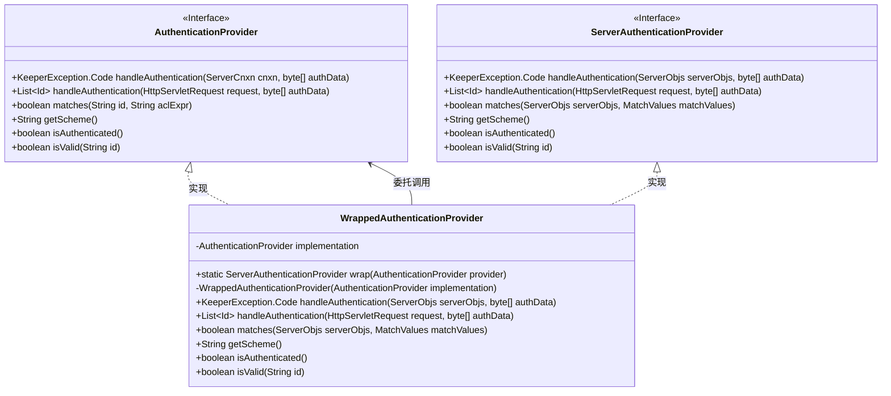
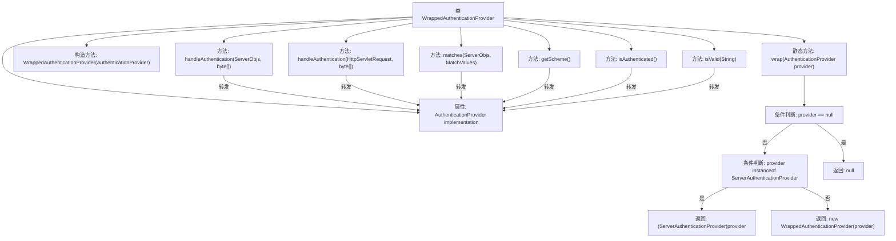

# 基础信息

|      |      |
|------|------|
| 名称 | WrappedAuthenticationProvider |
| 编码语言 | .java |
| 代码路径 | zookeeper/zookeeper-server/src/main/java/org/apache/zookeeper/server/auth/WrappedAuthenticationProvider.java |
| 包名 | org.apache.zookeeper.server.auth |
| 依赖项 | ['java.util.List', 'javax.servlet.http.HttpServletRequest', 'org.apache.zookeeper.KeeperException', 'org.apache.zookeeper.data.Id', 'org.apache.zookeeper.server.ServerCnxn'] |
| 概述说明 | WrappedAuthenticationProvider包装AuthenticationProvider，转发旧方法调用，保持接口兼容性。 |

# 说明

WrappedAuthenticationProvider类继承ServerAuthenticationProvider，封装AuthenticationProvider实现。提供静态wrap方法，根据输入类型返回原对象或新建包装实例。构造函数接收具体实现。重写多个方法，将请求转发给内部实现处理，包括handleAuthentication（两种参数形式）、matches、getScheme、isAuthenticated和isValid。通过委托模式兼容新旧接口，保持功能一致性。

# 类列表 Class Summary

| 名称   | 类型  | 说明 |
|-------|------|-------------|
| WrappedAuthenticationProvider | class | WrappedAuthenticationProvider包装AuthenticationProvider，转发方法调用至原实现类，适配新旧接口。 |

## 类 WrappedAuthenticationProvider

|      |      |
|------|------|
| 访问范围 | None |
| 类型 | class |
| 名称 | WrappedAuthenticationProvider |
| 说明 | WrappedAuthenticationProvider包装AuthenticationProvider，转发方法调用至原实现类，适配新旧接口。 |

### UML类图

这段类图展示了WrappedAuthenticationProvider作为适配器模式的结构，它同时实现了ServerAuthenticationProvider接口并包装了AuthenticationProvider接口。该类通过委托机制将新接口方法调用转发给旧接口实现，实现了接口兼容性转换。图中清晰显示了接口继承关系（实线三角箭头）、类实现关系（虚线三角箭头）和委托依赖关系（普通箭头）。

### 内部方法调用关系图

这段代码展示了一个包装器模式实现，WrappedAuthenticationProvider类封装了AuthenticationProvider接口的功能。流程图清晰地描述了类结构、静态工厂方法和所有委托调用的转发逻辑。核心是通过wrap()方法实现提供者的智能包装，其他方法均将调用委托给内部implementation对象处理，保持了原始接口的完整功能。

### 字段列表 Field List

| 名称  | 类型  | 说明 |
|-------|-------|------|
| implementation | AuthenticationProvider | 私有且不可变的认证提供者实现实例。 |

### 方法列表 Method List

| 名称  | 类型  | 说明 |
|-------|-------|------|
| matches | boolean | 重写matches方法，调用implementation.matches检查ID和ACL表达式匹配。 |
| getScheme | String | 重写getScheme方法，直接返回implementation对象的Scheme值。 |
| wrap | ServerAuthenticationProvider | 静态方法wrap接收AuthenticationProvider参数，若为空返回null，否则检查是否为ServerAuthenticationProvider实例，是则强制转换，否则用WrappedAuthenticationProvider包装。 |
| isAuthenticated | boolean | 这是一个Java方法重写，检查用户是否已认证，直接调用内部实现并返回结果。 |
| isValid | boolean | 重写方法isValid，调用implementation的isValid验证id有效性。 |
| handleAuthentication | List<Id> | 重写handleAuthentication方法，调用implementation处理认证请求并返回ID列表。 |
| handleAuthentication | KeeperException.Code | 重写方法handleAuthentication，调用实现类的处理逻辑并返回结果。 |

