# 基础信息

|      |      |
|------|------|
| 名称 | X509AuthenticationProvider |
| 编码语言 | .java |
| 代码路径 | zookeeper/zookeeper-server/src/main/java/org/apache/zookeeper/server/auth/X509AuthenticationProvider.java |
| 包名 | org.apache.zookeeper.server.auth |
| 依赖项 | ['java.security.cert.Certificate', 'java.security.cert.CertificateException', 'java.security.cert.X509Certificate', 'java.util.ArrayList', 'java.util.Arrays', 'java.util.Collection', 'java.util.Collections', 'java.util.List', 'javax.net.ssl.X509KeyManager', 'javax.net.ssl.X509TrustManager', 'javax.security.auth.x500.X500Principal', 'javax.servlet.http.HttpServletRequest', 'org.apache.zookeeper.KeeperException', 'org.apache.zookeeper.common.ClientX509Util', 'org.apache.zookeeper.common.X509Exception', 'org.apache.zookeeper.common.X509Exception.KeyManagerException', 'org.apache.zookeeper.common.X509Exception.TrustManagerException', 'org.apache.zookeeper.common.X509Util', 'org.apache.zookeeper.common.ZKConfig', 'org.apache.zookeeper.data.Id', 'org.apache.zookeeper.server.ServerCnxn', 'org.slf4j.Logger', 'org.slf4j.LoggerFactory'] |
| 概述说明 | X509AuthenticationProvider实现基于X509证书的认证，管理密钥和信任管理器，支持超级用户配置，处理客户端证书链验证并返回认证ID。 |

# 说明

X509AuthenticationProvider是一个实现AuthenticationProvider接口的类，用于处理基于X509证书的认证。它通过系统属性配置密钥库和信任库的位置及密码，支持CRL、OCSP和主机名验证。类中包含X509TrustManager和X509KeyManager，用于验证客户端证书和管理密钥。认证时检查证书链有效性，支持超级用户配置，并生成对应的身份标识。若证书无效或缺少管理器，会记录错误并返回认证失败。

# 类列表 Class Summary

| 名称   | 类型  | 说明 |
|-------|------|-------------|
| X509AuthenticationProvider | class | X509AuthenticationProvider实现ZooKeeper的X509证书认证，管理密钥和信任库，支持超级用户配置，验证客户端证书并处理会话授权。 |


## 类 X509AuthenticationProvider

|      |      |
|------|------|
| 访问范围 | public |
| 类型 | class |
| 名称 | X509AuthenticationProvider |
| 说明 | X509AuthenticationProvider实现ZooKeeper的X509证书认证，管理密钥和信任库，支持超级用户配置，验证客户端证书并处理会话授权。 |


### UML类图

```mermaid
classDiagram
    class X509AuthenticationProvider {
        <<Interface>> AuthenticationProvider
        +String X509_CERTIFICATE_ATTRIBUTE_NAME
        +String ZOOKEEPER_X509AUTHENTICATIONPROVIDER_SUPERUSER
        -Logger LOG
        -X509TrustManager trustManager
        -X509KeyManager keyManager
        +X509AuthenticationProvider()
        +X509AuthenticationProvider(X509TrustManager trustManager, X509KeyManager keyManager)
        +String getScheme()
        +KeeperException.Code handleAuthentication(ServerCnxn cnxn, byte[] authData)
        +List~Id~ handleAuthentication(HttpServletRequest request, byte[] authData)
        -String getClientId(X509Certificate clientCert)
        +boolean matches(String id, String aclExpr)
        +boolean isAuthenticated()
        +boolean isValid(String id)
        +X509TrustManager getTrustManager() throws TrustManagerException
        +X509KeyManager getKeyManager() throws KeyManagerException
        -List~Id~ handleAuthentication(X509Certificate[] certChain)
    }

    interface AuthenticationProvider {
        <<Interface>>
        +String getScheme()
        +KeeperException.Code handleAuthentication(ServerCnxn cnxn, byte[] authData)
        +List~Id~ handleAuthentication(HttpServletRequest request, byte[] authData)
        +boolean matches(String id, String aclExpr)
        +boolean isAuthenticated()
        +boolean isValid(String id)
    }

    X509AuthenticationProvider ..|> AuthenticationProvider : 实现
```

这段类图展示了X509AuthenticationProvider类及其实现的AuthenticationProvider接口。X509AuthenticationProvider是一个基于X.509证书的身份验证提供者，包含密钥管理器(X509KeyManager)和信任管理器(X509TrustManager)的配置与验证逻辑。它提供了处理HTTP请求和服务器连接的认证方法，支持超级用户配置，并能验证证书链的有效性。类中包含了详细的日志记录和异常处理机制，确保安全认证过程的可靠性。


### 内部方法调用关系图

```mermaid
graph TD
    A["类X509AuthenticationProvider"]
    B["常量: X509_CERTIFICATE_ATTRIBUTE_NAME"]
    C["常量: ZOOKEEPER_X509AUTHENTICATIONPROVIDER_SUPERUSER"]
    D["属性: X509TrustManager trustManager"]
    E["属性: X509KeyManager keyManager"]
    F["构造方法: X509AuthenticationProvider()"]
    G["构造方法: X509AuthenticationProvider(X509TrustManager, X509KeyManager)"]
    H["方法: String getScheme()"]
    I["方法: handleAuthentication(ServerCnxn, byte[])"]
    J["方法: handleAuthentication(HttpServletRequest, byte[])"]
    K["方法: String getClientId(X509Certificate)"]
    L["方法: boolean matches(String, String)"]
    M["方法: boolean isAuthenticated()"]
    N["方法: boolean isValid(String)"]
    O["方法: X509TrustManager getTrustManager()"]
    P["方法: X509KeyManager getKeyManager()"]
    Q["私有方法: handleAuthentication(X509Certificate[])"]

    A --> B
    A --> C
    A --> D
    A --> E
    A --> F
    A --> G
    A --> H
    A --> I
    A --> J
    A --> K
    A --> L
    A --> M
    A --> N
    A --> O
    A --> P
    A --> Q
    I --> Q
    J --> Q
    Q --> K
    Q --> L
```



这段代码是ZooKeeper中实现X509证书认证的核心类，主要功能包括：通过双构造方法初始化密钥/信任管理器，处理来自ServerCnxn和HttpServletRequest的认证请求，验证客户端证书链有效性，提取客户端标识并支持超级用户特权检查。流程图展示了类成员、公开接口与私有方法之间的调用关系，特别是handleAuthentication的两种公开方法最终都会调用私有版本进行实际处理，体现了证书验证、身份提取和权限匹配的核心逻辑。

### 字段列表 Field List

| 名称  | 类型  | 说明 |
|-------|-------|------|
| X509_CERTIFICATE_ATTRIBUTE_NAME = "javax.servlet.request.X509Certificate" | String | 定义常量X509_CERTIFICATE_ATTRIBUTE_NAME，值为javax.servlet.request.X509Certificate，用于表示X509证书属性名。 |
| keyManager | X509KeyManager | 私有不可变的X509密钥管理器实例。 |
| trustManager | X509TrustManager | 私有不可变的X509TrustManager信任管理器实例。 |
| ZOOKEEPER_X509AUTHENTICATIONPROVIDER_SUPERUSER = "zookeeper.X509AuthenticationProvider.superUser" | String | ZOOKEEPER_X509认证提供者的超级用户配置项。 |
| LOG = LoggerFactory.getLogger(X509AuthenticationProvider.class) | Logger | X509认证提供者类的私有静态日志记录器实例。 |

### 方法列表 Method List

| 名称  | 类型  | 说明 |
|-------|-------|------|
| handleAuthentication | List<Id> | 重写方法处理认证，从请求属性获取X509证书链并调用内部方法处理。 |
| matches | boolean | 检查ID是否匹配ACL表达式或超级用户属性，优先匹配超级用户。 |
| getTrustManager | X509TrustManager | 获取信任管理器，若为空则抛出异常。 |
| isAuthenticated | boolean | Java方法重写，始终返回true表示认证通过。 |
| handleAuthentication | KeeperException.Code | 处理客户端认证，验证证书链并返回认证结果。成功则添加授权信息，失败记录错误。 |
| getClientId | String | 方法getClientId通过X509证书获取客户端ID，返回证书主题名称。 |
| isValid | boolean | 该方法检查字符串id是否为有效的X500Principal格式，若解析成功返回true，否则捕获异常返回false。 |
| getScheme | String | 重写getScheme方法，返回字符串"x509"。 |
| getKeyManager | X509KeyManager | 获取密钥管理器，若为空则抛出异常。 |
| handleAuthentication | List<Id> | 
方法处理X509证书认证：检查证书链和信任管理器，验证客户端证书，生成用户ID。超级用户特殊处理，返回不可修改的ID列表。 |


