# 基础信息

|      |      |
|------|------|
| 名称 | auth |
| 编码语言 | .java |
| 代码路径 | zookeeper/zookeeper-server/src/main/java/org/apache/zookeeper/server/auth |
| 包名 | zookeeper.docs.zookeeper-server.src.main.java.org.apache.zookeeper.server.auth |
| 概述说明 | ZooKeeper认证模块包含多个实现：SASL处理回调、Kerberos解析、摘要认证、IP认证、X509证书验证等。各类通过AuthenticationProvider接口提供统一认证方案，支持超级用户、ACL匹配和日志记录。 |

# 说明

## 概述  
该模块是ZooKeeper的认证系统核心，负责多种安全协议的实现和集成。主要接口遵循AuthenticationProvider规范，支持SASL、Kerberos、Digest等认证方案。关键数据结构包括Kerberos名称解析器和凭证映射表，依赖JAAS框架和加密算法库。例如SaslServerCallbackHandler通过回调机制处理SASL认证流程，类似网关的角色验证请求合法性。

## 主要业务场景  
模块支持客户端连接认证、ACL权限验证等核心流程，采用同步认证模式确保线程安全。功能完整性体现在支持RFC标准的Kerberos和X509证书验证，例如KerberosName实现主体名称到系统用户的映射。典型场景包括集群节点认证和运维管理，提供动态加载接口与IDE集成。第三方可通过ProviderRegistry扩展自定义认证方案，类似插件机制增强安全性。

### 包内部结构视图

```mermaid
graph TD
    auth --> SaslServerCallbackHandler.java
    auth --> SASLAuthenticationProvider.java
    auth --> KerberosName.java
    auth --> DigestAuthenticationProvider.java
    auth --> AuthenticationProvider.java
    auth --> WrappedAuthenticationProvider.java
    auth --> ProviderRegistry.java
    auth --> ServerAuthenticationProvider.java
    auth --> DigestLoginModule.java
    auth --> KeyAuthenticationProvider.java
    auth --> IPAuthenticationProvider.java
    auth --> EnsembleAuthenticationProvider.java
    auth --> X509AuthenticationProvider.java
```

该流程图展示了Zookeeper服务器认证模块下的文件结构关系，所有文件都直接隶属于auth目录。这些文件包括多种认证提供者实现（如SASL、Kerberos、Digest等）、核心接口（AuthenticationProvider）以及辅助类（ProviderRegistry），共同构成了Zookeeper的认证体系，共计13个节点完全对应输入路径数量。

# 文件列表 File List

| 名称   | 类型  | 说明 |
|-------|------|-------------|
| [AuthenticationProvider.java](AuthenticationProvider.md) | file | 认证提供者接口定义：获取方案、处理认证、匹配ACL表达式、验证ID语法、提取用户名等功能。 |
| [DigestAuthenticationProvider.java](DigestAuthenticationProvider.md) | file | 摘要：DigestAuthenticationProvider实现认证逻辑，支持SHA1摘要算法，提供超级用户访问控制，处理认证请求并生成摘要。 |
| [ServerAuthenticationProvider.java](ServerAuthenticationProvider.md) | file | ServerAuthenticationProvider是抽象类，提供ZooKeeper服务器认证功能，包含ServerObjs和MatchValues两个内部类，分别封装服务器连接信息和匹配值，定义handleAuthentication和matches抽象方法用于处理认证和匹配逻辑。 |
| [KeyAuthenticationProvider.java](KeyAuthenticationProvider.md) | file | KeyAuthenticationProvider实现密钥认证，从ZooKeeper获取密钥并验证客户端数据是否为密钥倍数。验证失败返回AUTHFAILED，成功则添加认证信息并返回OK。 |
| [X509AuthenticationProvider.java](X509AuthenticationProvider.md) | file | X509AuthenticationProvider实现基于X509证书的认证，管理密钥和信任管理器，支持超级用户配置，处理客户端证书链验证并返回认证ID。 |
| [EnsembleAuthenticationProvider.java](EnsembleAuthenticationProvider.md) | file | EnsembleAuthenticationProvider实现认证逻辑，检查客户端提供的ensemble名称是否匹配预设集合。匹配则认证成功，否则关闭连接并记录错误。不参与ACL验证。 |
| [IPAuthenticationProvider.java](IPAuthenticationProvider.md) | file | IP认证提供者类，实现基于IP的认证，支持IPv4地址转换与匹配，处理X-Forwarded-For头获取客户端IP，提供认证和验证功能。 |
| [DigestLoginModule.java](DigestLoginModule.md) | file | DigestLoginModule实现登录模块，处理用户名密码初始化，不直接认证，交由SASLClient后续处理。提供提交、注销等基础功能。 |
| [ProviderRegistry.java](ProviderRegistry.md) | file | ProviderRegistry类管理认证提供者，支持初始化、重置、添加、移除和查询功能，使用同步机制确保线程安全。 |
| [WrappedAuthenticationProvider.java](WrappedAuthenticationProvider.md) | file | WrappedAuthenticationProvider包装AuthenticationProvider，转发旧方法调用，保持接口兼容性。 |
| [KerberosName.java](KerberosName.md) | file | KerberosName类用于解析和转换Kerberos名称，包含服务名、主机名和域名字段。支持规则匹配和转换，提供默认域配置及短名称生成功能。 |
| [SASLAuthenticationProvider.java](SASLAuthenticationProvider.md) | file | SASL认证提供者类，实现认证接口。提供SASL方案名称，处理认证失败，匹配用户ID与ACL表达式，验证Kerberos名称有效性。认证状态默认为真。 |
| [SaslServerCallbackHandler.java](SaslServerCallbackHandler.md) | file | SaslServerCallbackHandler处理SASL回调，支持用户名、密码、域和授权验证。超级用户密码通过系统属性设置，Kerberos名称根据系统属性调整。包含日志记录和错误处理。 |

