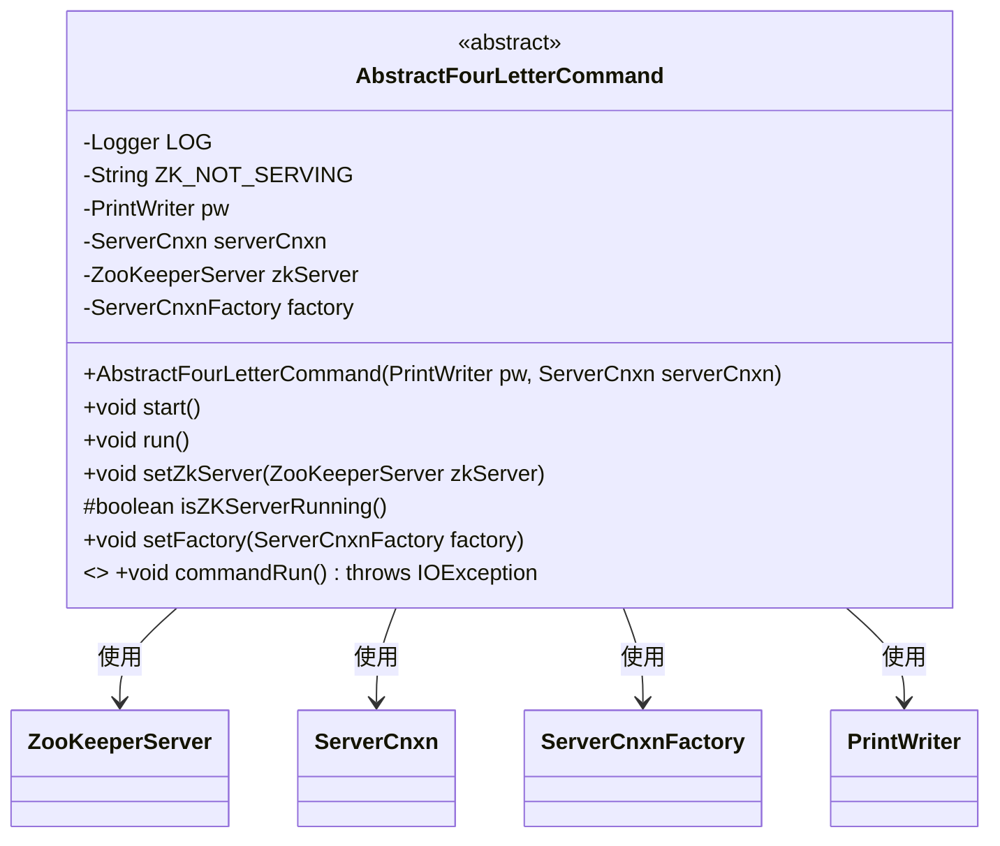
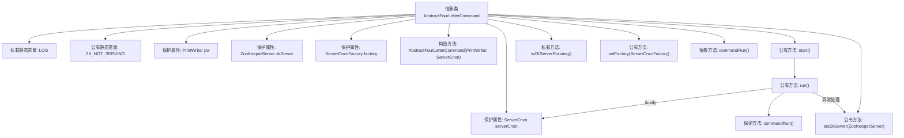

# 基础信息

|      |      |
|------|------|
| 名称 | AbstractFourLetterCommand |
| 编码语言 | .java |
| 代码路径 | zookeeper/zookeeper-server/src/main/java/org/apache/zookeeper/server/command/AbstractFourLetterCommand.java |
| 包名 | org.apache.zookeeper.server.command |
| 依赖项 | ['java.io.IOException', 'java.io.PrintWriter', 'org.apache.zookeeper.server.ServerCnxn', 'org.apache.zookeeper.server.ServerCnxnFactory', 'org.apache.zookeeper.server.ZooKeeperServer', 'org.slf4j.Logger', 'org.slf4j.LoggerFactory'] |
| 概述说明 | 抽象类AbstractFourLetterCommand定义了ZooKeeper四字命令的基本结构，包含运行命令、服务器状态检查及资源清理功能，需子类实现具体命令逻辑。 |

# 说明

这是一个抽象类AbstractFourLetterCommand，用于处理ZooKeeper的四字命令。它包含核心组件：PrintWriter用于输出，ServerCnxn管理连接，ZooKeeperServer和ServerCnxnFactory。主要功能包括启动命令执行、检查服务器状态、设置服务器实例和连接工厂。执行流程通过start()触发run()，最终调用抽象方法commandRun()实现具体命令逻辑。异常处理会记录错误并清理连接。类中定义了常量ZK_NOT_SERVING表示服务不可用状态。

# 类列表 Class Summary

| 名称   | 类型  | 说明 |
|-------|------|-------------|
| AbstractFourLetterCommand | class | 抽象类AbstractFourLetterCommand定义了ZooKeeper四字命令的基础结构，包含运行状态检查、命令执行及资源清理功能，需子类实现具体命令逻辑。 |

## 类 AbstractFourLetterCommand

|      |      |
|------|------|
| 访问范围 | public abstract |
| 类型 | class |
| 名称 | AbstractFourLetterCommand |
| 说明 | 抽象类AbstractFourLetterCommand定义了ZooKeeper四字命令的基础结构，包含运行状态检查、命令执行及资源清理功能，需子类实现具体命令逻辑。 |

### UML类图

这段代码展示了一个抽象类`AbstractFourLetterCommand`，主要用于处理ZooKeeper的四字命令协议。该类包含核心组件如日志记录器、网络连接(ServerCnxn)、ZooKeeper服务器实例和连接工厂，提供了命令执行框架和服务器状态检查方法。作为抽象类，它要求子类必须实现`commandRun()`方法来定义具体命令逻辑，同时封装了异常处理和资源清理的通用流程。类图中清晰展示了它与ZooKeeper核心组件之间的依赖关系。

### 内部方法调用关系图

这段代码定义了一个抽象类`AbstractFourLetterCommand`，主要用于处理ZooKeeper的四字命令。类中包含日志记录、属性初始化、服务器状态检查等功能，核心逻辑通过抽象方法`commandRun()`交由子类实现。流程图展示了类的结构层次，包括属性、构造方法、普通方法和抽象方法的调用关系，特别突出了`run()`方法对`commandRun()`的调用及异常处理流程。

### 字段列表 Field List

| 名称  | 类型  | 说明 |
|-------|-------|------|
| LOG = LoggerFactory.getLogger(AbstractFourLetterCommand.class) | Logger | 私有静态日志常量LOG，用于记录AbstractFourLetterCommand类的日志信息。 |
| zkServer | ZooKeeperServer | 保护类型的ZooKeeper服务器实例变量zkServer。 |
| factory | ServerCnxnFactory | 保护类型的ServerCnxnFactory工厂实例。 |
| serverCnxn | ServerCnxn | 受保护的ServerCnxn类型变量serverCnxn。 |
| ZK_NOT_SERVING = "This ZooKeeper instance is not currently serving requests" | String | ZK实例当前未处理请求的静态错误信息常量。 |
| pw | PrintWriter | 声明一个受保护的PrintWriter类变量pw。 |

### 方法列表 Method List

| 名称  | 类型  | 说明 |
|-------|-------|------|
| start | void | 方法start调用run执行任务。 |
| setZkServer | void | 设置ZooKeeper服务器实例的方法。 |
| run | void | 方法run执行commandRun，捕获IO异常并记录错误，最终清理writerSocket。 |
| isZKServerRunning | boolean | 检查ZK服务器是否运行，返回服务器非空且运行中的状态。 |
| setFactory | void | 设置服务器连接工厂方法，将传入的factory参数赋值给当前对象的factory属性。 |
| commandRun | void | 抽象方法commandRun，无返回值，可能抛出IOException异常。 |

