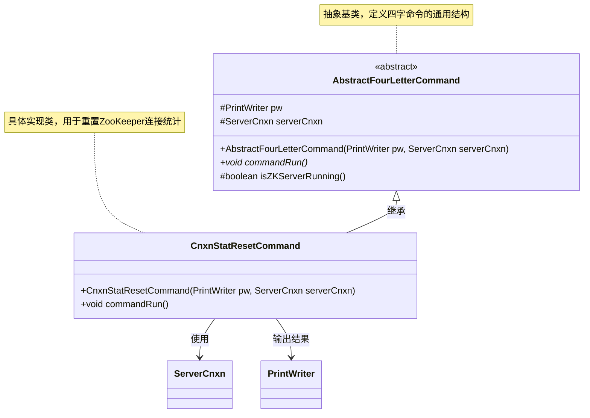
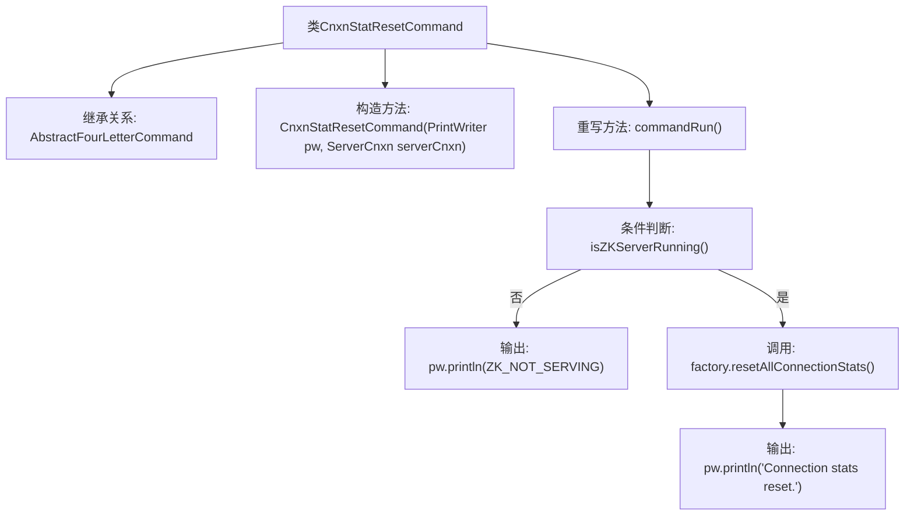

# 基础信息

|      |      |
|------|------|
| 名称 | CnxnStatResetCommand |
| 编码语言 | .java |
| 代码路径 | zookeeper/zookeeper-server/src/main/java/org/apache/zookeeper/server/command/CnxnStatResetCommand.java |
| 包名 | org.apache.zookeeper.server.command |
| 依赖项 | ['java.io.PrintWriter', 'org.apache.zookeeper.server.ServerCnxn'] |
| 概述说明 | CnxnStatResetCommand类继承AbstractFourLetterCommand，用于重置ZooKeeper服务器连接统计。若服务器未运行则输出错误，否则重置并提示成功。 |

# 说明

该内容描述了一个名为CnxnStatResetCommand的Java类，继承自AbstractFourLetterCommand。该类用于重置ZooKeeper服务器连接统计信息。构造函数接收PrintWriter和ServerCnxn参数。commandRun方法首先检查服务器是否运行，若未运行则输出提示信息；否则调用factory的resetAllConnectionStats方法重置统计，并输出成功消息。

# 类列表 Class Summary

| 名称   | 类型  | 说明 |
|-------|------|-------------|
| CnxnStatResetCommand | class | CnxnStatResetCommand继承AbstractFourLetterCommand，用于重置ZooKeeper连接统计。若服务未运行输出错误，否则重置并返回成功信息。 |

## 类 CnxnStatResetCommand

|      |      |
|------|------|
| 访问范围 | public |
| 类型 | class |
| 名称 | CnxnStatResetCommand |
| 说明 | CnxnStatResetCommand继承AbstractFourLetterCommand，用于重置ZooKeeper连接统计。若服务未运行输出错误，否则重置并返回成功信息。 |

### UML类图

类图描述：该代码展示了一个ZooKeeper四字命令的实现结构，其中`AbstractFourLetterCommand`是抽象基类，定义了命令执行框架和公共属性；`CnxnStatResetCommand`是具体子类，实现重置连接统计的功能。通过继承关系，子类复用父类的打印输出和连接对象，并重写`commandRun()`方法实现特定业务逻辑（检查服务状态、重置统计）。整体采用模板方法模式，体现了命令模式的设计思想。

### 内部方法调用关系图

这段代码定义了一个`CnxnStatResetCommand`类，继承自`AbstractFourLetterCommand`，用于重置ZooKeeper服务器的连接统计信息。流程图展示了从类结构到方法调用的完整逻辑：首先检查服务器是否运行，若未运行则输出错误信息，否则重置统计并输出成功消息。关键步骤包括条件分支、工厂方法调用和输出操作，体现了命令模式的具体实现。

### 字段列表 Field List

| 名称  | 类型  | 说明 |
|-------|-------|------|

### 方法列表 Method List

| 名称  | 类型  | 说明 |
|-------|-------|------|
| commandRun | void | 检查ZK服务状态，未运行则输出提示，否则重置连接统计并输出确认信息。 |

