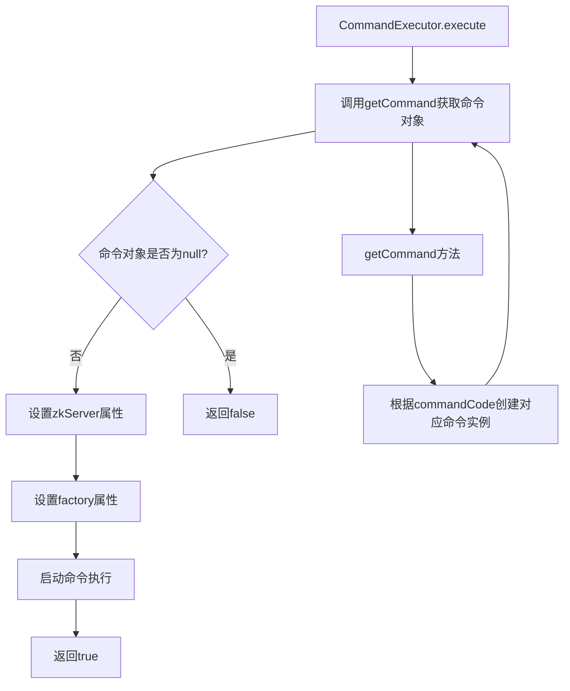

# 基础信息

|      |      |
|------|------|
| 名称 | CommandExecutor |
| 编码语言 | .java |
| 代码路径 | zookeeper/zookeeper-server/src/main/java/org/apache/zookeeper/server/command/CommandExecutor.java |
| 包名 | org.apache.zookeeper.server.command |
| 依赖项 | ['java.io.PrintWriter', 'org.apache.zookeeper.server.ServerCnxn', 'org.apache.zookeeper.server.ServerCnxnFactory', 'org.apache.zookeeper.server.ZooKeeperServer'] |
| 概述说明 | CommandExecutor类根据命令码选择并执行对应的四字母命令，如ruok、stat等，设置相关参数后启动命令执行。 |

# 说明

CommandExecutor类负责根据传入的commandCode决定并执行对应的四字母命令。execute方法接收服务器连接、输出流、命令码等参数，通过getCommand方法创建具体命令实例。getCommand方法包含15种命令码分支，每个分支实例化不同的命令类（如RuokCommand、StatCommand等），未匹配时返回null。命令执行前会设置ZooKeeper服务器和连接工厂，最后启动命令。

# 类列表 Class Summary

| 名称   | 类型  | 说明 |
|-------|------|-------------|
| CommandExecutor | class | CommandExecutor类根据命令码执行对应操作，支持多种四字命令如ruok、stat等，初始化并启动相应命令实例。 |

## 类 CommandExecutor

|      |      |
|------|------|
| 访问范围 | public |
| 类型 | class |
| 名称 | CommandExecutor |
| 说明 | CommandExecutor类根据命令码执行对应操作，支持多种四字命令如ruok、stat等，初始化并启动相应命令实例。 |

### UML类图

```mermaid
classDiagram
    class CommandExecutor {
        +boolean execute(ServerCnxn serverCnxn, PrintWriter pwriter, int commandCode, ZooKeeperServer zkServer, ServerCnxnFactory factory)
        -AbstractFourLetterCommand getCommand(ServerCnxn serverCnxn, PrintWriter pwriter, int commandCode)
    }

    class AbstractFourLetterCommand {
        <<Interface>>
        +setZkServer(ZooKeeperServer zkServer)
        +setFactory(ServerCnxnFactory factory)
        +start()
    }

    class RuokCommand {
        +RuokCommand(PrintWriter pwriter, ServerCnxn serverCnxn)
    }
    class TraceMaskCommand {
        +TraceMaskCommand(PrintWriter pwriter, ServerCnxn serverCnxn)
    }
    class EnvCommand {
        +EnvCommand(PrintWriter pwriter, ServerCnxn serverCnxn)
    }
    class ConfCommand {
        +ConfCommand(PrintWriter pwriter, ServerCnxn serverCnxn)
    }
    class StatResetCommand {
        +StatResetCommand(PrintWriter pwriter, ServerCnxn serverCnxn)
    }
    class CnxnStatResetCommand {
        +CnxnStatResetCommand(PrintWriter pwriter, ServerCnxn serverCnxn)
    }
    class DirsCommand {
        +DirsCommand(PrintWriter pwriter, ServerCnxn serverCnxn)
    }
    class DumpCommand {
        +DumpCommand(PrintWriter pwriter, ServerCnxn serverCnxn)
    }
    class StatCommand {
        +StatCommand(PrintWriter pwriter, ServerCnxn serverCnxn, int commandCode)
    }
    class ConsCommand {
        +ConsCommand(PrintWriter pwriter, ServerCnxn serverCnxn)
    }
    class WatchCommand {
        +WatchCommand(PrintWriter pwriter, ServerCnxn serverCnxn, int commandCode)
    }
    class MonitorCommand {
        +MonitorCommand(PrintWriter pwriter, ServerCnxn serverCnxn)
    }
    class IsroCommand {
        +IsroCommand(PrintWriter pwriter, ServerCnxn serverCnxn)
    }
    class DigestCommand {
        +DigestCommand(PrintWriter pwriter, ServerCnxn serverCnxn)
    }

    CommandExecutor --> AbstractFourLetterCommand : 创建/调用
    AbstractFourLetterCommand <|-- RuokCommand : 实现
    AbstractFourLetterCommand <|-- TraceMaskCommand : 实现
    AbstractFourLetterCommand <|-- EnvCommand : 实现
    AbstractFourLetterCommand <|-- ConfCommand : 实现
    AbstractFourLetterCommand <|-- StatResetCommand : 实现
    AbstractFourLetterCommand <|-- CnxnStatResetCommand : 实现
    AbstractFourLetterCommand <|-- DirsCommand : 实现
    AbstractFourLetterCommand <|-- DumpCommand : 实现
    AbstractFourLetterCommand <|-- StatCommand : 实现
    AbstractFourLetterCommand <|-- ConsCommand : 实现
    AbstractFourLetterCommand <|-- WatchCommand : 实现
    AbstractFourLetterCommand <|-- MonitorCommand : 实现
    AbstractFourLetterCommand <|-- IsroCommand : 实现
    AbstractFourLetterCommand <|-- DigestCommand : 实现
```

这段代码展示了一个命令执行器模式，CommandExecutor根据commandCode动态创建不同的具体命令对象（如RuokCommand、StatCommand等），这些命令均继承自AbstractFourLetterCommand接口。执行器通过setZkServer和setFactory配置命令后，调用start()执行具体逻辑。该设计实现了命令的创建与执行的解耦，支持灵活扩展新命令类型。

### 内部方法调用关系图

这段流程图描述了CommandExecutor类的执行流程。首先通过execute方法调用getCommand获取命令对象，如果对象不存在则返回false；否则依次设置zkServer和factory属性后启动命令执行并返回true。getCommand方法内部根据不同的commandCode值创建对应的具体命令类实例，实现了命令的分发逻辑。整个过程展示了命令模式的核心实现，通过抽象类统一处理不同类型的命令请求。

### 字段列表 Field List

| 名称  | 类型  | 说明 |
|-------|-------|------|

### 方法列表 Method List

| 名称  | 类型  | 说明 |
|-------|-------|------|
| getCommand | AbstractFourLetterCommand | 根据命令码返回对应的四字母命令实例，如ruokCmd返回RuokCommand，statCmd返回StatCommand等。 |
| execute | boolean | 该方法执行四字母命令，初始化并启动命令对象，成功返回true，失败返回false。 |

