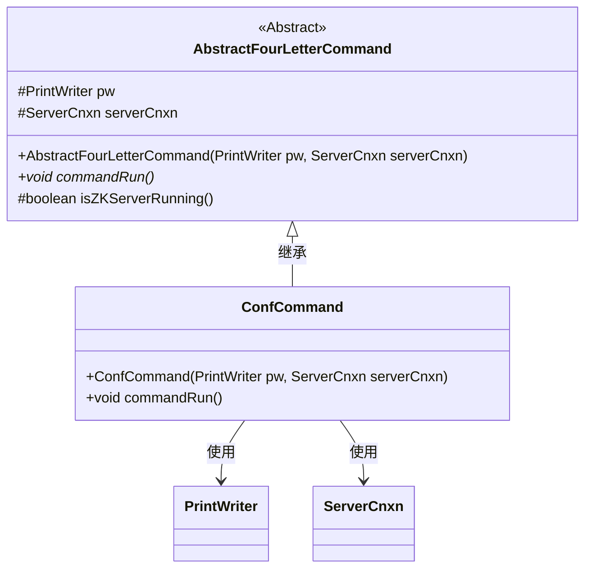
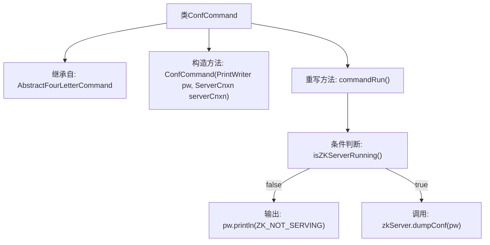

# 基础信息

|      |      |
|------|------|
| 名称 | ConfCommand |
| 编码语言 | .java |
| 代码路径 | zookeeper/zookeeper-server/src/main/java/org/apache/zookeeper/server/command/ConfCommand.java |
| 包名 | org.apache.zookeeper.server.command |
| 依赖项 | ['java.io.PrintWriter', 'org.apache.zookeeper.server.ServerCnxn'] |
| 概述说明 | Java类ConfCommand继承AbstractFourLetterCommand，检查ZK服务状态并输出配置信息。 |

# 说明

该内容描述了一个名为ConfCommand的Java类，继承自AbstractFourLetterCommand。该类包含一个构造函数，接收PrintWriter和ServerCnxn对象作为参数。主要功能在commandRun方法中实现：首先检查ZKServer是否运行，若未运行则输出ZK_NOT_SERVING；若运行则调用zkServer的dumpConf方法将配置信息输出到PrintWriter。该类用于处理与ZooKeeper服务器配置相关的命令操作。

# 类列表 Class Summary

| 名称   | 类型  | 说明 |
|-------|------|-------------|
| ConfCommand | class | ConfCommand继承AbstractFourLetterCommand，检查ZK服务状态，运行则输出配置信息，否则提示未运行。 |

## 类 ConfCommand

|      |      |
|------|------|
| 访问范围 | public |
| 类型 | class |
| 名称 | ConfCommand |
| 说明 | ConfCommand继承AbstractFourLetterCommand，检查ZK服务状态，运行则输出配置信息，否则提示未运行。 |

### UML类图

这段代码展示了一个ZooKeeper配置命令的实现结构。ConfCommand继承自抽象基类AbstractFourLetterCommand，实现了commandRun()方法用于输出服务器配置。当ZooKeeper服务器未运行时输出错误信息，否则通过zkServer对象打印配置信息。类图清晰地体现了继承关系和关键依赖，包括对PrintWriter和ServerCnxn两个核心组件的使用。

### 内部方法调用关系图

这段流程图描述了ConfCommand类的结构和工作流程。该类继承自AbstractFourLetterCommand，包含一个构造方法和一个重写的commandRun方法。commandRun方法首先检查ZK服务器是否运行，若未运行则输出错误信息ZK_NOT_SERVING，否则调用zkServer的dumpConf方法将配置信息输出到PrintWriter。整个流程清晰地展示了条件分支和不同路径下的处理逻辑。

### 字段列表 Field List

| 名称  | 类型  | 说明 |
|-------|-------|------|

### 方法列表 Method List

| 名称  | 类型  | 说明 |
|-------|-------|------|
| commandRun | void | 该方法检查ZooKeeper服务器是否运行，未运行则输出提示信息，否则输出服务器配置。 |

