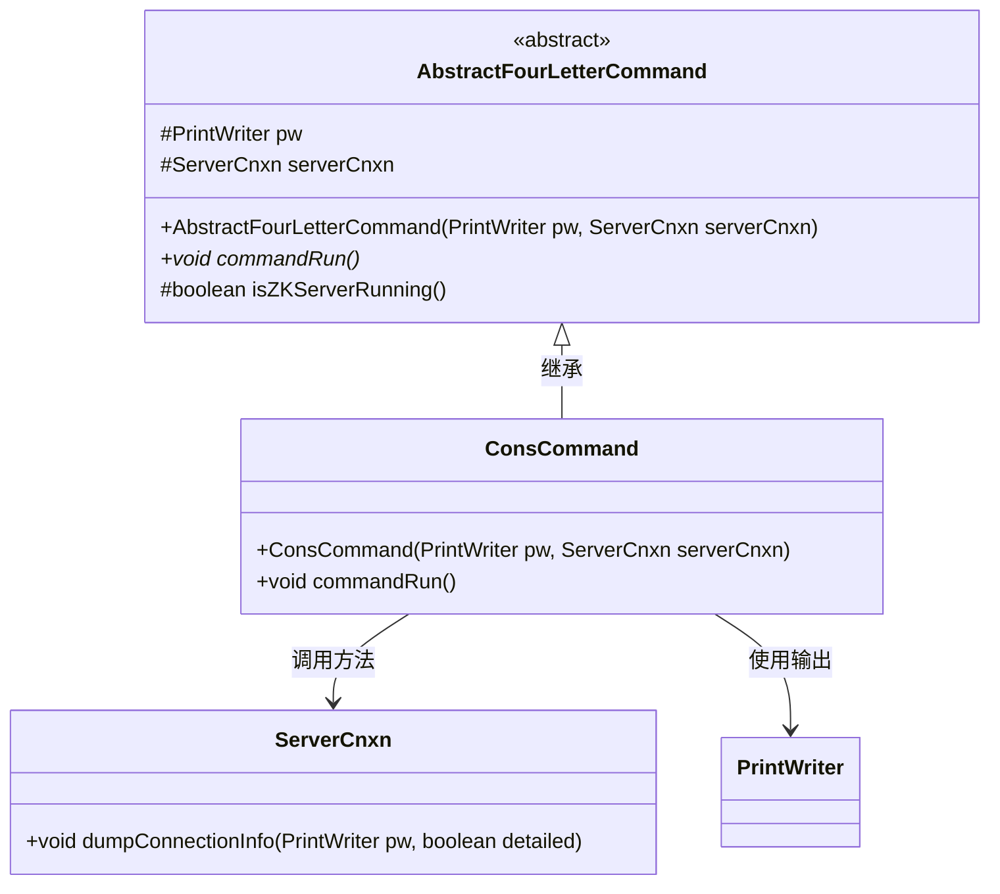
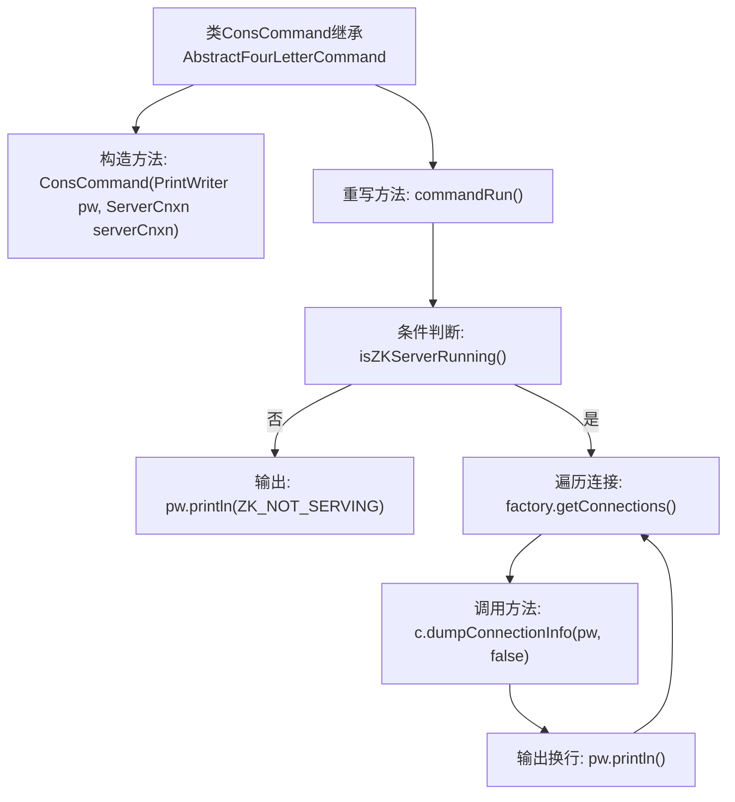

# 基础信息

|      |      |
|------|------|
| 名称 | ConsCommand |
| 编码语言 | .java |
| 代码路径 | zookeeper/zookeeper-server/src/main/java/org/apache/zookeeper/server/command/ConsCommand.java |
| 包名 | org.apache.zookeeper.server.command |
| 依赖项 | ['java.io.PrintWriter', 'org.apache.zookeeper.server.ServerCnxn'] |
| 概述说明 | ConsCommand继承AbstractFourLetterCommand，检查ZK服务状态并输出连接信息。 |

# 说明

ConsCommand类继承自AbstractFourLetterCommand，用于处理四字命令。构造函数接收PrintWriter和ServerCnxn参数。commandRun方法首先检查ZK服务器是否运行，若未运行则输出ZK_NOT_SERVING；否则遍历所有连接，调用dumpConnectionInfo输出连接信息，每个连接信息后换行，最后再输出一个空行。

# 类列表 Class Summary

| 名称   | 类型  | 说明 |
|-------|------|-------------|
| ConsCommand | class | ConsCommand类继承AbstractFourLetterCommand，检查ZK服务状态并输出连接信息。 |

## 类 ConsCommand

|      |      |
|------|------|
| 访问范围 | public |
| 类型 | class |
| 名称 | ConsCommand |
| 说明 | ConsCommand类继承AbstractFourLetterCommand，检查ZK服务状态并输出连接信息。 |

### UML类图

类图描述：该图展示了ConsCommand继承自抽象类AbstractFourLetterCommand的层级关系，其中ConsCommand通过调用ServerCnxn的dumpConnectionInfo方法实现具体功能，并使用PrintWriter进行输出操作。AbstractFourLetterCommand定义了公共属性和抽象方法，ConsCommand实现了具体的commandRun逻辑，包含对ZooKeeper服务器连接状态的检查和连接信息输出。

### 内部方法调用关系图

这段代码展示了一个继承自AbstractFourLetterCommand的ConsCommand类，主要用于处理ZooKeeper服务器的连接信息。当服务器未运行时输出错误信息，否则遍历所有活跃连接并打印其详细信息。流程图清晰呈现了构造方法初始化、运行时条件判断、连接信息遍历输出等关键步骤，体现了对连接状态的分支处理和循环操作逻辑。

### 字段列表 Field List

| 名称  | 类型  | 说明 |
|-------|-------|------|

### 方法列表 Method List

| 名称  | 类型  | 说明 |
|-------|-------|------|
| commandRun | void | Java方法重写，检查ZK服务状态，未运行则输出提示，否则遍历连接并打印信息。 |

