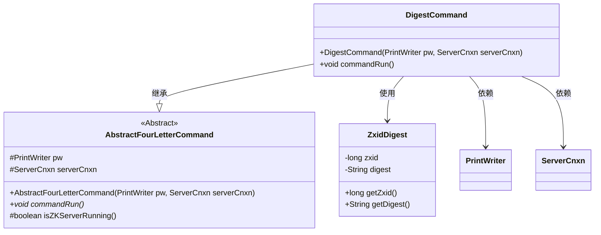
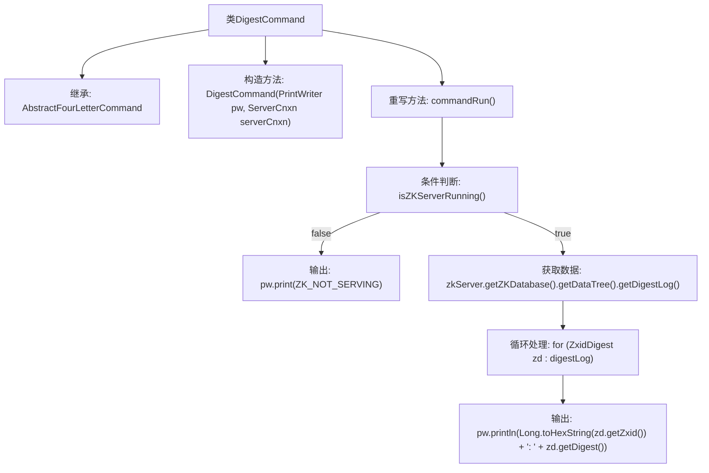

# 基础信息

|      |      |
|------|------|
| 名称 | DigestCommand |
| 编码语言 | .java |
| 代码路径 | zookeeper/zookeeper-server/src/main/java/org/apache/zookeeper/server/command/DigestCommand.java |
| 包名 | org.apache.zookeeper.server.command |
| 依赖项 | ['java.io.PrintWriter', 'java.util.List', 'org.apache.zookeeper.server.DataTree.ZxidDigest', 'org.apache.zookeeper.server.ServerCnxn'] |
| 概述说明 | DigestCommand继承AbstractFourLetterCommand，检查ZK服务状态，若运行则输出数据树摘要日志（zxid和digest），否则提示未运行。 |

# 说明

这是一个名为DigestCommand的Java类，继承自AbstractFourLetterCommand。它通过构造函数接收PrintWriter和ServerCnxn对象。核心功能在commandRun方法中实现：首先检查ZKServer是否运行，若未运行则输出ZK_NOT_SERVING；若运行则从ZKDatabase获取DataTree中的digestLog，遍历每个ZxidDigest条目，以"十六进制zxid: digest值"格式逐行输出到PrintWriter。该类主要用于处理ZooKeeper的四字命令，实现数据摘要信息的查询功能。

# 类列表 Class Summary

| 名称   | 类型  | 说明 |
|-------|------|-------------|
| DigestCommand | class | DigestCommand继承AbstractFourLetterCommand，检查ZK服务状态后输出数据树的Zxid和摘要日志。 |

## 类 DigestCommand

|      |      |
|------|------|
| 访问范围 | public |
| 类型 | class |
| 名称 | DigestCommand |
| 说明 | DigestCommand继承AbstractFourLetterCommand，检查ZK服务状态后输出数据树的Zxid和摘要日志。 |

### UML类图

这段代码展示了一个继承自抽象类`AbstractFourLetterCommand`的`DigestCommand`类，主要用于处理ZooKeeper服务器的数据摘要命令。`DigestCommand`通过`commandRun`方法检查服务器状态并输出数据树的摘要日志，其中涉及`ZxidDigest`类来获取事务ID和摘要信息。类图清晰地反映了继承关系和依赖关系，体现了命令模式的基本结构。

### 内部方法调用关系图

这段代码展示了一个继承自AbstractFourLetterCommand的DigestCommand类，主要用于处理ZKServer的数据摘要命令。当服务器未运行时输出错误信息，否则遍历ZKDatabase中的数据树摘要日志，将每个ZxidDigest的zxid（十六进制）和摘要值通过PrintWriter输出。流程清晰展现了条件分支和循环处理逻辑。

### 字段列表 Field List

| 名称  | 类型  | 说明 |
|-------|-------|------|

### 方法列表 Method List

| 名称  | 类型  | 说明 |
|-------|-------|------|
| commandRun | void | 检查ZK服务状态，未运行则输出提示，否则遍历日志并输出十六进制事务ID及摘要。 |

