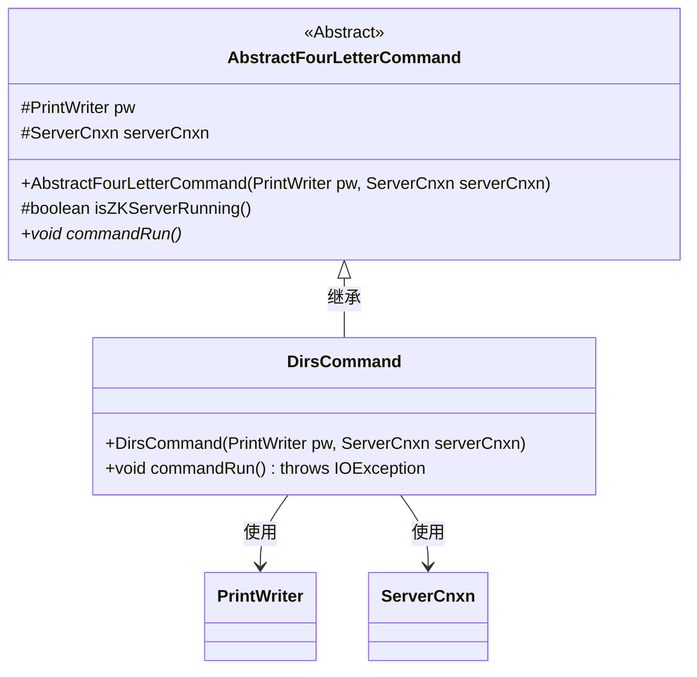
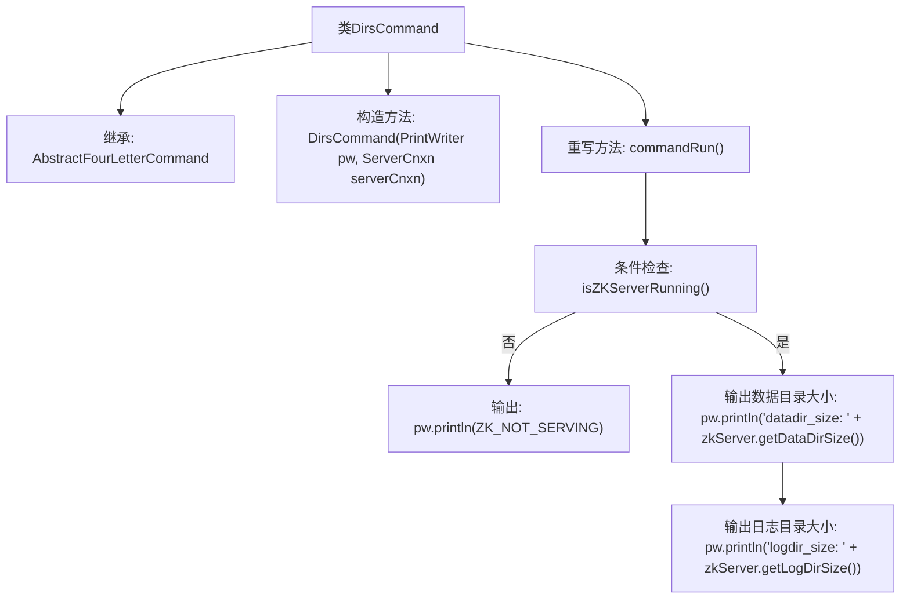

# 基础信息

|      |      |
|------|------|
| 名称 | DirsCommand |
| 编码语言 | .java |
| 代码路径 | zookeeper/zookeeper-server/src/main/java/org/apache/zookeeper/server/command/DirsCommand.java |
| 包名 | org.apache.zookeeper.server.command |
| 依赖项 | ['java.io.IOException', 'java.io.PrintWriter', 'org.apache.zookeeper.server.ServerCnxn'] |
| 概述说明 | DirsCommand类继承AbstractFourLetterCommand，检查ZK服务状态并输出数据目录和日志目录大小。 |

# 说明

DirsCommand类继承自AbstractFourLetterCommand，用于处理四字命令。构造函数接收PrintWriter和ServerCnxn参数。commandRun方法首先检查ZK服务器是否运行，若未运行则输出ZK_NOT_SERVING并返回。若服务器运行正常，则输出数据目录和日志目录的大小信息，分别通过zkServer.getDataDirSize和zkServer.getLogDirSize获取。

# 类列表 Class Summary

| 名称   | 类型  | 说明 |
|-------|------|-------------|
| DirsCommand | class | DirsCommand继承AbstractFourLetterCommand，检查ZK服务状态并输出数据目录和日志目录大小。 |

## 类 DirsCommand

|      |      |
|------|------|
| 访问范围 | public |
| 类型 | class |
| 名称 | DirsCommand |
| 说明 | DirsCommand继承AbstractFourLetterCommand，检查ZK服务状态并输出数据目录和日志目录大小。 |

### UML类图

类图描述：该图展示了一个ZooKeeper命令处理框架中的类结构，其中DirsCommand继承自抽象基类AbstractFourLetterCommand。DirsCommand实现了具体的commandRun方法，用于输出服务器数据目录和日志目录的大小信息。当检测到服务器未运行时，会返回未服务状态。类图中清晰地体现了继承关系和工具类依赖，符合命令模式的设计规范。

### 内部方法调用关系图

这段代码描述了一个继承自AbstractFourLetterCommand的DirsCommand类，主要用于检查ZooKeeper服务器状态并输出数据目录和日志目录的大小。流程图展示了从类结构到方法调用的完整流程，包括构造方法初始化、重写的commandRun()方法执行逻辑，以及根据服务器运行状态的不同输出路径。当服务器未运行时输出ZK_NOT_SERVING，否则依次输出两个目录的尺寸信息。

### 字段列表 Field List

| 名称  | 类型  | 说明 |
|-------|-------|------|

### 方法列表 Method List

| 名称  | 类型  | 说明 |
|-------|-------|------|
| commandRun | void | 重写commandRun方法，检查ZK服务状态，未运行输出提示，否则输出数据目录和日志目录大小。 |

